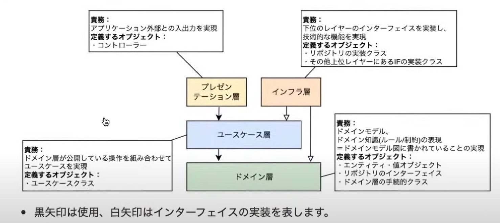

# # 課題1
## # オニオンアーキテクチャを図解してください

一般的なオニオンアーキテクチャの概念図

松岡さんの[クリーンアーキテクチャはおすすめしません。10分でわかるDDDのアーキテクチャ - ドメイン駆動設計](https://www.youtube.com/live/80NeuPXs2J0?si=HyAFFtlkyMFFXDxi)で、オニオンアーキテクチャの説明に使用していた概念図

### # DDDにおけるモデルの意味
問題解決のために、物事の特定を抽象化したのも

### # DDDにおけるドメインの意味
「ドメイン」とは、ソフトウェア開発におけるプログラムを適応する対象となる領域。
ドメイン駆動設計における「ドメイン」とは、特定のビジネスにおける「知識」「ルール」「要求」を表す概念。

### # ドメインモデル
現実世界のソフトウェアを容易て解決しようとしている課題を抽象化したモデル

### # ドメインサービス
エンティティや値オブジェクトの責務ではないドメインモデルのロジック

### # ドメイン層
ドメインモデルに書かれている「知識」「ルール」「要求」などはこのレイヤーで実現する。

### # ユースケース層
ドメイン層が公開している操作を組み合わせて、ユースケースを実現する。

### # プレゼンテーション層
アプリとの外部との入出力を実現する。
APIなど

### # インフラ
repositoryを実装  
Domain層に定義しているinterfaceに依存する形で実装することで、依存性を逆転させて実装する。

あれそもそもRepositoryの役割って何だっけとなったので、
### # Repository
日本語訳は「保管庫」。
オブジェクトを保管しておき、必要なときに取り出せるという役割を持ったコンポーネントのことで、データベースのアクセスを隠蔽している。

### # ユーザインターフェース
Application、Http Clientなどサービスのユーザー（人）がサービスを利用する際のインターフェイス。

### # 参考サイト
- [ドメイン駆動設計 モデリング_実装入門勉強会_2020.3.8](https://www.slideshare.net/koichiromatsuoka/202038)
- [[DDD]ドメイン駆動 + オニオンアーキテクチャ概略](https://qiita.com/little_hand_s/items/2040fba15d90b93fc124)

  

## # 中心に位置するドメインモデル層は他のどの層にも依存していません。こうすることに、どのようなメリットがあるのでしょうか？
- 他の層で不具合が発生した場合でも、ドメインロジックが直接的に影響を最小限にできる。
- 再利用が容易。
- 単体テストが書きやすい。

## # 層をまたいで依存関係が発生する時（例えばユースケース層がレポジトリ層のメソッドを呼び出す時など）はインターフェースに対する依存のみ許可します。こうすることに、どのようなメリットがあるのでしょうか？
- レポジトリ層（下位モジュール）はインターフェースにのみ依存している。これにより、インターフェースの定義に従っていれば、レポジトリ層を修正してもユースケース層（上位モジュール）が不具合を起こすことはない。
- ユースケース層（上位モジュール）はレポジトリ層（下位モジュール）に直接的なコードの依存関係を持たないため、変更が容易であり、テストも行いやすい。

## #「依存性の逆転」がオニオンアーキテクチャにおいてどのように使われているのか説明してください
依存性の逆転を使用しなかったら、ドメイン層はインターフェイス層に依存する形になり、例えばデータベースや外部サービスとの接続に関する具体的な操作がドメインロジックに組み込まれてしまう可能性がある。その結果、外部のサービスの不具合が発生した際、ドメイン層に直接的な影響が及んでしまう。

一方、依存性の逆転を活用すると、、ドメイン層はインターフェイスのみに依存し、具体的なインターフェイス層の実装から独立することができる。これにより、ドメインロジックが外部の変更から保護され、安定性が向上する。

## # 特定のユーザにしかリソースの追加や更新を許さないようなアクセス制限機能を実装したいとします。どの層に記述するのが適切でしょうか？（これは開発者によって意見が割れると思いますので、様々な観点から根拠を集めてみてください！）
ビジネスロジック層（ドメイン層）で実装して、場合によってはプレゼンテーション層（UI/UX）でも、アクセス制限を付与するという方針が良いと思う。

セキュリティ的な要因で、プレゼンテーション層のみに頼るのはリスクが大きい。
また、データアクセス層（データーベース）で、実装するのも（DB課題で議論になったが）変更容易性が低いので、あまり進んで採用したくない。
よって、セキュリティ的、変更容易性の観点からみて、ビジネスロジック層で実装するのが良いと思う。

ただ、ビジネスロジックの肥大化や複雑化によりバグが増える懸念もある。

## # データベースをMySQLからPostgreSQLに変更するとします。どの層を変更する必要があるでしょうか？
インフラ層を修正する必要がある。

# # 課題2
## # オニオンアーキテクチャに関するクイズを作成してください
Q1. オニオンアーキテクチャをコードとして実装する上で最も重要になる原則は何でしょうか？

Q2. オニオンアーキテクチャの弱点や欠点は何か？

Q3. オニオンアーキテクチャのどの層が、システム全体のエントリーポイントとして機能するか？

A1. 依存性の逆転の原則

A2. 従来のアーキテクチャとことなるので、学習コストが高め。
またプロジェクト初期がオーバーヘッドになるため、小規模、短期間なプロジェクトには向いていない。

A3. インターフェース層またはプレゼンテーション層
