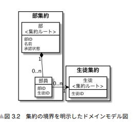

# # 課題1
## # 以下の用語を解説してください

### # 値オブジェクト（バリューオブジェクト）
- 状態と振る舞いを持つ不変（イミュータブル）なシステム固有の値のこと。
- 属性値が同じなら、同じものとして扱う。
- ドメインオブジェクト。

**メリット**
- ガード節を適切に適応したコンストラクタやデータの更新用関数を1つのオブジェクトにまとめるて、不正なデータが存在することを防げる。
- ドメイン知識を値オブジェクトにまとめることで、ロジックの分散を防ぐことが出来る。

<details><summary>例</summary><div>

- オブジェクトを分けることで、不適切な値を代入しようとした時に、コンパイルエラーが教えてくれる。
```C#
/// プリミティブの場合
// 間違えて、idにnameを代入してもバグか指摘されるまで気づけない。
private User CreateUser(String name)
{
    var user = new User();
    user.Id = name;
    return user;
}

/// プリミティブの場合
// コンパイルエラーで即座に気づくことが出来る。
private User CreateUser(UserName name)
{
    var user = new User();
    // user.Id = name; // コンパイルエラー！
    return user;
}
```

- プリミティブ型を使用するその値の意味を表す手段が、変数名しかない。しかし値オブジェクトを使用すると、その値についてより解像度高く表現することが出来る。
```c#
/// プリミティブの場合
// エンジニア  「まあ、とりあえずこれが製品番号を出力しているんだな、製品番号ってどんな値なんだろう？？？」
// 処理を遡ったり、仕様書を読んだり、他のエンジニアにチャットしたり、、、
void Method(string modelNumber) 
{
    Console.WriteLine("ModelNumber:" + modelNumber);
}


/// 値オブジェクの場合
// エンジニア  「まあ、とりあえずこれが製品番号を出力しているんだな、製品番号ってどんな値なんだろう？？？」
// ModelNumberを確認！
void Method(ModelNumber modelNumber) 
{
    Console.WriteLine("ModelNumber:" + modelNumber.ToString());
}

class ModelNumber
{
    private readonly string productCode;
    private readonly string branch;
    private readonly string lot;

    public ModelNumber(string productCode, string branch, string lot)
    {
        if (productCode == null) throw new ArgumentNullException(nameof(productCode));
        if (branch == null) throw new ArgumentNullException(nameof(branch));
        if (lot == null) throw new ArgumentNullException(nameof(lot));

        this.productCode = productCode;
        this.branch = branch;
        this.lot = lot;
    }

    public override string ToString()
    {
        return productCode + "-" + branch + "-" + lot;
    }
}

```

</div></details>

<br><br>
---

### # エンティティ(DDDの文脈における)
- ライフサイクル(状態の変化)を持つ、可変なドメインオブジェクト。
- 属性が同じ柄も区別される。（例）同姓同名でも別の人として区別する。

<br><br>
---

### # DTO(Data Transfer Object)
アプリケーション（ユースケース層）からviewに値を渡す際に、Entityをそのまま渡すと、  
viewからドメインに直接アクセス出来るようになってしまう。  
それを避けるために、データを渡す為のオブジェクトに値を詰め替えて渡す。  
そのデータを渡すためのオブジェクトをData Transfer Objectという。

このデータを詰め替える作業がかなり面倒くさいらしい、、、


<br><br>
---

### # 集約
集約とは、「必ず守りたい強い整合性を持ったオブジェクトのまとまり」。  
いくつかのオブジェクトの整合性を取りたい時に、それらを１つの集約として定義する。  
例として、以下のように部活と部員のオブジェクトがあったとします。  
部員が 5 人以上所属し、学校の承認が通ると「承認済」と
なり、部員が 4 人以下になると承認状態は「未承認」に戻るとします。  
この場合、「部集約」を作ることにより、部と部員数の整合性を確保することができます。



<br><br>
---

### # ドメイン
「領域」という意味を持っており、ソフトウェア開発に置いては、「プログラムを適用する対象となる領域」を指す。

<br><br>
---

### # ドメインモデル
現実世界のソフトウェアを容易て解決しようとしている課題を抽象化したモデル

<br><br>
---

### # ドメインオブジェクト
ドメインモデルをソフトウェアで動くモジュールとして表現したもの

<br><br>
---

### # ドメインサービス
- 自分の振る舞いを変更するようなインスタンス特有の状態を持たないオブジェクト
- ドメインオブジェクトに実装すると不事前になるふるまいをドメインサービスに実装する
    - User名の重複の確認
    - 物流システムの物流拠点から物流拠点への輸送処理

<br><br>
---

### # リポジトリ
データの保管庫。データの永続化（保存）と再構成（復元）を担当するオブジェクト。  
データに関する技術的な要素をリポジトリに閉じることにより、ドメインオブジェクトをクリアにする事ができる。

<br><br>
---

### # アプリケーション（ユースケース層と呼ばれることも）
ドメインオブジェクトを組み合わせたスクリプト。
ドメインオブジェクトを組み合わせて、利用者の目的を達成するように導くもの。
例）ユーザーデータの登録、取得、更新、削除など（CRUD処理）

<br><br>
---

### # ドメインモデル貧血症
ドメインオブジェクトに本来記述されるべき知識や振る舞いが、ドメインサービスやアプリケーションにサービスに記述され、<br>
語るべきことを何も語っていないドメインオブジェクトの状態を表す言葉。

<br><br>
---

### # ユビキタス言語
> ユビキタス言語とはシステム開発において「開発者、クライアントなどプロジェクトに関わる人全体で作り上げ共有する言語」のこと
そのプロジェクト専用に言語を作成することで、円滑にコミュニケーションが行え堅牢なシステム開発が進められる。

[引用](https://pivot.jp/column/system-2/)

<br><br>
---

### # 境界づけられたコンテキスト
販売する部署と発送する部署の人が同じ「商品」という言葉をみて思い浮かべるイメージは異なる。
ビジネスの領域が違うと、異なった概念になってしまう。
なので、混同しないようにそれぞれを切り分けて扱うようにしようという考え方。


<br><br>
実装は、原則`1コンテキスト = 1アプリケーション`なので、2つのアプリケーション作ることになる。


<br><br>
---

### # CQS/CQRS（似ているため、違いを重点的に調べてみましょう）
CQSは基礎となるプログラミング原則で、CQRSはアーキテクチャレベルまでCQSを適用したデザインパターン。  
適用範囲と目的が異なる。  


#### # CQS
CQSはオブジェクト単位でメソッドの責務を更新と取得に応じて明確に分離すべきというプログラミング原則。  
「getterメソッドを叩いたら、実はdataが変更されていた！」ていう直感に反する実装はしないようにしましょうねってこと。

<br><br>
---

#### # CQRS
アプリケーションやシステムのデータ操作を「コマンド（Command）」と「クエリ（Query）」の二つに分けるアーキテクチャパターン。  

<br><br>
---

#### # GPTに[CQRS Documents by Greg Young](https://cqrs.files.wordpress.com/2010/11/cqrs_documents.pdf)を読んでもらって、具体的な例を提示してもらいました。
<details><summary>具体的な例</summary><div>

#### 例：オンライン銀行システム
オンライン銀行システムを例に考えてみましょう。

##### コマンドの部分
- **機能**: 口座への入金、引き出し、振り込みなど。
- **操作**: これらの操作はシステムの状態を変更します（例えば、口座残高の変更）。
- **設計**: コマンドはしばしば複雑なビジネスロジックや検証ロジックを含みます。たとえば、引き出しの際に口座残高が十分かどうかを確認する必要があります。
- **データベース**: コマンド操作はデータベースの書き込み操作に対応し、しばしばトランザクション管理が必要です。

##### クエリの部分
- **機能**: 口座残高の確認、取引履歴の閲覧など。
- **操作**: これらの操作はデータを読み取るだけで、システムの状態を変更しません。
- **設計**: クエリ操作は通常、高速であることが要求されます。ユーザーはすぐに情報を見たいと思うため、パフォーマンスが重要です。
- **データベース**: クエリはデータベースの読み取り操作に対応し、最適化された読み取り専用のビューを利用することができます。

#### CQRSの利点
1. **スケーラビリティ**: コマンドとクエリを分離することで、それぞれに最適なスケーリング戦略を適用できます。例えば、読み取り操作が多い場合は、クエリ用のサーバーを増やすことができます。
2. **セキュリティ**: コマンド操作には高いセキュリティ要件がある場合が多いのに対し、クエリ操作には異なるレベルのセキュリティ要件を適用できます。
3. **メンテナンスと開発のしやすさ**: コマンドとクエリのロジックが分離されているため、システムの複雑性が減り、メンテナンスや新機能の追加が容易になります。

#### CQRSの欠点
1. **複雑性**: 小規模なアプリケーションでは、CQRSの導入によって不必要な複雑性が増すことがあります。
2. **一貫性の課題**: コマンドによる変更がクエリに反映されるまでにタイムラグがある場合（イベントチュアリティ）、一貫性の確保が課題となることがあります。

CQRSは、適切に適用された場合に、システムの性能、拡張性、柔軟性を大幅に向上させることができますが、その複雑性とコストも考慮する必要があります。
</div></details>

#### # 参考サイト
- [CQRSとCQSの違い](https://zenn.dev/praha/articles/4da7c1f91fb91f)
- [CQRS Documents by Greg Young](https://cqrs.files.wordpress.com/2010/11/cqrs_documents.pdf)

<br><br><br><br>


# # 課題2
## # 境界づけられたコンテキストの実例を一つ挙げてください
例として、病院における患者は、看護師、医師が患者を扱うコンテキストと病院受付が患者を扱うコンテキストによって、
異なってきます。
医療スタッフは診断や治療に関連する詳細情報に焦点を当てているのに対し、  
受付スタッフは行政的、運用的な詳細に焦点を当てている。

### 患者
#### 看護師、医師が患者を扱うコンテキスト
- 体調
- 体温
- 服用している薬
- 持病
- 症状の進行度
- 治療歴
- アレルギー情報
- 検査結果

#### 病院受付が患者を扱うコンテキスト
- 保険情報
- 受診理由
- 患者の連絡先
- 予約状況
- 請求情報
- 過去の受診記録


## # 「Human」エンティティを作成してください。
[human_entity_1](./課題2/human_entity_1.ts)

## # 先輩に『プロパティはデータ型じゃなくて値オブジェクトにしておいて』って言われたんです。何がダメなんですか？」
- コードの重複を避けるため: IDや血液型のドメインルールをHumanに記載してしまうと、他のオブジェクトで利用する際に、再度同じバリデーションルールをコピーアンドペーストすることになります。Valueオブジェクトを作成し、バリデーションをコンストラクターにそれぞれ定義することで、重複を避けることができます。
- 誤った代入を防ぐ: プリミティブ型だとIDもnameもどちらもStringなので、間違えてあべこべの値を渡しても、コンストラクターに問題なく渡せてしまいます。また、バリデーションに引っかからなかった場合、そのままオブジェクトが生成される危険性もあります。Valueオブジェクトを作成することで、もし間違えてもコンパイルエラーが教えてくれるようになります。
- 不変性の保証: 値オブジェクトはイミュータブルに設計されるので、予期しない副作用を防ぎ、プログラムの安全性を高めることができます。
- リファクタリングと拡張性の向上: 例えば、nameを名字と名前分けて管理する必要が出た場合、Nameの値オブジェクトを使用していた場合、firstNameとlastNameをもたせ、firstName + lastNameを返すfullNameのgetterを作成することで、最小限の影響でコードを回収することができます。

## # 先ほど新人エンジニアが作成した「Human」エンティティの各プロパティを値オブジェクトに置き換えてください。
