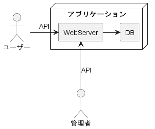
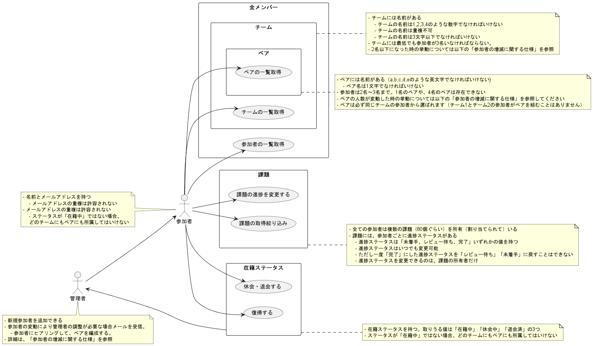
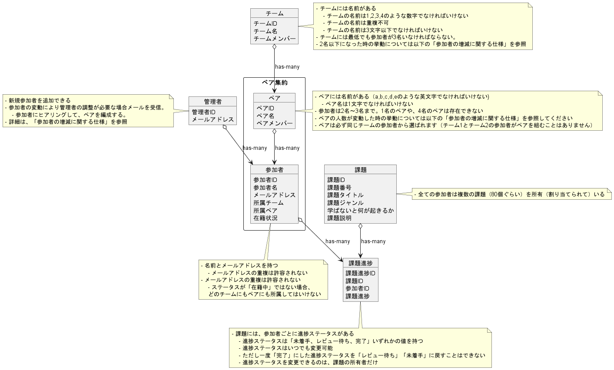

## # 1. ユビキタス言語の定義
[ユビキタス言語]('./ユビキタス言語/ubiquitous_language.md')

## # 2. コンテキスト図

## # 3. ユースケース図

## # 4. ドメインモデル図

## # 5. コーディング
[praha-challenge-ddd](https://github.com/YamazakiYusuke/praha-challenge-ddd)