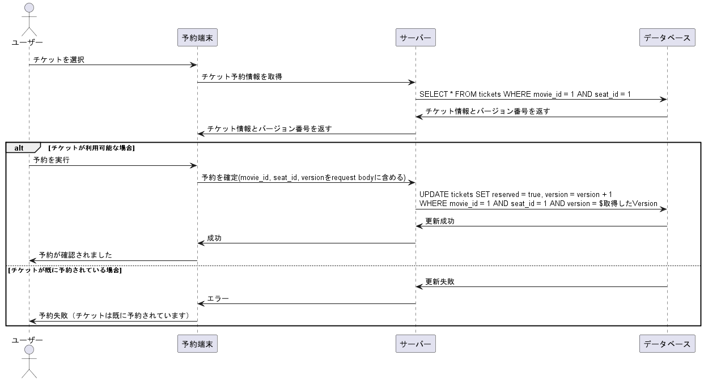

# 課題１（質問）
## デッドロックを説明してください
### そもそもロックとは🎸
一般的にDBは、複数のトランザクションが同時にアクセスできるような仕組みになっている。
そのおかげで、アクセス待ちが少なくなり効率よくトランザクションをさばくことが出来る。

しかし困るのが、複数のトランザクションが同じデータにアクセスしたときです。
このとき何らかのケアをしないと、例えば更新途中の値を読み取ってしまうなど、データの整合性が崩れてしまうことがあります。

図書館の漫画を複数人で読むとき、みんなが違う巻を見ているなら問題はありませんが、同じ巻を見ようとするなら何らかの話し合いが必要なのと似ています。

そんな問題を解決するのが「ロック」です！

ロックとは、トランザクションが自信がアクセスするリソース(行やテーブル)に対して、他のトランザクションからアクセス制限をかける仕組みです。

ロック(鍵)という名前の通り、あるデータに対して鍵をかけて他の人が触れないようにするとイメージすればわかりやすいです。

### 「共有ロック」と「排他ロック」🥁
- 共有ロック
共有ロックはデータを参照(SELECT)するときに使います。
共有ロックがあると、他のトランザクションはそのリソース(行やテーブルのこと)を更新できなくなります。

例えば共有ロックが掛かっていた場合、そのリソースは他のトランザクションが参照中ということなので、更新できなくなります。
(参照中にもかかわらずに値を更新してしまっては、不整合なデータを参照されてしまう可能性がありますからね)

共有ロックの特徴としては、「共有」という言葉の通り、１つのリソースに対して複数の共有ロックをかけることができます。
例えば、共有ロックをかけようとするリソースにすでに他のトランザクションが共有ロックをかけていたとしても、かまわずロックを掛けることができます。
参照するだけであれば何人が同時に見ていても問題が起こるわけではないので、複数のロックが共存できるというわけです。

- 排他ロック
排他ロックはデータの更新(UPDATE, INSERT, DELETE)または参照(SELECT)するときに使います。
排他ロックがあると、他のトランザクションはそのリソースを参照も更新のできなくなります。

さっきの共有ロックは他から「更新」を防ぐだけでしたが、排他ロックは「参照」すらもさせません。

排他ロックは「排他」という名の通り、１つのリソースに対して１つのトランザクションがロックを掛けることができます。
データを更新するときは、ほかから参照・更新されると不整合が起こるため、排他ロックを使ってリソースを独占します。

また、SELECTでも排他ロックをしたいケースががときにありまが、そんなときは専用の構文を使うことでSELECTでも排他ロックを書けることができます。

### デットロックとは👿
デットロックとは２つのトランザクションがお互いにロックの解放街をして動けなくなってしまう現象です。
デットロックの問題は、１度起こるともう自然に解消することはないので、それ以降の処理が続行できなくなってしまうところです。

例:
```sql
create table Fruit (
    Id int primary key,
    Name varchar(255)
);
create table Color (
    Id int primary key,
    Name varchar(255)
);

insert into Fruit values (1, "Apple");
insert into Color values (1, "Red");

-- Colorテーブル
-- # Id, Name
-- 1, 'Red'

-- Fruitテーブル
-- # Id, Name
-- 1, 'Apple'
```

このテーブルに以下の2つのトランザクションが同時に実行されたとします。

```sql
-- トランザクション1
START TRANSACTION;
UPDATE Fruit SET Name ='Pineapple' WHERE Id=1; // ロック！
SELECT SLEEP(5);
UPDATE Color SET Name ='Blue' WHERE Id=1; // トランザクション2でロックされているので、開放待ち
COMMIT;
```

```sql
-- トランザクション2
START TRANSACTION;
UPDATE Color SET Name ='Yellow' WHERE Id=1; // ロック！
SELECT SLEEP(5);
UPDATE Fruit SET Name ='Mango' WHERE Id=1; // トランザクション1でロックされているので、開放待ち
COMMIT;
```

この２つのスクリプトを同時に流すと、デットロックが起こります。

この記事がわかりやすかったので、写経しました。  
[DBのデッドロックとは何か？初心者にもわかりやすく解説](https://on-resolve.com/database-deadlock/)

## 実際に世の中でデッドロックが発生した事例を1つ調べて、その原因と解決方法を紹介してください
### [デッドロックおじさん戦記  事例2)正規化に伴う複雑化](https://engineering.mercari.com/blog/entry/2017-12-18-deadlock/)  
メルカリ サーバーサイド  

- 原因
MySQLのギャップロックが原因。
存在しないレコードに対して、UPDATE処理を行うと、ギャップロックが掛かり、インデックスのスキマ全域に対してロックが掛かる。
リファクタリングで、テーブルを分割したことにより、デッドロックの発生条件の1つである「更新が複数のテーブルや行に跨っていること」に当てはまってしまい、今回の事象が発生した。

- 解決方法
レコードの存在確認をしてからUPDATEを走らせるように修正して、解決。

## それぞれのISOLATION LEVELについて説明してみてください。それぞれの差分、それによってどんな問題が生じる可能性があるでしょうか？
### ISOLATION LEVEL(分離性)とは
分離性とは他のトランザクションに影響を与えない性質ということ。

### 複数のトランザクションが同時に走ると発生する問題

- **ダーティリード (Dirty Read)**:
  - 説明: トランザクションBで、commitされていないデータを、トランザクションAがよみとってしまう問題が起きる。
  - 例: 
    ```sql
    -- トランザクションA
    START TRANSACTION;
    UPDATE accounts SET balance = balance - 100 WHERE account_id = 1;
    -- トランザクションB
    START TRANSACTION;
    SELECT balance FROM accounts WHERE account_id = 1; -- トランザクションAの未コミットのデータを読み取る
    ```
  - 問題点: トランザクションAがコミットされていない変更をトランザクションBが読み取ると、トランザクションAがロールバックされた場合、トランザクションBが不正確なデータを基に処理を行うことになる。このため、データの一貫性が失われる可能性がある。

- **ファジーリード/ノンリピータブルリード (Fuzzy Read / Non-repeatable Read)**:
  - 説明: トランザクションAで、データを複数回読み取っている途中で、トランザクションBでデータを更新してコミットした場合、トランザクションAで違う結果のデータを読み取ってしまう問題。
  - 例:
    ```sql
    -- トランザクションA
    START TRANSACTION;
    SELECT balance FROM accounts WHERE account_id = 1; -- 初回読み取り
    -- トランザクションB
    START TRANSACTION;
    UPDATE accounts SET balance = balance + 100 WHERE account_id = 1;
    COMMIT;
    -- トランザクションA
    SELECT balance FROM accounts WHERE account_id = 1; -- 2回目の読み取りで異なる結果を取得
    ```
  - 問題点: トランザクションAが同じクエリを複数回実行する間に、トランザクションBがデータを更新すると、トランザクションAが異なる結果を取得することになる。これにより、トランザクションAの処理が予期しない結果を生む可能性があり、データの一貫性が損なわれる。

- **ファントムリード (Phantom Read)**:
  - 説明: トランザクションAで一定の範囲のレコードに対して処理を行っている途中で、トランザクションBでデータを追加・削除してコミットした場合、トランザクションAで幻影のようにデータが反映されるため、処理結果が変わってしまう問題が置きます。
  - 例:
    ```sql
    -- トランザクションA
    START TRANSACTION;
    SELECT COUNT(*) FROM orders WHERE amount > 100; -- 初回読み取り
    -- トランザクションB
    START TRANSACTION;
    INSERT INTO orders (order_id, amount) VALUES (5, 150);
    COMMIT;
    -- トランザクションA
    SELECT COUNT(*) FROM orders WHERE amount > 100; -- 2回目の読み取りで異なる結果を取得
    ```
  - 問題点: トランザクションAが特定の条件に基づいてデータを処理している間に、トランザクションBがデータを追加または削除すると、トランザクションAの処理結果が変わる可能性がある。これにより、トランザクションAの処理が不完全または不正確になる可能性がある。


### 各ISOLATION LEVELの説明
- **READ UNCOMMITTED**:
  - 説明: トランザクションがコミットされていない変更を他のトランザクションが読み取ることができる。一番低いトランザクション分離レベル。
  - 問題: ダーティリード、ファジーリード、ファントムリードが発生する可能性がある。

- **READ COMMITTED**:
  - 説明: トランザクションがコミットされた変更のみを他のトランザクションが読み取ることができる。Oracle, PostgreSQL, SQL Serverでのデフォルト。
  - 問題: ファジーリード、ファントムリードが発生する可能性がある。

- **REPEATABLE READ**:
  - 説明: トランザクションが開始されてから終了するまで、同じクエリが同じ結果を返すことを保証する。MySQLのデフォルト。
  - 問題: ファントムリードが発生する可能性がある。ただし、MySQLのInnoDBではファントムリードが発生しない。

- **SERIALIZABLE**:
  - 説明: トランザクションが完全に直列化され、他のトランザクションと同時に実行されないようにする。一番高いトランザクション分離レベル。
  - 問題: パフォーマンスが低下する可能性があるが、ダーティリード、ファジーリード、ファントムリードが発生しない。最も安全だが、相対的にパフォーマンスが悪いので使用されないらしい。

### まとめ
| 分離レベル            | ダーティリード | ファジーリード | ファントムリード |
| ---------------- | ------- | ------- | -------- |
| READ UNCOMMITTED | ○       | ○       | ○        |
| READ COMMITTED   | ×       | ○       | ○        |
| REPEATABLE READ  | ×       | ×       | ○        |
| SERIALIZABLE     | ×       | ×       | ×        |
| ○：発生する ×：発生しない   |         |         |          |

参考: [トランザクション分離レベルについてのまとめ](https://qiita.com/song_ss/items/38e514b05e9dabae3bdb)

## 行レベルのロック、テーブルレベルのロックの違いを説明してください
### 行レベルのロック🎸
行レベルのロックは、データベースのテーブルの特定の行に対してロックをかける仕組み。
他のトランザクションがその行に対して同時にアクセスすることを防ぎつつ、同一テーブル内の他のトランザクション処理とのデータの競合を最小限に抑える。

### テーブルレベルのロック🥁
テーブルレベルのロックは、データベースの特定のテーブル全体に対してロックをかける仕組み。
他のトランザクションがそのテーブル全体に対して同時にアクセスすることを防ぐ為、並行処理の効率は低下する。

## 悲観ロックと楽観ロック（あるいは悲観的排他制御と楽観的排他制御）の違いを説明してください
どちらも排他制御の方式こと。
### 悲観ロック
悲観ロックとは、他社が同じデータに頻繁に変更を加えるであろう、という悲観的な前提の排他制御。更新対象のデータを取得する際ににロックを掛けることで、他のトランザクションから更新されないようにする方式。
いつも使っている方がこれ。

#### メリット
- データの整合性が高く保たれる。
- 競合が発生しにくい。

#### デメリット
- ロックの取得・解放に時間がかかるため、パフォーマンスが低下する可能性がある。
- デッドロックが発生するリスクがある。

### 楽観ロック
楽観ロックとは、めったなことでは他者との同時更新は起きないであろう、という楽観的な前提の排他制御。
データそのものに対してはロックは行わずに、更新対象のデータがデータ取得時と同じであることを確認してから更新することで、データの整合性を保証する方式。

#### メリット
- ロックを使用しないため、パフォーマンスが高い。
- デッドロックが発生しない。

#### デメリット
- 同時更新が発生した場合、更新が失敗する可能性がある。
- 更新失敗時に再試行が必要となるため、実装が複雑になることがある。

参考: [排他制御（楽観ロック・悲観ロック）の基礎](https://qiita.com/NagaokaKenichi/items/73040df85b7bd4e9ecfc#%E6%A5%BD%E8%A6%B3%E3%83%AD%E3%83%83%E3%82%AF%E6%A5%BD%E8%A6%B3%E7%9A%84%E6%8E%92%E4%BB%96%E5%88%B6%E5%BE%A1)


## 共有ロックと排他ロックの違いを説明してください
"デッドロックを説明してください"の課題で説明したのでスキップ。

select....for updateは共有ロックでしょうか排他ロックでしょうか？
これは、排他ロック。mysqlの場合はFOR UPDATEを付けると、明示的に排他ロックを指定できる。

## fuzzy(non-repeatable)-readとphantom-readは何が違うのでしょうか？
- ファジーリード/ノンリピータブルリードは、同じクエリを複数回実行する際に、他のトランザクションによる**データの更新**が原因で異なる結果を取得する問題。
- ファントムリードは、特定の条件に基づいてデータを処理している間に、他のトランザクションによる**データの追加や削除**が原因で、処理結果が変わる問題。

違いは、ファジーリードは既存のデータの更新に関する問題であり、ファントムリードはデータの追加や削除に関する問題。

# 課題２（実装）

## 以下の状況を再現するようなクエリを発行してください
MySQLで検証

**事前準備**
```sql
-- 検証用データの作成
---- テーブルの作成
CREATE TABLE player_coin (
    id INT PRIMARY KEY,
    player_id VARCHAR(255),
    quantity INT
);

---- データの挿入
INSERT INTO player_coin (id, player_id, quantity) VALUES
(1, 'player1', 1000),
(2, 'player2', 1000);

---- データの確認
SELECT * FROM player_coin;
```
- **ダーティリード (Dirty Read)**:
トランザクション分離レベル: READ UNCOMMITTEDで検証

トランザクションA
```sql
-- トランザクション分離レベルをREAD UNCOMMITTEDに設定
SET SESSION TRANSACTION ISOLATION LEVEL READ UNCOMMITTED;
-- トランザクション開始
START TRANSACTION;
-- データの取得
SELECT * FROM player_coin;
```

トランザクションB
```sql
-- トランザクション分離レベルをREAD UNCOMMITTEDに設定
SET SESSION TRANSACTION ISOLATION LEVEL READ UNCOMMITTED;
-- トランザクション開始
START TRANSACTION;
-- データの更新、コミットはしない
UPDATE player_coin set quantity=quantity+500 WHERE id=1;
```

トランザクションA
```sql
-- データの取得 => データが変わってる！ダーティーリードだ！
SELECT * FROM player_coin;
```

- **ファジーリード/ノンリピータブルリード (Fuzzy Read / Non-repeatable Read)**:
トランザクション分離レベル: READ COMMITTEDで検証

トランザクションA
```sql
-- トランザクション分離レベルをREAD COMMITTEDに設定
SET SESSION TRANSACTION ISOLATION LEVEL READ COMMITTED;
-- トランザクション開始
START TRANSACTION;
-- データの取得
SELECT * FROM player_coin;
```

トランザクションB
```sql
-- トランザクション分離レベルをREAD UNCOMMITTEDに設定
SET SESSION TRANSACTION ISOLATION LEVEL READ COMMITTED;
-- トランザクション開始
START TRANSACTION;
-- データの更新、コミットはしない
UPDATE player_coin set quantity=quantity+500 WHERE id=1;
```

トランザクションA
```sql
-- データの取得 => お、データが変わらない、ダーティーリードは発生しない。
SELECT * FROM player_coin;
```

トランザクションB
```sql
-- コミットする
COMMIT;
```

トランザクションA
```sql
-- データの取得 => コミットしたらデータが変わった！ファジーリードだ！
SELECT * FROM player_coin;
```

- **ファントムリード (Phantom Read)**:
トランザクション分離レベル: REPEATABLE READで検証

トランザクションA
```sql
-- トランザクション分離レベルをREPEATABLE READに設定
SET SESSION TRANSACTION ISOLATION LEVEL REPEATABLE READ;
-- トランザクション開始
START TRANSACTION;
-- データの取得
SELECT * FROM player_coin;
```

トランザクションB
```sql
-- トランザクション分離レベルをREPEATABLE READに設定
SET SESSION TRANSACTION ISOLATION LEVEL REPEATABLE READ;
-- トランザクション開始
START TRANSACTION;
-- データを追加
INSERT INTO player_coin VALUES(3, 'player3', 1000);
-- コミット
COMMIT;
```

トランザクションA
```sql
-- データの取得 => あれ、ファントムリード発生しない、、
SELECT * FROM player_coin;
```
MySQL(InnoDB)では、MVCC(MultiVersion Concurrency Control)という技術でファントムリードを防いでいるらしいです。

## クエリを作成したら、トリオの方と見せ合って比較してみましょう
レビューの時に確認します

## 映画のチケットを販売するシステムを開発しているとします。映画の予約は（前時代的ですが）映画館に設置されている10台程度の端末でしか行われないため、よほど運が悪くない限り多重予約が発生することはありません
### このような状況では楽観ロックを利用するでしょうか？それとも悲観ロックを利用するでしょうか？
オンライン予約システムが、将来作られる可能性を考慮して、悲観ロックを利用するのが良いと思います。

### 上記の仕組みを楽観ロックで実装するとしたら、どのようなアプリケーションの流れになりますか？以下のような疑似コードでも、シーケンス図でも構わないので、楽観ロックを用いた排他制御の流れを説明してみてください


### food for thought: 外部APIを用いた決済と自分たちが管理しているDBへの永続化を行う場合、どちらを先に実施するのが良いのでしょうか？
先にDBを更新して、その後API処理という流れのほうが、処理の失敗時のロールバックがやりやすいの良さげ。

```ts
const currentSeat = getEmptyMovieSeat(movieId)

if (currentSeat.isPurchased) {
  throw('その席は既に購入されていますよ!')
}

const newSeat = seat.copyWith(
  isPurchased: true,
  version: currentSeat.version + 1
)

const updatedRows = updateSeat(newSeat, currentSeat.version)

if (updatedRows === 0) {
   throw('他のトランザクションで席が購入されました。')
}

try {
    // 4. 外部APIを用いて決裁を行う
    makePayment()
} catch (error) {
    // 5. 決済に失敗した場合、データベースの更新をロールバック
    rollbackSeatUpdate(currentSeat)
    throw('決済に失敗しました。')
}
```

## 「1つのParentに紐づくChildは5つまで」というルールを厳格に守る必要が生じたとします。アプリケーションでChildと新規作成してParentに紐付ける処理があったとして、この処理を複数のクライアントから同時に呼び出されてしまうと、場合によっては5つより多くのChildがParentに紐づいてしまう可能性があります。これまでは「特定のレコードに対する排他ロック」を取得すればよかったのですが、今回は新たにレコードがINSERTされる可能性があるため、同じ対応では不完全です。このような状況を避けるためには、どのようにトランザクションを管理する必要があるでしょうか？
1. DBに子テーブルへのインサート前に発火して、レコード数を確認するトリガーをセットする。
```sql
CREATE TRIGGER TrigChildTable
BEFORE INSERT ON ChildTable
FOR EACH ROW
BEGIN
    SELECT 1 FROM ParentTable WHERE ParentID = NEW.ParentFKColumn FOR UPDATE;

    IF (SELECT COUNT(*) FROM ChildTable WHERE ParentFKColumn = NEW.ParentFKColumn) >= 5 THEN
        SIGNAL SQLSTATE '45000' SET MESSAGE_TEXT = 'Cannot have more than 5 child rows for a given parent';
    END IF;
END;
```
2. INSERT処理は、トランザクション分離レベルを、SERIALIZABLEにして行う。
```sql
SET SESSION TRANSACTION ISOLATION LEVEL SERIALIZABLE;

START TRANSACTION;

INSERT INTO ChildTable (ParentFKColumn, ...) VALUES (@ParentFKColumn, ...);

COMMIT;
```

参考: [constraint that limits number of children in MySQL](https://stackoverflow.com/questions/19843047/constraint-that-limits-number-of-children-in-mysql)

## 課題３（クイズ）
Q1. トランザクション分離レベルは、SERIALIZABLEが最も安全であるのに、なぜ全てのDBMSのデフォルトとして設定されていないのでしょうか？
Q2. MySQLのトランザクション分離レベルの変更方法は？(セッション単位、グローバルの変更それぞれ。)
Q3. 楽観ロックを使用すべきアプリは、どのようなアプリでしょうか？

A1. パフォーマンスが悪いから。
A2. 
セッション単位
```sql
SET SESSION TRANSACTION ISOLATION LEVEL {{ isolation_level }};
```
グローバルに変更
2パターンある
commandから
```sql
SET GLOBAL TRANSACTION ISOLATION LEVEL {{ isolation_level }};
```
my.confから
MySQLサーバーの再起動が必要
```conf
[mysqld]
transaction-isolation = {{ isolation_level }}
```
A3. 楽観ロックは、競合が少ないと予想される読み取り多用のアプリケーションで効果的。
