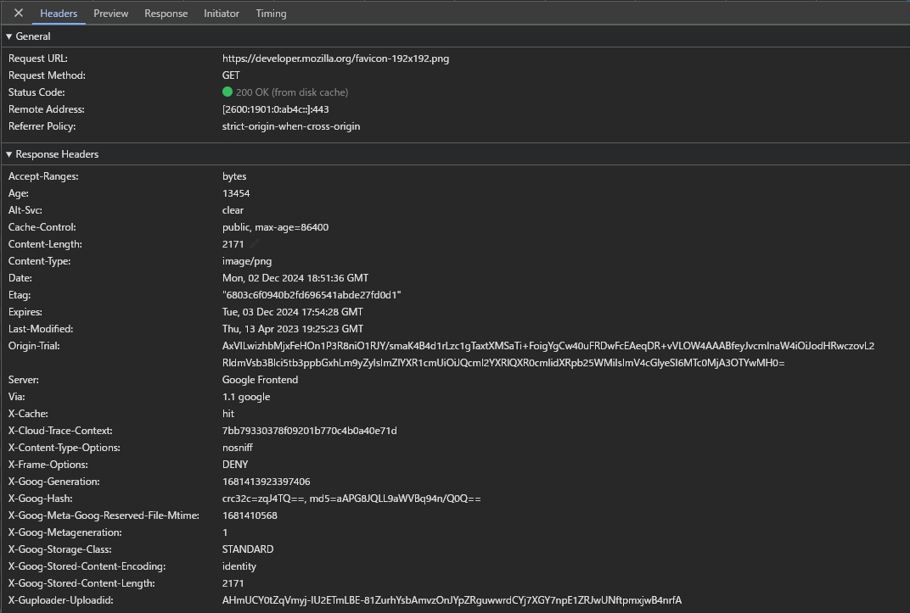
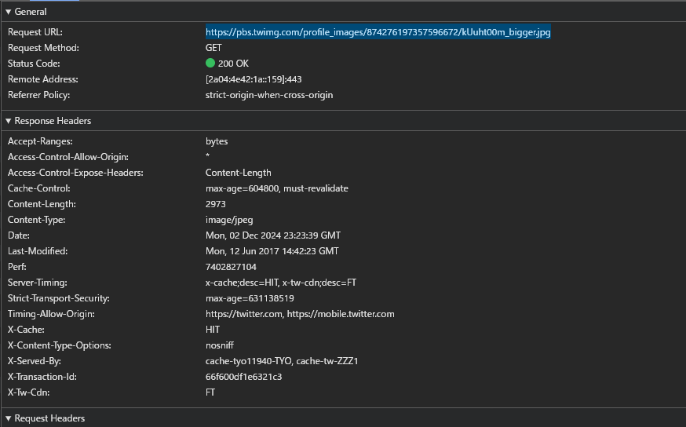
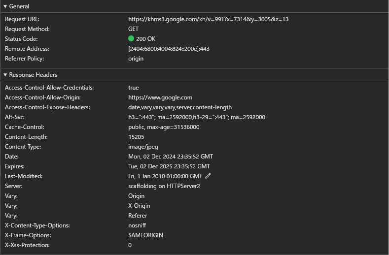

# 課題1（質問）
> 1. なぜキャッシュが必要なのか、説明してください

キャッシュを用いるメリットとして、画面の表示速度の向上、サーバー負荷の軽減やネットワーク帯域を節約などがある。

## クライアントキャッシュ
クライアントサイドキャッシュでは、webブラウザーまたはアプリケーションがユーザーのデバイスにデータをローカルに保存して、パフォーマンスを向上させ、サーバーの負荷を軽減する手法。

## サーバーサイドキャッシュ
サーバーサイドキャッシュは、頻繁にアクセスされるデータをダーバーのメモリに保存し、データの取得や計算を繰り返す必要性を減らすことで、アプリケーションのパフォーマンスを向上させるために使用される手法。  
一般的な方法には、データベースクエリの結果、HTMLフラグメント、API応答のキャッシュがある。

[強いキャッシュと弱いキャッシュ](https://zenn.dev/mesi/articles/e218457fc6c52e) 

> 2. キャッシュヒット率とは何でしょうか？どのように向上できるでしょうか？
キャッシュヒット率とは、キャッシュのパフォーマンスを評価する指標の1つ。

キャッシュヒット率 = キャッシュヒット数 / (キャッシュヒット数 + キャッシュミス数)

## キャッシュヒット
キャッシュヒットとは、命令処理に必要なデータがキャッシュメモリに存在し、キャッシュメモリからデータを読み込むことができること

## キャッシュミス
キャッシュミスとは、命令処理に必要なデータがキャッシュメモリに存在せず、キャッシュメモリからデータを読み込むことができないこと

↓ これはCPUのキャッシングの話だけど、基本的に考えは同じだと思う

[キャッシュヒット、キャッシュミスとは：用語解説](https://www.fujitsu.com/jp/products/computing/servers/unix/term/cachehit/)

CDNでのキャッシュヒット率を向上させるには、、、

1. クエリストリングの最適化: 
    クエリストリングが異なると、同じURLでも異なるコンテンツとして扱われるため、キャッシュヒット率が低下します。不要なクエリストリングを削除するか、CDNの設定で無視するようにします。
2. Cookieの管理:
    Cookieが付与されると、キャッシュが無効化されることがあります。必要のないCookieを削除するか、CDNの設定で無視するようにします。

[CDN で高いHIT率にするチューニングとは](https://blog.redbox.ne.jp/cdn-high-hitrate-cookie-query.html)

> 3. キャッシュには様々な種類があります。いくつか例を挙げてそれぞれのキャッシュの違いを説明してください（「ブラウザキャッシュ」「プロキシキャッシュ」など）

- ブラウザキャッシュ
  ユーザーのブラウザに保存されるキャッシュで、ウェブページのリソース（画像、CSS、JavaScriptなど）を一時的に保存します。これにより、同じページを再訪問する際にリソースを再ダウンロードする必要がなくなり、ページの読み込み速度が向上します。

- プロキシキャッシュ
  ネットワーク上のプロキシサーバーに保存されるキャッシュで、複数のユーザーが同じリソースにアクセスする際に、サーバーへのリクエストを減らすことができます。これにより、帯域幅の節約とサーバー負荷の軽減が可能になります。

- CDNキャッシュ
  コンテンツ配信ネットワーク（CDN）に保存されるキャッシュで、地理的に分散したサーバーにコンテンツを保存し、ユーザーに最も近いサーバーからコンテンツを配信します。これにより、遅延が減少し、ユーザーエクスペリエンスが向上します。

> 4. HTTP通信における、ブラウザがキャッシュを制御するために存在するヘッダーを3つ以上挙げて、それぞれの役割を説明してください

- [Cache-Control](https://developer.mozilla.org/ja/docs/Web/HTTP/Headers/Cache-Control)
  このヘッダーは、キャッシュの動作を詳細に制御するために使用されます。例えば、`no-cache`はキャッシュを使用せずにサーバーから最新のリソースを取得することを指示し、`max-age`はキャッシュが有効である期間を秒単位で指定します。

- [Expires](https://developer.mozilla.org/ja/docs/Web/HTTP/Headers/Expires)
  このヘッダーは、リソースの有効期限を指定するために使用されます。指定された日時を過ぎると、キャッシュされたリソースは無効とされ、再度サーバーから取得されます。

- [Age](https://developer.mozilla.org/ja/docs/Web/HTTP/Headers/Age)
  このヘッダーは、キャッシュされたリソースがサーバーから取得されてからの経過時間を秒単位で示します。これにより、キャッシュの新鮮さを判断するのに役立ちます。

- [Vary](https://developer.mozilla.org/ja/docs/Web/HTTP/Headers/Vary)
  このヘッダーは、キャッシュのバリエーションを指定するために使用されます。特定のリクエストヘッダーに基づいて異なるバージョンのリソースをキャッシュすることができます。例えば、`Vary: Accept-Language`は、言語設定に基づいて異なるキャッシュを作成することを意味します。これは、Accept-Language: en ヘッダーでキャッシュされた英語のコンテンツが、Accept-Language: ja リクエストヘッダーを持つリクエストに対して再利用されないようにするためです。

- [ETag](https://developer.mozilla.org/ja/docs/Web/HTTP/Headers/ETag)
  このヘッダーは、リソースのバージョンを識別するためのタグを提供します。ブラウザはサーバーに対してこのタグを送信し、リソースが変更されていない場合はキャッシュを使用することができます。

- [Last-Modified](https://developer.mozilla.org/ja/docs/Web/HTTP/Headers/Last-Modified)
  このヘッダーは、リソースが最後に変更された日時を示します。ブラウザはこの情報を使用して、リソースが変更されていないかどうかを確認し、キャッシュを使用するかどうかを決定します。 ETag ヘッダーよりも精度は低く、その代替手段になります。 If-Modified-Since や If-Unmodified-Since ヘッダーを含む条件付きリクエストはこのフィールドを使用します。

[HTTP キャッシュ](https://developer.mozilla.org/ja/docs/Web/HTTP/Caching#%E3%82%AD%E3%83%A3%E3%83%83%E3%82%B7%E3%83%A5%E3%81%AE%E7%A8%AE%E9%A1%9E)

> 5. ブラウザのキャッシュサイズの上限は、ユーザが自由に変更できます
> キャッシュサイズの容量上限を超えると何が起きるでしょうか？容量上限はどの程度でしょうか？

キャッシュサイズの容量上限を超えると、ブラウザは通常、古いキャッシュエントリを削除して新しいデータを保存するためのスペースを確保します。このプロセスは「エビクション（eviction）」と呼ばれます。

- [Firefoxのエビクション戦略](https://developer.mozilla.org/ja/docs/Web/API/Storage_API/Storage_quotas_and_eviction_criteria)
- [Google Chromeのエビクション戦略](https://chromium.googlesource.com/chromium/src/+/refs/heads/main/content/browser/service_worker/README.md#eviction)

容量上限はどの程度でしょうか？
> ウェブストレージは、 Window オブジェクトの localStorage および sessionStorage プロパティを使用してアクセスすることができ、すべてのブラウザーでデータ量が最大 10[MiB](https://academy.gmocloud.com/wp/keywords/20170510/4314) に制限されています。

[ブラウザーのストレージ制限と削除基準](https://developer.mozilla.org/ja/docs/Web/API/Storage_API/Storage_quotas_and_eviction_criteria#%E3%82%A6%E3%82%A7%E3%83%96%E3%82%B9%E3%83%88%E3%83%AC%E3%83%BC%E3%82%B8)

> 6. あなたは、マイページ（ユーザの情報が動的に表示されるページ）の作成を任されました。マイページへのアクセスが多いことに気づいたあなたは、マイページをキャッシュしておくことを考えました。そこで「Expires」ヘッダをレスポンスに含めることで、1週間程度はキャッシュを使用するように設定しました
> すると先輩エンジニアに「動的なサイトをキャッシュするなら、Expiresは使わない方が良いよ。そもそも今時あんまりExpires使わないし」と言われました。
> 6-1. なぜ動的なサイトではExpiresは使わないのでしょうか？

Expiresヘッダは指定された期日が過ぎるまで新しいコンテンツを取りに行かないという仕様のため、頻繁に更新されるようなコンテンツには適していない。
また、Expiresヘッダが付与されている場合、EtagとIf-Modified-Sinceを上書きしてしまいます。つまり、最新のコンテンツをサーバーから取りに行くことをせずExpiresヘッダに付与されている期間までブラウザのキャッシュを読みにいってしまいます。

> 6-2. なぜ今時あまり使われないのでしょうか？

タイムゾーンの違いなどの要因で`Expires`の時刻形式は解釈が難しく、不具合が発生しやすい。

> 6-3. どう対応すれば良いのでしょうか？

キャッシュの有効期限は`Expires`ではなく`Cache-Control: max-age`で指定できる。`max-age`は秒数で指定する。

[有効期限または max-age](https://developer.mozilla.org/ja/docs/Web/HTTP/Caching#%E6%9C%89%E5%8A%B9%E6%9C%9F%E9%99%90%E3%81%BE%E3%81%9F%E3%81%AF_max-age)

> 7. ブラウザのキャッシュがWEBサービスに用いられている実例を、3つ以上見つけて共有してください。どのような仕組みで対象がキャッシュされているのか、技術的な流れを説明してみてください

mozilla web docs Cachingのページのicon画像

https://developer.mozilla.org/ja/docs/Web/HTTP/Caching

Cache-Control, Expires, ETag, Last-Modifiedが設定されている。
ExpiresとCache-Controlがどちらも設定されている場合は、Cache-Controlが優先される
Cache-Controlのmax ageが切れていたら、ETag, Last-Modifiedを下にサーバーに問い合わせて必要に応じて、リソースを更新する。

なんで、Expires設定してるんだろう？
[強いキャッシュ弱いキャッシュについて改めて調べてみた Cache-Control,Expires,Last-Modified,ETag](https://blog.nikuniku.me/entry/2021/08/10/081050)

XのHome画面 postのユーザーicon画像

https://pbs.twimg.com/profile_images/874276197357596672/kUuht00m_bigger.jpg

Cache-Control, Last-Modifiedが設定されている。

X-CacheがHITとなっているので、CDNがリクエストを処理したと理解できる。

Google衛星画像データ
https://khms3.google.com/kh/v=991?x=7314&y=3005&z=13

Cache-Control, Expires, Last-Modifiedが設定されている。

Cache-Controlのmax ageが優先されるのに、Expiresが設定されているのはなぜだろう？古いブラウザーに対応するためかな？

# 課題２（実装）
実装しました
https://github.com/YamazakiYusuke/praha-challenge-hono-52-2/blob/54/src/index.ts

ブラウザーでリフレッシュするとCache-Controlのmax-age設定した方も再取得してるな、、
なんでだろう

# 課題３（成果物に関する質問）
- ブラウザキャッシュを使うべきではない状況を考えて、ペアと会話してみてください
ユーザーのプライバシーやセキュリティが重要なサービス(オンラインバンキングや医療情報システム)

# 課題４（クイズ）
Q1. 強いキャッシュ弱いキャッシュとはなんですか？
Q2. Cache-Controlの`no-cache`と`no-store`の違いは？
Q3. クライアント側で一度キャッシュを強制的に無効にする方法は？

A1. 
TTL期間中は強いキャッシュ(Cache-Control, Expires)で、リクエストのタイミングでTTLが切れていれば検証が必要な弱いキャッシュ(ETag, Last-Modified)  
それぞれのヘッダの役割を覚えれば、この概念は特に重要ではない気がする、、、
[強いキャッシュ 弱いキャッシュとはなにか](https://blog.xcir.net/?p=2869)

A2. 
`no-cache`は、キャッシュされたリソースを使用する前に、必ずサーバーにそのリソースの有効性を確認することを指示します。
`no-store`は、リソースをキャッシュに保存しないことを指示し、ブラウザやキャッシュにデータを保存しないようにします。

[リクエストディレクティブ](https://developer.mozilla.org/ja/docs/Web/HTTP/Headers/Cache-Control)

A3. 
- Cache Busting
GETパラメータのクエリストリングを変えるとブラウザは異なるURLと認識するため、キャッシュを読まずに最新ファイルを再取得してくれます。

<link href="https://example.com/css/style.css?ver=210615" rel="stylesheet">

