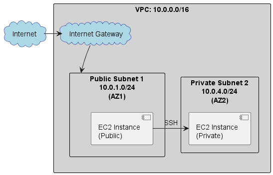

# 課題１
## プライベートサブネットとパブリックサブネットの違いを説明してください
### サブネット（サブネットワーク）
1つの大きなネットワークを複数の小さなネットワークに分割したネットワークのこと。

サブネットマスクは、ネットワーク部(IPアドレスが所属するネットワークを識別するアドレス部分)とホスト部(ネットワーク内の機器を識別するためのアドレス部分)を分ける仕組み。

### プライベートネットワーク
社内ネットワークや家庭内ネットワークなど、接続できるユーザーを限定しているネットワークのこと。
通常、企業内や家庭内で使用され、外部からのアクセスは制限されている。
プライベートIPアドレスを使用し、NAT（Network Address Translation）を通じてインターネットにアクセスすることが一般的。
例: 家庭内のネットワーク、会社内のネットワーク

### パブリックネットワーク
インターネット上でユニークなIPアドレスを持ち、他のインターネット上のデバイスからアクセス可能。
ウェブサイトやオンラインサービスなど、広くアクセスされることを目的としたネットワーク。

### プライベートサブネット
プライベートネットワークのサブネット。
外部のインターネットから直接アクセスできないサブネット。

### パブリックサブネット
パブリックネットワークのサブネット。
インターネットLゲートウェイを通じてインターネットに直接接続できるサブネット。

## VPCにプライベートサブネットとパブリックサブネットをマルチAZで構築してみてください
### VPC(Amazon Virtual Private Cloud)
AWS上に作成できるプライベート仮想ネットワーク空間。

### AZ(AWS Availability Zone)
アベイラビリティーゾーンは、複数の「データセンター（DC）」から構成されるインフラ設備の単位。


リージョン: 特定の地理的エリアを示したもの。
AZ: 1つまたは複数の物理的なデータセンターで構成されており、同じリージョン内に複数存在する。

[AWS アベイラビリティーゾーンとは？わかりやすく解説](https://managed.gmocloud.com/knowledge/aws/availability-zone.html)


### シングルAZ
アベイラビリティーゾーン（AZ）を1つだけ使用したシステム構成。

例: テスト用サーバーの構築
該当するAZで障害が発生すると全システムが止まるけど、テスト用サーバーなら、コストや管理のしやすさ的にメリットが多いというこよかな。


### マルチAZ
AZをを2つ以上利用したシステム構成。
Web3階層アーキテクチャの例


片方のAZで障害が発生しても、もう片方でリカバリーできる。

### AWS Internet Gateway
- VPCとインターネットとの間の通信を可能にするためのもの。
- IPv4 アドレスが割り当てられているインスタンスへNATをする

### NAT(Network Address Translation)
送信元、もしくは宛先となるIPアドレスを別のIPアドレスへ変換する技術のこと。
一般的には、プライベートIPアドレスをグローバルIPアドレスに変換、もしくはその逆を行う。

必要性
仮にプライベートIPアドレスでインターネットへの接続を試みようとしても、プライベートIPアドレスはインターネット上にルート情報が存在しないため通信できません。プライベートネットワークからインターネットに接続しようとする場合は、必ずグローバルIPアドレスにNATすることが必要になります。

NATは、プライベートネットワークとインターネットの間にあるルーターやファイアウォール、負荷分散装置（ロードバランサー）などのネットワーク機器に機能として備わっており、プライベートIPアドレスとグローバルIPアドレスの変換を行います。


[NATとは？アドレス変換の仕組みや必要性、NAPTとの違いを解説](https://baremetal.jp/blog/2023/09/08/1298/)

### ルートテーブル
ルートテーブルとは、VPC内（サブネット内）の通信を振り分けるルールの一覧こと

[【図解AWS】ルートテーブルとは？初心者にもわかりやすく解説！](https://en-junior.com/routetable/)

### セキュリティグループ
AWSのセキュリティグループとは、VPC（Amazon Virtual Private Cloud：AWSの仮想ネットワーク）上に構築したAmazon EC2などのリソースに対して適用できる仮想ファイアウォール機能

[AWSのセキュリティグループとは？ 設定上の注意やネットワークACLとの違いを解説](https://baresupport.jp/blog/2023/04/10/197/#AWS%E3%82%BB%E3%82%AD%E3%83%A5%E3%83%AA%E3%83%86%E3%82%A3%E3%82%B0%E3%83%AB%E3%83%BC%E3%83%97%E3%81%A8%E3%81%AF)

#### インバウンド
インバウンドとは外部からEC2インスタンスへ向かう内向きの通信

#### アウトバウンド
アウトバウンドとはEC2インスタンスから外部へ出る外向きの通信

## パブリックサブネットにSSH可能なEC2インスタンスを立てて、アクセスしてみてください
## プライベートサブネットにもEC2インスタンスを立てて、パブリックサブネットのEC2インスタンスからのみプライベートサブネットのEC２インスタンスにSSHでアクセスできるようにしてください
## プライベートサブネットにVPCの外から（自身のパソコンのターミナルなどから）アクセスできないことを確認してください
以下のような構成で作成しました



```
// Localからprivateのインスタンスにアクセスはできない。
/local $ ssh -A ec2-user@10.0.2.XXX
[1]+  Stopped                 ssh -A ec2-user@10.0.2.XXX

// Localからpublicのインスタンにはアクセスできる
/local $ ssh -A ec2-user@23.22.247.XXX
   ,     #_
   ~\_  ####_        Amazon Linux 2023
  ~~  \_#####\
  ~~     \###|
  ~~       \#/ ___   https://aws.amazon.com/linux/amazon-linux-2023
   ~~       V~' '->
    ~~~         /
      ~~._.   _/
         _/ _/
       _/m/'
Last login: Tue Feb 11 09:13:23 2025 from XXX.XX.XX.XXX

// PublicのインスタンスからPrivateのインスタンスにアクセスできる
[ec2-user@ip-10-0-1-100 ~]$ ssh ec2-user@10.0.2.XXX
   ,     #_
   ~\_  ####_        Amazon Linux 2023
  ~~  \_#####\
  ~~     \###|
  ~~       \#/ ___   https://aws.amazon.com/linux/amazon-linux-2023
   ~~       V~' '->
    ~~~         /
      ~~._.   _/
         _/ _/
       _/m/'
Last login: Tue Feb 11 09:13:39 2025 from 10.0.1.100
```

<details>
<summary>以下の手順でやりました</summary>

```
1. VPCの作成
AWSマネジメントコンソールでVPCサービスを選択し、新しいVPCを作成します。
CIDRブロックを指定（例: 10.0.0.0/16）。
2. サブネットの作成
パブリックサブネット: VPC内にパブリックサブネットを作成し、異なるAZ（例: us-east-1a）に配置します。CIDRブロックを指定（例: 10.0.1.0/24）。
プライベートサブネット: 別のAZ（例: us-east-1b）にプライベートサブネットを作成し、CIDRブロックを指定（例: 10.0.2.0/24）。
インターネットゲートウェイの設定
インターネットゲートウェイを作成し、VPCにアタッチします。
パブリックサブネット用のルートテーブルを編集し、インターネットゲートウェイへのルートを追加します。
4. セキュリティグループの設定
パブリックサブネット用のセキュリティグループを作成し、SSHアクセスを許可します。
プライベートサブネット用のセキュリティグループを作成し、パブリックサブネットのインスタンスからのSSHアクセスを許可します。
EC2インスタンスの起動
パブリックサブネット: パブリックIPを自動割り当ててEC2インスタンスを起動します。
プライベートサブネット: プライベートIPのみでEC2インスタンスを起動します。
SSHエージェント転送を使用した接続
ローカルマシンでSSHエージェントを起動し、キーペアを追加します。
パブリックインスタンスにSSHで接続し、エージェント転送を有効にしてプライベートインスタンスに接続します。
```

</details>