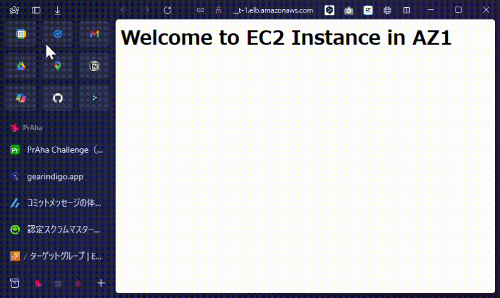

# 課題１
## 先ほどの課題で作成した、マルチAZに展開されたプライベート、パブリックサブネットを使用します
## それぞれのAZのプラベートサブネットにEC2インスタンスを構築してください。（今回の課題で計2個EC2インスタンスを設定することになります）
## それぞれのEC2にNginxを導入して、それぞれのEC2インスタンスから別々のHTMLページを返すようにしてください
## いずれかのパブリックサブネットにALB（アプリケーションロードバランサー）を設置して、ALB経由でブラウザからnginxで設定したページにアクセスできるようにしてください
## ALBのAレコードにブラウザからアクセスして、先ほど設置したページが表示されるか確認してください。アクセスするたびに表示されるサンプルページがランダムで変わるはずです

## 片方のEC2インスタンスを停止して、再度ALBのAレコードにアクセスしてください
## 落ちていない方のEC2インスタンスの画面が表示され続けていることを確認してください
AZ1と止めると、確かにAZ2しか表示されなくなった

## 詰まったところ
- ロードバランサーには2つのインターネットゲートウェイにアクセスできるsubnet(public subnet)を紐づける必要がある。
- ロードバランサーが振り分けるec2インスタンスは、ロードバランサーに紐づけたpublic subnetと同じAZに存在する必要がある。
- private subnetにアクセスする際にpublic subnetに設置してた、ec2インスタンスを踏み台にする必要があった。ssh接続にssh-agentというのを使うことで、keyをコピーしないでも、privateのインスタンスに接続できた。
- private subnetにnginxをインスールする際に、ねーっとワークの接続が必要だったが、NATゲートウェイをルーティングテーブルに追加してあげる必要があった。