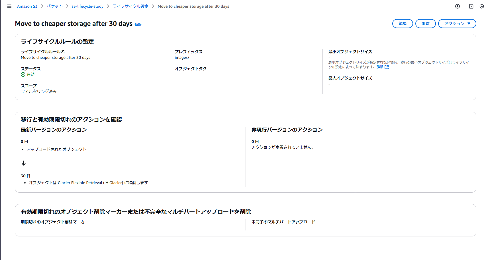
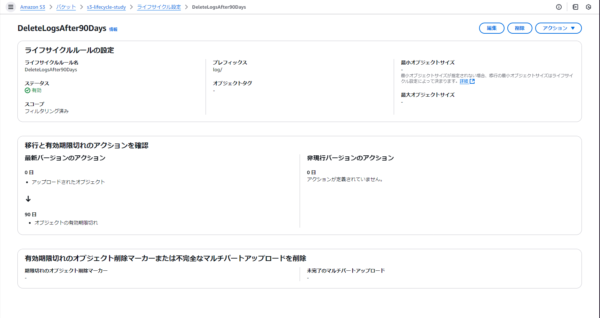
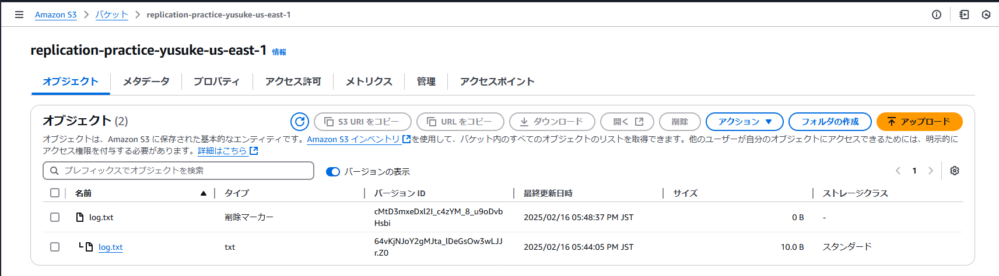

# 課題１（ストレージクラス）
## ストレージクラス
### S3には何種類かの「ストレージクラス」が存在します。どのような時に、どのストレージクラスを選択するべきでしょうか？

[AWS S3 ストレージクラス比較](https://zenn.dev/k_tana/articles/2023-07_aws-s3-storage-class)

### ほとんどアクセスされないバケットを作成する場合はどのストレージクラスの選定が良いでしょうか？
条件によって変わってくる。

- 即時のデータ取り出しが必要
  - AZ耐障害性が必要
    - Standard-IA
    - Glacier Instant Retrieval
  - AZ耐障害性が不要
    - One Zone IA
- 即時のデータ取り出しが不要
  - Glacier Flexible Retrieval
  - Glacier Deep Archive

## ライフサイクル
### ライフサイクルとは何でしょうか？
AWS S3のライフサイクルは、オブジェクトのストレージ管理を自動化するための機能。
ライフサイクルポリシーを設定することで、オブジェクトのストレージクラスを自動的に変更したり、不要になったオブジェクトを削除したりすることができる。
[オブジェクトのライフサイクルの管理](https://docs.aws.amazon.com/ja_jp/AmazonS3/latest/userguide/object-lifecycle-mgmt.html)

### ある日先輩から「S3にアップロードされる本人確認書類の画像は登録以降ほとんど使われないんだけど、一応監査のために取っておく必要があるんだよね。作成から30日経ったら、もっと安いストレージクラスに移動するようにしておいて！」と頼まれました
#### pngやjpegなどの任意の画像を用意してS3に保存してください
#### 上記の仕様を満たすようなライフサイクルを画像オブジェクトに設定してみましょう

### ある日、別の先輩から「このログファイルは90日経ったら要らないらしいから、作成から90日経ったら自動的に消えるようにしておいて！」と頼まれました
#### 任意の.txtファイルを用意してS3に保存してください
#### 上記の仕様を満たすようなライフサイクルをファイルに設定してみましょう
ライフサイクルルールを追加。
ライフサイクルルールのアクションを「[オブジェクトの有効期限切れ](https://docs.aws.amazon.com/ja_jp/AmazonS3/latest/userguide/lifecycle-expire-general-considerations.html)」にして、日数を90日にする。

- [S3のライフサイクルルールのアクションを理解する](https://www.capybara-engineer.com/entry/2021/09/16/151849)

# 課題２（バックアップ）
## S3における「バージョニング」と「レプリケーション」の違いは何でしょうか？
### バージョニングとは
目的
バージョニングは、オブジェクトの異なるバージョンを保存することで、データの誤削除や上書きから保護することを目的とする。

機能
バージョニングを有効にすると、同じキーのオブジェクトに対して複数のバージョンを保存できる。
これにより、誤ってデータを削除したり上書きした場合でも、以前のバージョンに戻すことが可能。

使用例
データの変更履歴を保持したい場合や、誤操作によるデータ損失を防ぎたい場合に有効。

### レプリケーションとは
目的
レプリケーションは、データの冗長性を高め、異なるリージョンやバケット間でデータを自動的に複製することを目的とする。

機能
レプリケーションを設定すると、指定したバケット内のオブジェクトが自動的に他のバケットにコピーされる。これにより、データの可用性と耐障害性が向上する。

使用例
災害復旧のためにデータを異なる地理的リージョンに複製したい場合や、データのアクセス速度を向上させるために複数のリージョンでデータを利用可能にしたい場合に有効。

疑問
S3のストレージクラスの選定でAZ耐障害性があるものを選べば、レプリケーションいらなくない？？

回答
AZ耐障害性がある場合、単一のAZの障害に対しては十分な保護が提供されますが、リージョン全体の障害や災害に対する保護を考慮する場合は、レプリケーションが有効です。
核戦争とか、首都直下地震とかあったら同一リージョン内のAZが壊滅するから、AZ耐障害性では不十分ってことらしい。

## レプリケーション
### 2つのリージョンにバケットを作り、クロスリージョンレプリケーションを設定してください
### レプリケーション元のパケットにオブジェクトを新規作成してください
### レプリケーション先のバケットにオブジェクトがコピーされていることを確認してください
レプリケーションの設定もGUIでポチポチ簡単にできた。
originalにアップロードしたら、数秒後にレプリケーション先にもコピーされていた。
レプリケーションするには、originalもレプリケーション先もバージョニングを有効にする必要があるみたい。

[Amazon S3のレプリケーション機能を使用してみました。](https://dev.classmethod.jp/articles/lim-s3-replication/)

## バージョニング
### バージョニングを有効にしたS3バケットを作成し、任意のファイルを保存してください
#### 保存したオブジェクトを削除してください（誤って誰かが削除してしまったケースを想定しています）
#### バージョニング機能を活かして、削除してしまったファイルを復元してみましょう

バージョニングを有効にしておくと、バージョン表示を有効にすると削除マーカーが表示される。
削除マーカーだけを消してやると、基のファイルが復活する。

感想
やりたいこととできることを理解しておけばGPTが手取り足取り教えてくれる。