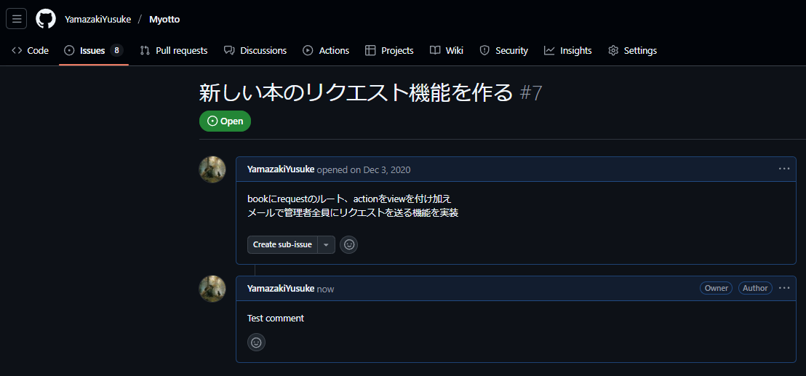

# 課題1
> この課題ではGitHub REST APIを使ってCLIアプリケーションを実装します。

## GitHub REST APIで使用できるエンドポイントには、認証が必要なものがあります。認証が必要なエンドポイントを使用できるように、トークンを生成しておきましょう。
> 今回の課題ではPersonal access tokensを生成していただければ大丈夫です。

## GitHubの設定画面ではPersonal access tokensの他にGitHub AppsやOAuth Appsがあったと思います。これらにはどのような違いがあるのでしょうか？どのようなシチュエーションでどの認証方法を選択すべきか、考えてみましょう。
### Personal access tokens
個人アクセス トークンは、自分に代わって GitHub リソースにアクセスするためのもの。

選択すべきシチュエーション:
- 個人開発
- CLIツール

### GitHub Apps
GitHub Apps は、Organization や個人アカウントに直接インストールでき、特定のリポジトリへのアクセス権を付与することが可能

- アクセス権限を細かく設定することができる。
- インストール単位が User/Organization の保持するリポジトリ単位になる。
- リポジトリにおけるイベントの発生も受け取ることができる（Webhook を備える）。

また GitHub Apps は、パーソナルアクセストークン（personal access token）と異なり、個人アカウントに紐づかないので会社組織等で使う際の管理に向いています。

[GitHub Apps のトークンを使ってプライベートリポジトリにアクセスする](https://zenn.dev/farstep/articles/32751d92dd1452)

選択すべきシチュエーション:
- アクセス権限をより細かく設定したい場合。
- Organizationが、アクセス権限を管理したい場合。
- 長期的な運用・保守の必要性。

### OAuth Apps
OAuth Apps は「誰かとして認証」する事で、そのユーザが持つ権限の範囲内で、リソースを操作できるようになる。

[GitHub AppsとOAuth Appsの違いが分からなかった人のために、日本一わかりやすく説明してみた](https://qiita.com/dowanna6/items/cfe3fc88643d3ef95a37#%E7%B5%90%E8%AB%96)
松原さんの記事わかりやすかったです。

選択すべきシチュエーション:
- ユーザーの個人情報やアカウントレベルの操作が必要な場合。
- GitHub以外のサービス（例：GitLab, Bitbucket）も同時にサポートする必要がある場合は、OAuthは標準的な認証プロトコルなので、実装が統一しやすい

# 課題2
> GitHub REST APIを利用して、次の機能を満たすCLIアプリケーションをTypeScriptで開発してみてください。
> ヒント: fetch などを使ってREST APIを直接叩いてもいいですし、SDKを使ってみてもいいかもしれません！

## 認証トークンをコードに直接書く（gitリポジトリでコードとして管理する）ことは避けるべきであると考えられています。なぜでしょうか？また、それを回避する方法を考えて実装してみてください。
コードと一緒に管理すると、誤って流出するリスクがあるため、環境変数として`.env`において、.envは.gitignoreでgit管理から外す。

## issuesの一覧を取得する機能を実装してください。リポジトリのオーナー名・リポジトリの名前を引数で指定できるようにしてください。

```
> npx tsx src/index.ts list-issues -o YamazakiYusuke -r Myotto

Issues:

#66 seedのコード書き直す
State: open
Created by: YamazakiYusuke
URL: https://github.com/YamazakiYusuke/Myotto/issues/66

#65 お気に入り一覧を表示可能にする（自分のお気に入りのみ）
State: open
Created by: YamazakiYusuke
URL: https://github.com/YamazakiYusuke/Myotto/issues/65

#55 welcome page を作る
State: open
Created by: YamazakiYusuke
URL: https://github.com/YamazakiYusuke/Myotto/issues/55

#53 管理者専用の管理ページを作る
State: open
Created by: YamazakiYusuke
URL: https://github.com/YamazakiYusuke/Myotto/issues/53

#51 translationのlikeをAjaxにする
State: open
Created by: YamazakiYusuke
URL: https://github.com/YamazakiYusuke/Myotto/issues/51

#47 DM機能を追加
State: open
Created by: YamazakiYusuke
URL: https://github.com/YamazakiYusuke/Myotto/issues/47

#46 google 翻訳投稿のAPIを実装する
State: open
Created by: YamazakiYusuke
URL: https://github.com/YamazakiYusuke/Myotto/issues/46

#7 新しい本のリクエスト機能を作る
State: open
Created by: YamazakiYusuke
URL: https://github.com/YamazakiYusuke/Myotto/issues/7
```


## 特定のissueにコメントする機能を実装してください。リポジトリのオーナー名・リlポジトリの名前・issueの番号・コメントの内容を引数で指定できるようにしてください。

```
> npx tsx src/index.ts create-comment -o YamazakiYusuke -r Myotto -i 7 -c "Test comment"

Comment created successfully!
URL: https://github.com/YamazakiYusuke/Myotto/issues/7#issuecomment-2727251631
```
ちゃんと追加できている🙆


ほぼAPIに実装してもらいました
[実装](https://github.com/YamazakiYusuke/github-cli-app/pull/1)