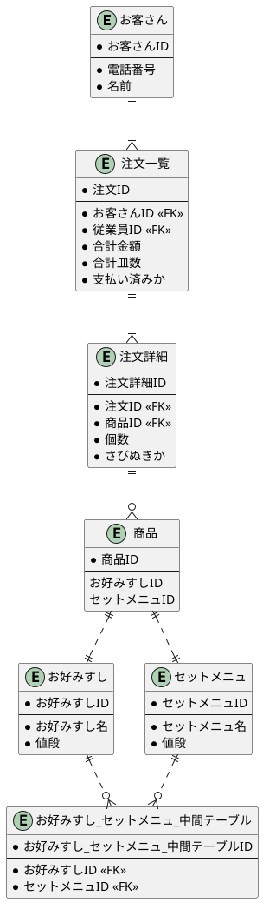

# 課題１

## 疑問点メモ

- 主キーは複数のキーを選択できるのか。複数キーにするのと新たにIDを設けるのとどちらがいいのか。
- 「お客さん.電話番号」みたいな指定ができるのか。IDはIDじゃだめなのか。"商品"IDとかつけないといけないのか

# 任意課題

ER図には概念、論理、物理モデルがある。基本的には概念→論理→物理の順に詳細化していく類のもの。ただサイトによって定義が違うよう…[DMBOKというのが元ネタ](http://jp.drinet.co.jp/blog/datamanagement/data_modeling_3minutes)？PMBOKのDB版？

## 概念モデル

「基本的&重要なエンティティのみを対象にしたデータモデルです。これらのデータをどのように実装するかは考慮せずに、企業の現実をそのまま写し取るようにモデル化します(実装独立)。」（[出典](http://jp.drinet.co.jp/blog/datamanagement/data_modeling_3minutes)）とのこと。現実の写像モデル。

## 論理モデル

「概念データモデルよりもデータの要件が詳細に書かれたデータモデルです。概念データモデルに属性を追加し、正規化という作業を行って作られます。概念データモデルと同じく、実装手段は考慮しません。」（[出典](http://jp.drinet.co.jp/blog/datamanagement/data_modeling_3minutes)）「論理モデルはER図上だけの情報であり、実際のDBとは異なる情報（実体がないエンティティなど）もある」（[出典](https://products.sint.co.jp/ober/blog/logic-physics)）とのこと。おそらく概念と物理の橋渡しであり、現実の写像である概念モデルをテーブル化したものだが、DBの制約は意識していないという理解。
具体的な物理モデルとの違いとしては、下記あたり？（定義にもよりそうだが…）

* カラム名を日本語で表記（テーブルで実際に使う値ではなく、人間がわかりやすい表記）
* 物理テーブル、物理リレーションシップを隠す（多対多リレーションシップをそのまま多対多と表現する。中間テーブルは書かない）

## 物理モデル

そのままDBが作れるレベルのものという理解。

* テーブル名/カラム名はDBで使用するものと一致させる
* 型まで書く

