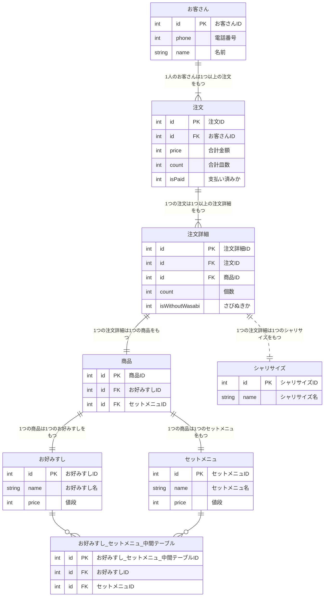

# 課題2

```mermaid
erDiagram

  "お客さん" {
    int id PK "お客さんID"
    int phone "電話番号"
    string name "名前"
  }

  "商品" {
    int id PK "商品ID"
    int id FK "お好みすしID"
    int id FK "セットメニュID"
  }

  "お好みすし" {
    int id PK "お好みすしID"
    string name "お好みすし名"
    int price "値段"
  }

  "セットメニュ" {
    int id PK "セットメニュID"
    string name "セットメニュ名"
    int price "値段"
  }

  "お好みすし_セットメニュ_中間テーブル" {
    int id PK "お好みすし_セットメニュ_中間テーブルID"
    int id FK "お好みすしID"
    int id FK "セットメニュID"
  }

  "注文" {
    int id PK "注文ID"
    int id FK "お客さんID"
    int price "合計金額"
    int count "合計皿数"
    int isPaid "支払い済みか"
  }

  "注文詳細" {
    int id PK "注文詳細ID"
    int id FK "注文ID"
    int id FK "商品ID"
    int count "個数"
    int isWithoutWasabi "さびぬきか"
  }

  "シャリサイズ" {
    int id PK "シャリサイズID"
    string name "シャリサイズ名"
  }

  "お客さん" ||--|{ "注文": "1人のお客さんは1つ以上の注文をもつ"
  "注文" ||--|{ "注文詳細": "1つの注文は1つ以上の注文詳細をもつ"
  "注文詳細" ||--|| "商品": "1つの注文詳細は1つの商品をもつ"
  "商品" ||--|| "お好みすし": "1つの商品は1つのお好みすしをもつ"
  "商品" ||--|| "セットメニュ": "1つの商品は1つのセットメニュをもつ"
  "お好みすし" ||--o{ "お好みすし_セットメニュ_中間テーブル": ""
  "セットメニュ" ||--o{ "お好みすし_セットメニュ_中間テーブル": ""
  "注文詳細" ||..|| "シャリサイズ": "1つの注文詳細は1つのシャリサイズをもつ"
```

## 疑問点メモ

- 