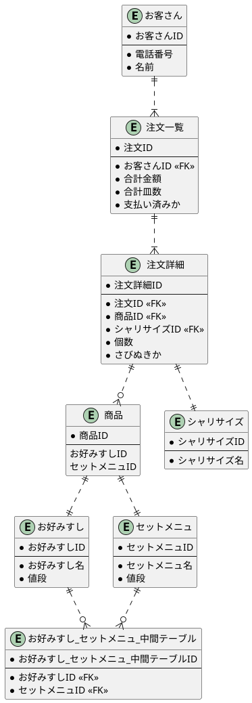

# 課題2

[プレビュー](https://www.plantuml.com/plantuml/uml/dPFVRjCm5CRl_HJHBf6s9vYcNI0an4D4XLfRfAQL6lS26gGwHbj65L4KKWHS5LRO1Xj3PLh5W3tCcTFaBKXiXxanus9NKSwVx_kTe-DDZpIwfEUs46uJXposLe0-voVlWIOGn2jMmxDS-r7F8nqNTwq-igmxUi7zkqLaTRKCv-ykiiDlY-I8lpWl__aeudiHUeh-AlDaXyTKQJe4kr9FXg-LIltfBw2NGDy0VIqI45m0Oy12O1DWGs3J8gn9rtgKXzVpjXq5ROWADpDJO0kemNvwSgPRc0YL2oRAmwZGRCpaZKur8jjijQ_cn_au1hO3x2UmCR3F0gP0aKFR3t6hqzvosbiAxJQI6hsnFcjz_Tw3ZOsRnbPfVQfqTf2ETw_cW-pZ9m5Bx4wtMHsLp2f7uyfqE_uxJgV7F9uiHqTXTX3cko_pINJzltXxcIQdGl_LrtGl0VeidOTYZA79bXtE5jzFTJQxYKd3QMc8gaW3bM4THbrqRKddm3u0EuBW389z27uiTmo62hIScCw0VW4QrIXDZUe2jnjTn_QS9rYIceKQhvda8_5CjNVk-sjhVh_Q0X9V8woMWvP_HL6dhruuaX_PwLTFqenYWbHEzV_hb94e_4-1YIBqzGKXj8dRpPxR-WC0)

## 疑問点メモ

- 