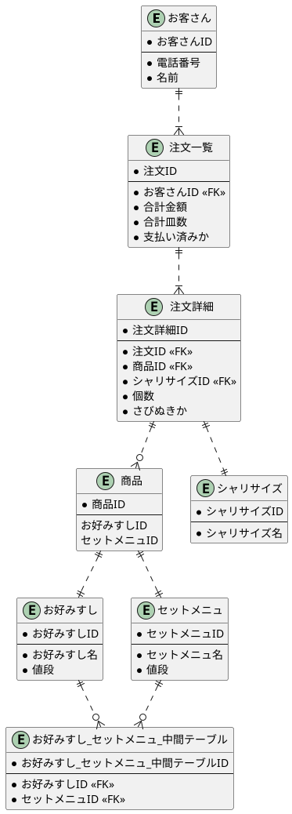

# 課題2

[プレビュー](https://www.plantuml.com/plantuml/uml/dPFVJjH05CRlvoaQBatW2GZXmfWO7w9PtGaqsMwJTdgXMvETZe7Yfd7DsZNg5GeAg8XP2HlHy327wRPlOJlJaQ4ZNd0rcVFd-tvpScOz81sVX6uFuJvno6Dh2UXpVlmUQ0RnPCdg19PhFme3uhdOjmR8ikxe1VVlLf7bvJfSlZil3hyliYF-ugo-yt7ATrBq5FrLvjaMdz16qo7ObNeoVALKw-__1de1z0tGro81yJam1Ym1jWji16o_2clIhPx68mY3JKUQj0gKcvcfi0NKS2y_FjKjJ0JbWedqC2jq6oDverEBo3PRxSlvrt8w0RO5x1UmAR3F0gP2aO-s7-AUrzzm-XiIxLQI6hqnFcjrzTw3jRMRdgtIsglosK4-tRwS3ukFdmGiiJs_gvPAPfMZiMMQ7HydnK5IRhyiTzEh--BjHPwT2ALNt_AT3EYpV9u8u959KHpE5ZzET0gxYqd7wKaOlKX3ac4DHkrkQnndm3u0EuBu5E8zY7zUxnYE6j3wRNG6z0lGj4LfQgXTs-puZXquJx0aDGirNZF9n-93QZywYbPMee6Q0f9dAwo6WwvVHP4tQFuoaeViZDJdCwEOe2Qd-l-nj4WK_gV0G97w-e0GMiVzRkZs_W00)

## 疑問点メモ

- 