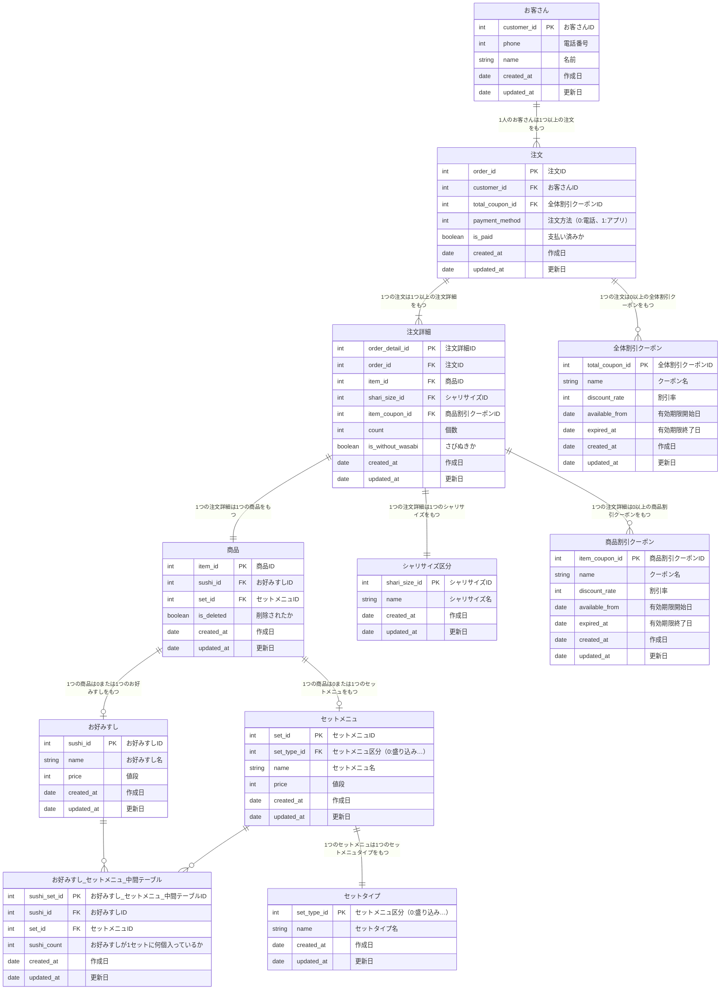

# 課題3

追加仕様

* 自分
  * 全体価格が10/20/30％オフになるクーポンが発行される
  * 特定商品が安くなるキャンペーンが開催される
* tanakas-2021
  * メニューが廃止された場合→商品.is_deletedで対応
* digarashi91
  * ランチ実施
    * 平日11:00-14:00はランチ実施（注文した時間）
    * 「にぎり」「丼」のメニューが税別の価格から10%オフ→クーポンで対応
    * 今後セット区分としての「ランチ」とその中の商品が追加される可能性がある→セットタイプで対応
  * 電話注文だけでなく、アプリからの注文も対応→注文.payment_methodで対応
    * 可能なのは注文のみで、配達などはなし、取りに来てもらう想定
    * アプリ利用の場合、支払いは注文時に必ず済ませるものとする（支払いは外部サービスを使う1択として支払い手段は考慮しない）

## 疑問点メモ

- クーポンの金額への反映はどうする？