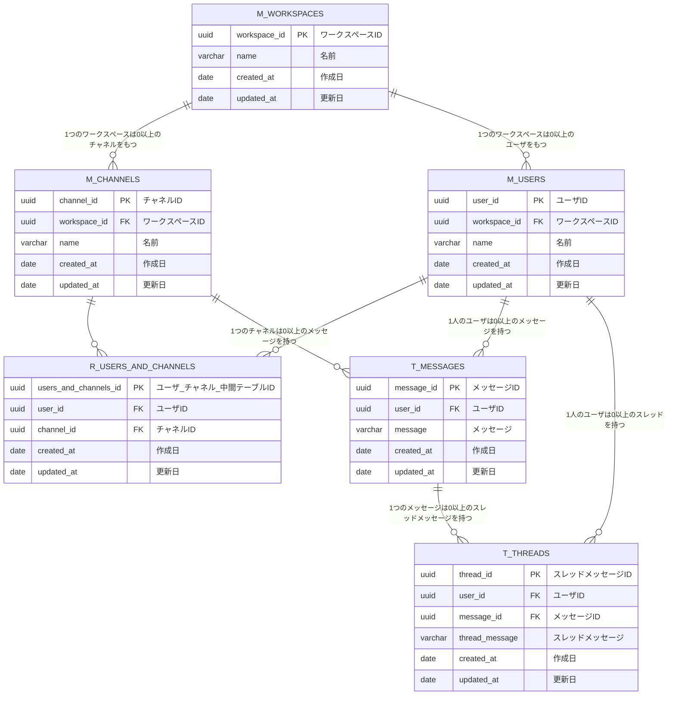

- ワークスペースごとにDBをたてる想定

```mermaid
erDiagram

  M_WORKSPACES {
    uuid workspace_id PK "ワークスペースID"
    varchar name "名前"
    date created_at "作成日"
    date updated_at "更新日"
  }

  M_USERS {
    uuid user_id PK "ユーザID"
    uuid workspace_id FK "ワークスペースID"
    varchar name "名前"
    date created_at "作成日"
    date updated_at "更新日"
  }

  M_CHANNELS {
    uuid channel_id PK "チャネルID"
    uuid workspace_id FK "ワークスペースID"
    varchar name "名前"
    date created_at "作成日"
    date updated_at "更新日"
  }

  R_USERS_AND_CHANNELS {
    uuid users_and_channels_id PK "ユーザ_チャネル_中間テーブルID"
    uuid user_id FK "ユーザID"
    uuid channel_id FK "チャネルID"
    date created_at "作成日"
    date updated_at "更新日"
  }

  T_MESSAGES {
    uuid message_id PK "メッセージID"
    uuid user_id FK "ユーザID"
    varchar message "メッセージ"
    date created_at "作成日"
    date updated_at "更新日"
  }

  T_THREADS {
    uuid thread_id PK "スレッドメッセージID"
    uuid user_id FK "ユーザID"
    uuid message_id FK "メッセージID"
    varchar thread_message "スレッドメッセージ"
    date created_at "作成日"
    date updated_at "更新日"
  }

  M_WORKSPACES ||--o{ M_CHANNELS: "1つのワークスペースは0以上のチャネルをもつ"
  M_WORKSPACES ||--o{ M_USERS: "1つのワークスペースは0以上のユーザをもつ"
  M_USERS ||--o{ R_USERS_AND_CHANNELS: ""
  M_CHANNELS ||--o{ R_USERS_AND_CHANNELS: ""
  M_CHANNELS ||--o{ T_MESSAGES: "1つのチャネルは0以上のメッセージを持つ"
  M_USERS ||--o{ T_MESSAGES: "1人のユーザは0以上のメッセージを持つ"
  T_MESSAGES ||--o{ T_THREADS: "1つのメッセージは0以上のスレッドメッセージを持つ"
  M_USERS ||--o{ T_THREADS: "1人のユーザは0以上のスレッドを持つ"
```

## 疑問点メモ

