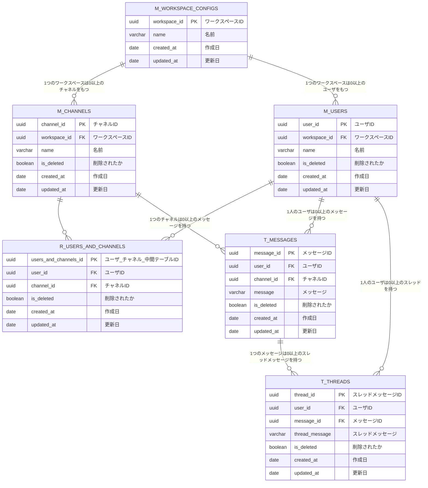

- ワークスペースごとにDBをたてる想定



## 疑問点メモ


# ユースケースを想定したクエリ

「hoge」と検索して、この文字列を含むメッセージとスレッドメッセージを両方とも取得する（検索したユーザが入っているチャネル内のメッセージに限る）

```sql
SELECT * FROM (
    SELECT m.message_id as id, m.user_id, m.channel_id, m.message, m.created_at
    FROM T_MESSAGES m
    JOIN R_USERS_AND_CHANNELS uc ON m.channel_id = uc.channel_id
    WHERE
      uc.user_id = UUID_TO_BIN('f3ea110d-ecb3-5a5c-910c-92e4e710ba81', 1)
      AND message LIKE '%hoge%'

    UNION

    SELECT t.thread_id, t.user_id, null, t.thread_message, t.created_at
    FROM T_THREADS t
    JOIN T_MESSAGES m ON t.message_id = m.message_id
    JOIN R_USERS_AND_CHANNELS uc ON m.channel_id = uc.channel_id
    WHERE
      uc.user_id = UUID_TO_BIN('f3ea110d-ecb3-5a5c-910c-92e4e710ba81', 1)
      AND thread_message LIKE '%hoge%'
) as messages_and_threads
ORDER BY created_at DESC;
```