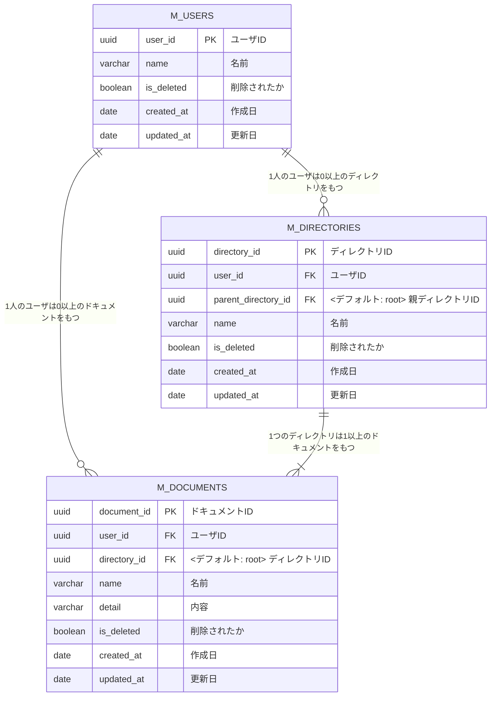

# 課題1

```mermaid
erDiagram

  M_USERS {
    uuid user_id PK "ユーザID"
    varchar name "<Not null> 名前"
    boolean is_deleted "<Not null> 削除されたか"
    date created_at "<Not null> 作成日"
    date updated_at "更新日"
  }

  M_DIRECTORIES {
    uuid directory_id PK "ディレクトリID"
    uuid user_id FK "<Not null> ユーザID"
    uuid parent_directory_id FK "<Not null><デフォルト: root> 親ディレクトリID"
    varchar name "<Not null> 名前"
    boolean is_deleted "<Not null> 削除されたか"
    date created_at "<Not null> 作成日"
    date updated_at "更新日"
  }

  M_DOCUMENTS {
    uuid document_id PK "ドキュメントID"
    uuid user_id FK "<Not null> ユーザID"
    uuid directory_id FK "<Not null><デフォルト: root> ディレクトリID"
    varchar name "<Not null> 名前"
    varchar detail "<Not null> 内容"
    boolean is_deleted "<Not null> 削除されたか"
    date created_at "<Not null> 作成日"
    date updated_at "更新日"
  }

  M_USERS ||--o{ M_DIRECTORIES: "1人のユーザは0以上のディレクトリをもつ"
  M_USERS ||--o{ M_DOCUMENTS: "1人のユーザは0以上のドキュメントをもつ"
  M_DIRECTORIES ||--|{ M_DOCUMENTS: "1つのディレクトリは1以上のドキュメントをもつ"
```

## 疑問点メモ

- CRUDの履歴とかっているんだろうか…DBのHistoryとかあるだろうし二重管理になる気がするのだが…
- ディレクトリが「一つ以上のドキュメントを含む階層構造」となっているが、別にドキュメントは０を許容していい気がする
