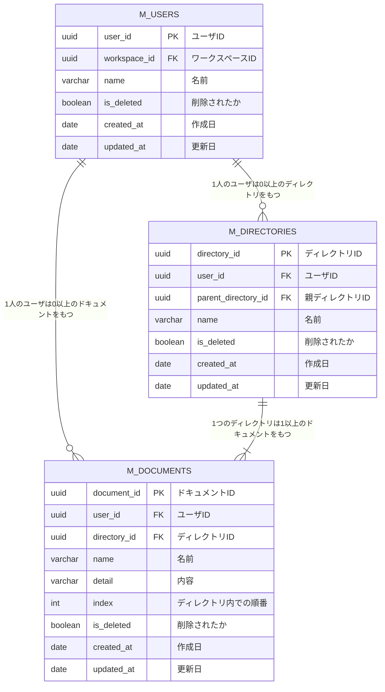

# 課題2

```mermaid
erDiagram

  M_USERS {
    uuid user_id PK "ユーザID"
    uuid workspace_id FK "<Not null> ワークスペースID"
    varchar name "<Not null> 名前"
    boolean is_deleted "<Not null> 削除されたか"
    date created_at "<Not null> 作成日"
    date updated_at "更新日"
  }

  M_DIRECTORIES {
    uuid directory_id PK "ディレクトリID"
    uuid user_id FK "<Not null> ユーザID"
    uuid parent_directory_id FK "<Not null><default: root> 親ディレクトリID"
    varchar name "<Not null> 名前"
    boolean is_deleted "<Not null> 削除されたか"
    date created_at "<Not null> 作成日"
    date updated_at "更新日"
  }

  M_DOCUMENTS {
    uuid document_id PK "ドキュメントID"
    uuid user_id FK "<Not null> ユーザID"
    uuid directory_id FK "<Not null><default: root> ディレクトリID"
    varchar name "<Not null> 名前"
    varchar detail "<Not null> 内容"
    int index "<Not null><default: 最大index+1> ディレクトリ内での順番"
    boolean is_deleted "<Not null> 削除されたか"
    date created_at "<Not null> 作成日"
    date updated_at "更新日"
  }

  M_USERS ||--o{ M_DIRECTORIES: "1人のユーザは0以上のディレクトリをもつ"
  M_USERS ||--o{ M_DOCUMENTS: "1人のユーザは0以上のドキュメントをもつ"
  M_DIRECTORIES ||--|{ M_DOCUMENTS: "1つのディレクトリは1以上のドキュメントをもつ"
```

## 疑問点メモ

- 「色んなサービスのAPIリクエストを眺めてみると面白いかもしれません。例えばtrelloやairtableで要素を並び替えてみた時、どんなリクエストが送られているでしょうか？」どうやって調べる？Network見るってこと？
