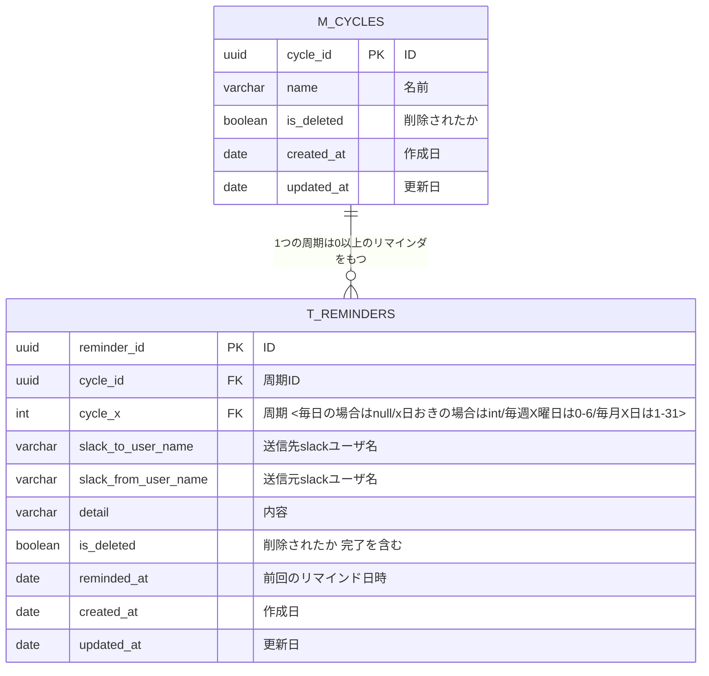

# 課題1

- メッセージはDM想定。複数名ユーザが指定された場合は、複数名にDMする
- リマインダの完了（削除）はユーザごとに行える想定
  - ユーザごとにリマインダのレコードを作成
  - ユーザごとにリマインダの周期を変更可能
- cycle_xの制御はアプリ側で行う想定

```mermaid
erDiagram

  M_CYCLES {
    uuid cycle_id PK "ID"
    varchar name "<Not null> 名前"
    boolean is_deleted "<Not null> 削除されたか"
    date created_at "<Not null> 作成日"
    date updated_at "更新日"
  }

  T_REMINDERS {
    uuid reminder_id PK "ID"
    uuid cycle_id FK "<Not null> 周期ID"
    int cycle_x FK "周期 <毎日の場合はnull/x日おきの場合はint/毎週X曜日は0-6/毎月X日は1-31>"
    varchar slack_to_user_name "<Not null> 送信先slackユーザ名"
    varchar slack_from_user_name "<Not null> 送信元slackユーザ名"
    varchar detail "<Not null> 内容"
    boolean is_deleted "<Not null> 削除されたか 完了を含む"
    date reminded_at "前回のリマインド日時"
    date created_at "<Not null> 作成日"
    date updated_at "更新日"
  }

  M_CYCLES ||--o{ T_REMINDERS: "1つの周期は0以上のリマインダをもつ"
```

## 疑問点メモ
