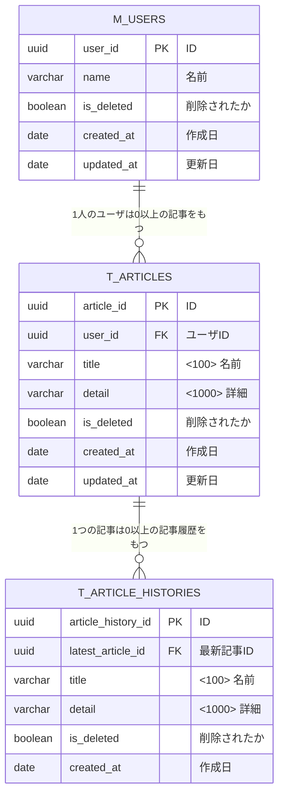

# 課題1

- 記事が更新された場合は、旧データをT_ARTICLE_HISTORIESにレコード追加し、T_ARTICLESを更新する

```mermaid
erDiagram

  M_USERS {
    uuid user_id PK "ID"
    varchar name "<Not null> 名前"
    boolean is_deleted "<Not null> 削除されたか"
    date created_at "<Not null> 作成日"
    date updated_at "<Not null> 更新日"
  }

  T_ARTICLES {
    uuid article_id PK "ID"
    uuid user_id FK "<Not null> ユーザID"
    varchar title "<Not null><100> 名前"
    varchar detail "<Not null><1000> 詳細"
    boolean is_deleted "<Not null> 削除されたか"
    date created_at "<Not null> 作成日"
    date updated_at "<Not null> 更新日"
  }

  T_ARTICLE_HISTORIES {
    uuid article_history_id PK "ID"
    uuid latest_article_id FK "<Not null> 最新記事ID"
    varchar title "<Not null><100> 名前"
    varchar detail "<Not null><1000> 詳細"
    boolean is_deleted "<Not null> 削除されたか"
    date created_at "<Not null> 作成日"
  }

  M_USERS ||--o{ T_ARTICLES: "1人のユーザは0以上の記事をもつ"
  T_ARTICLES ||--o{ T_ARTICLE_HISTORIES: "1つの記事は0以上の記事履歴をもつ"
```

## 疑問点メモ

- 