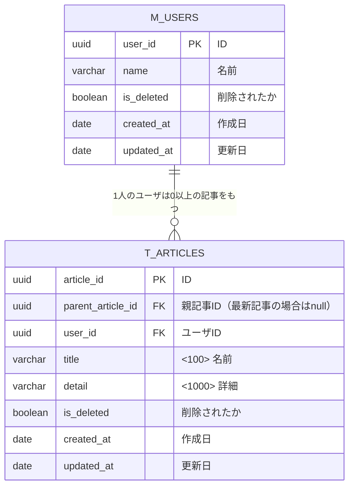

# 課題2

- 記事が更新された場合は、旧データをT_ARTICLE_HISTORIESにレコード追加し、T_ARTICLESを更新する

- メリット
  - １と違って最新のレコードの内容をHistoryに移して、新規レコードを追加し、親レコードを更新するということをする必要がない。単純に新規レコードを追加して、親IDを更新すればよい。
  - テーブルの数が減る
- デメリット
  - T_ARTICLESが肥大化し、検索性能が落ちる→インデックスを貼ればよい？
  - （最新のみの）記事一覧取得がワンクッション必要

## 疑問点メモ

- 