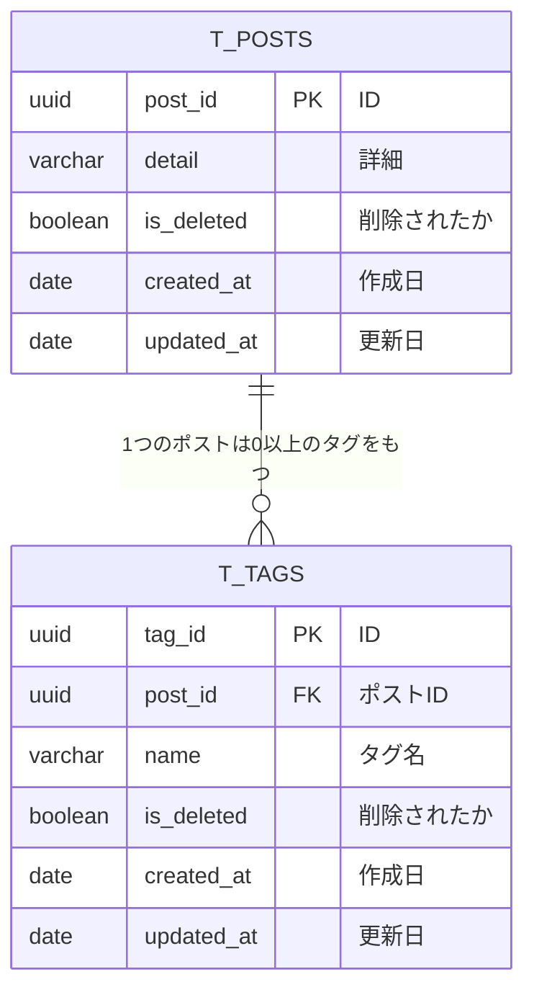

# 課題1

タグは選択式ではなく、フリーテキストとする

- 生じる問題
  - カンマのタイポ、カンマ後にスペースを置くかどうかのブレ、カンマがタグ名に必要な場合
  - 特定のタグが使用禁止になった場合、削除がひと手間かかる
  - 特定のタグでの検索がパターンマッチになり複雑化する
  - 文字数制限をかけづらい

# 課題2

# 課題3

1対多の関係があるケースはほとんど該当しそう。かつカテゴリなどのメインデータではないケースで安易にやってしまいそう。

- ブログのタグ
- ECサイトでセット商品がある場合
- 複数ユーザに対するリマインダ
