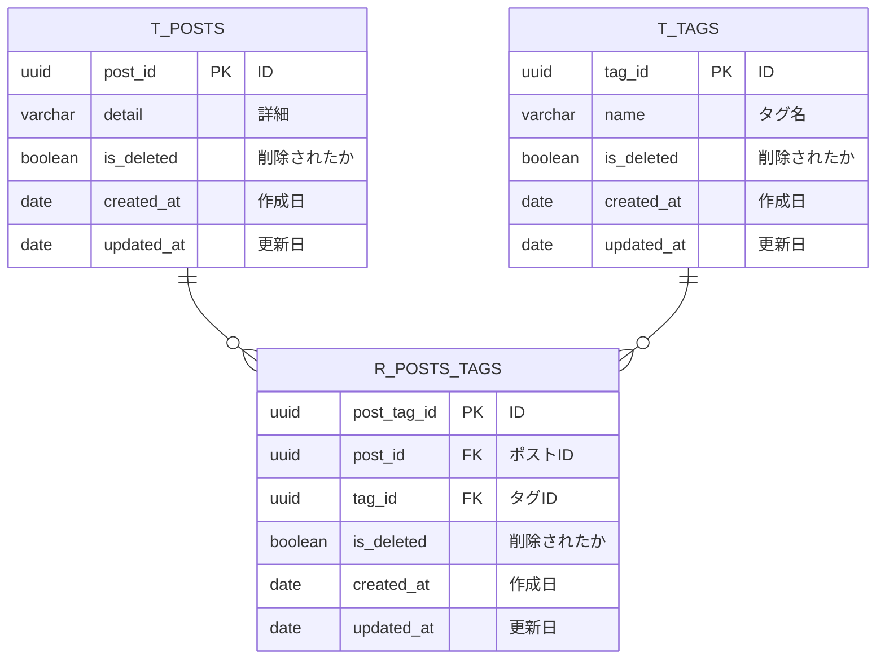

# 課題1

- 生じる問題
  - 4つ以上の場合
  - 1〜３が埋まっている状態で、1が削除された場合
  - 特定のタグでの検索が複数カラムを対象にする必要がある

# 課題2

# 課題3

1対1の関係だと想定していたものが、1対多や多対多になったときにテーブル増やすのはきついしってこうしそう。紐付ける対象がユーザなどのマスタデータの方が起きやすそう。

- 記事の執筆者は一人の想定だったが、共同執筆が可能になって複数を許容しなければならなくなった
- ブログのカテゴリは一つと想定していたが、あとから複数つけられるようになった
