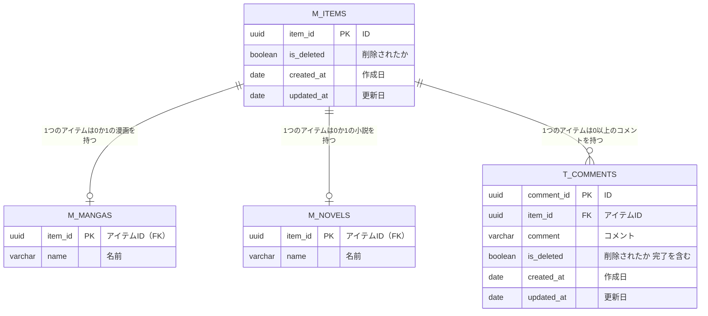

# 課題1

- 生じる問題
  - 外部キーの参照制約がかけられない
  - 結合ができない

# 課題2

```mermaid
erDiagram

  M_ITEMS {
    uuid item_id PK "ID"
    boolean is_deleted "<Not null> 削除されたか"
    date created_at "<Not null> 作成日"
    date updated_at "更新日"
  }

  M_MANGAS {
    uuid item_id PK "アイテムID（FK）"
    varchar name "<Not null> 名前"
  }

  M_NOVELS {
    uuid item_id PK "アイテムID（FK）"
    varchar name "<Not null> 名前"
  }

  T_COMMENTS {
    uuid comment_id PK "ID"
    uuid item_id FK "<Not null> アイテムID"
    varchar comment "<Not null> コメント"
    boolean is_deleted "<Not null> 削除されたか 完了を含む"
    date created_at "<Not null> 作成日"
    date updated_at "更新日"
  }

  M_ITEMS ||--o| M_MANGAS: "1つのアイテムは0か1の漫画を持つ"
  M_ITEMS ||--o| M_NOVELS: "1つのアイテムは0か1の小説を持つ"
  M_ITEMS ||--o{ T_COMMENTS: "1つのアイテムは0以上のコメントを持つ"
```

# 課題3

似てるけどちょっと違うマスタデータがあるとき…？カテゴリの違う商品をテーブル分けて管理してたりするとすぐ起きそう。

- ヨ◯バシで家電と酒類は別テーブルになっていて、苦情テーブルを一元管理している場合
