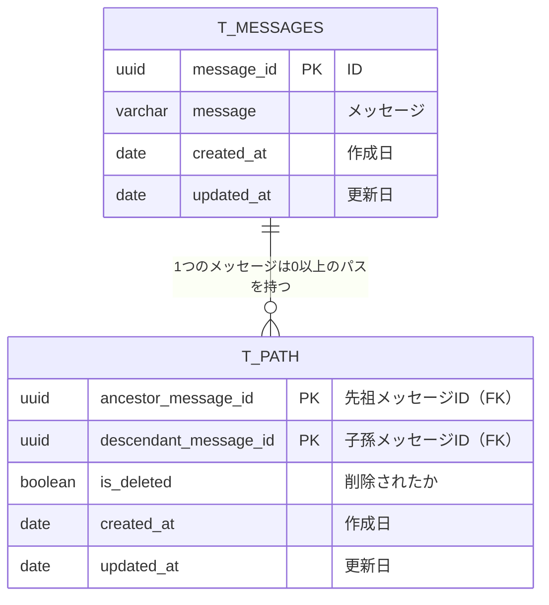

# 課題1

- 生じる問題
  - 階層に制限がない場合、あるコメントに対するスレッドすべてを取得するのにSQLを相当数発行する必要がある（結果Countなども取りづらい）
  - 途中のノードを削除するのが難しい
    - 途中のノード配下すべて削除する場合、まずは全ての子ノードを探し出し、末端から削除する必要がある
    - 子ノードを昇格させる場合は、削除前に子ノードの参照先IDを更新する必要がある

# 課題2

閉包テーブル

# 課題3

- コメント可能なブログ
- 階層化された組織のメンバ管理とか？（警察とか）
- 家系図データとか
