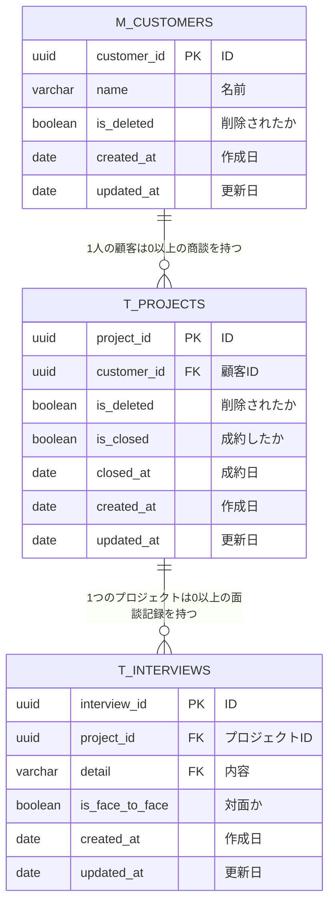

# 課題1

- 複数回電話した場合や複数回面談した場合のデータが取れない
- 同じ顧客で別のプロジェクトが発生した場合

# 課題2

```mermaid
erDiagram

  M_CUSTOMERS {
    uuid customer_id PK "ID"
    varchar name "<Not null> 名前"
    boolean is_deleted "<Not null> 削除されたか"
    date created_at "<Not null> 作成日"
    date updated_at "更新日"
  }

  T_PROJECTS {
    uuid project_id PK "ID"
    uuid customer_id FK "<Not null> 顧客ID"
    boolean is_deleted "<Not null> 削除されたか"
    boolean is_closed "<Not null> 成約したか"
    date closed_at "<Not null> 成約日"
    date created_at "<Not null> 作成日"
    date updated_at "更新日"
  }

  T_INTERVIEWS {
    uuid interview_id PK "ID"
    uuid project_id FK "プロジェクトID"
    varchar detail FK "内容"
    boolean is_face_to_face "<Not null> 対面か"
    date created_at "<Not null> 作成日"
    date updated_at "更新日"
  }

  M_CUSTOMERS ||--o{ T_PROJECTS: "1人の顧客は0以上の商談を持つ"
  T_PROJECTS ||--o{ T_INTERVIEWS: "1つのプロジェクトは0以上の面談記録を持つ"
```

# 課題3

- 社員との面談管理アプリ