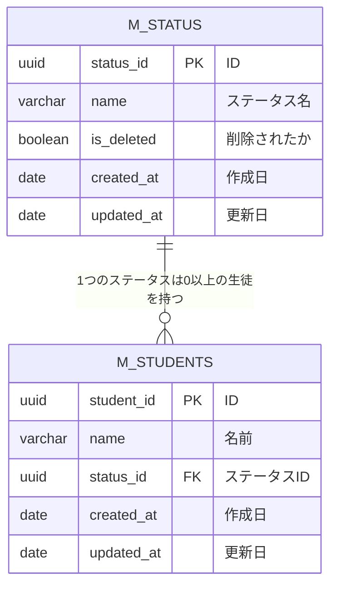

# 課題1

- DBを直接いじられたときに制約外のデータが入る可能性
- ステータスの名称や説明を保持したりすることができない
- ステータスの追加や削除、または名称の変更などの対応がひと手間かかる

# 課題2

```mermaid
erDiagram

  M_STATUS {
    uuid status_id PK "ID"
    varchar name "ステータス名"
    boolean is_deleted "<Not null> 削除されたか"
    date created_at "<Not null> 作成日"
    date updated_at "更新日"
  }

  M_STUDENTS {
    uuid student_id PK "ID"
    varchar name "<Not null> 名前"
    uuid status_id FK "ステータスID"
    date created_at "<Not null> 作成日"
    date updated_at "更新日"
  }

  M_STATUS ||--o{ M_STUDENTS: "1つのステータスは0以上の生徒を持つ"
```

# 課題3

Enum的な値を扱う時

- 商談のステータスを管理したい時（接触中、商談中、契約中、契約済み、など）
