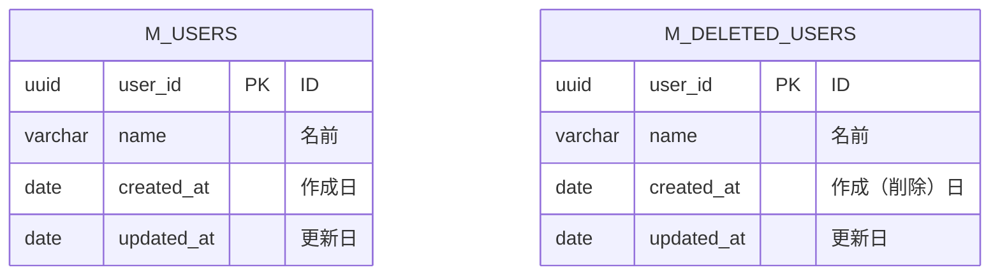

# 課題1

- ほぼ必ず削除されていないwhere句を追加しなければならず、忘れがち
- 物理削除と比べるとパフォーマンスが劣る

# 課題2

削除済みユーザテーブルを作成し、データを移す

# 課題3

- ECサイト
  - 注文取り消しがミス、取り消しが取り消された場合、戻すのが大変
  - ID打ち間違いとかありそう
  - 注文取り消しのデータが取得したい場合に取れない
- 学習塾の進捗管理サービス
  - 戻ってきたときに過去のデータと紐づけできない
  - その生徒が紐づいている他のデータがおかしくなる、または修正が必要になる
  - あとから過去の生徒の分析とかができない
- 自身が過去に開発したサービス
  - 開発したことないので分からないが、なんとなく物理削除は怖いので、自分なら課題２みたいに残すことにしそう。
