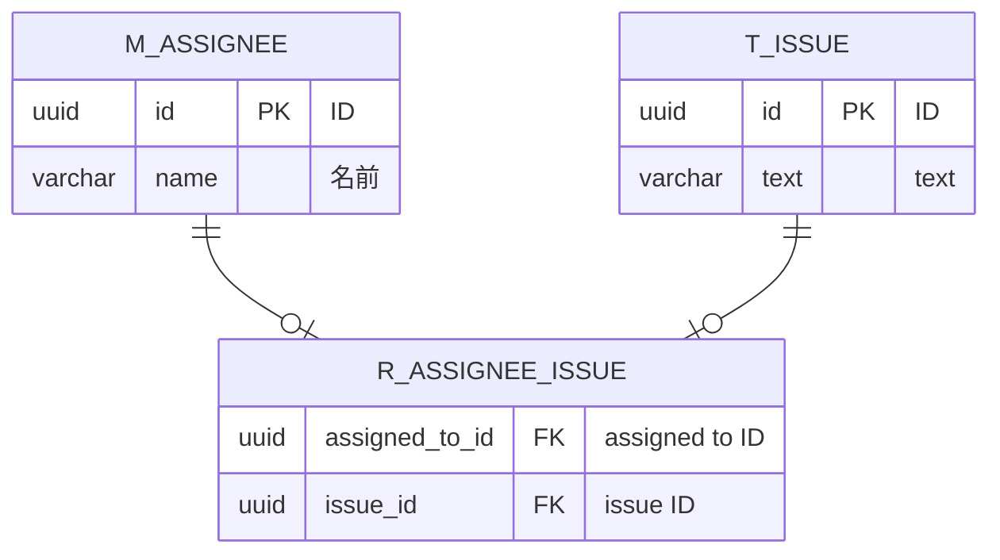

# 課題1

- SELECT NULL = 0;
  - null
- NULL = NULL (以下、SELECT部分を省略)
  - null
- NULL <> NULL
  - null
- NULL AND TRUE
  - null
- NULL AND FALSE
  - 0 ->??
- NULL OR TRUE
  - 1
- NULL OR FALSE
  - null ->??
- NULL IS NULL
  - 1
- NULL IS NOT NULL
  - 0

# 課題2

Nullが悪いかどうかはケースバイケースな気がする。
例えば今回のようなケースはNullでも良い気がする。現実を反映しているから？直感的にわかりやすいものはなんとでもなる気がするからNullで良い気がする。

https://zenn.dev/praha/articles/1f8a571d4bbdc2
↑なるほど…かなり納得できる説明だった。

http://mickindex.sakura.ne.jp/database/db_getout_null.html
↑難しかったのでほとんどわからんかったけど、3値論理の話とかは面白かったし、Null一つとっても深い哲学が隠されているんだなと思った。

正直DB使ったこと無いから、どういうことがどの程度影響があるのかが全くわからない。ただ、松原さんの記事はわかりやすくてバランスが良い気がした。

# 課題3

デフォルト値が別の意味を持ってしまうケースがあるので、自動的に割り当てるのは危険。例えば年齢をINT0にしたら0才と間違えてしまうなど。

# 課題4

- NULLデータのある列をcountした場合、NULLはカウントされるか
  - されない
- NULLデータのある列のavgはどうなるか
  - NULLを除外した平均になる
