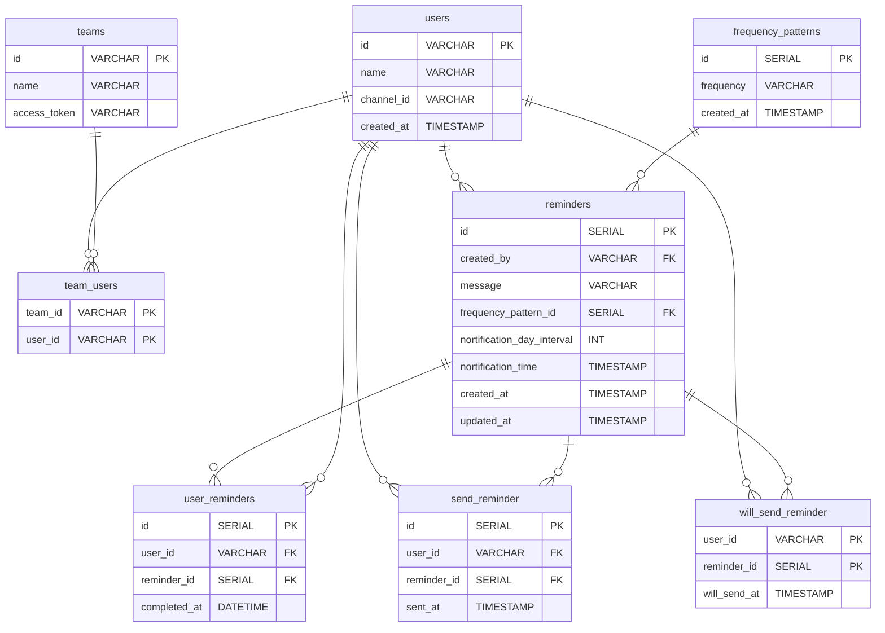

```mermaid

erDiagram

%% テーブル
users{
    id VARCHAR PK
    name VARCHAR
    channel_id VARCHAR
    created_at TIMESTAMP
}

teams{
    id VARCHAR PK
    name VARCHAR
    access_token VARCHAR
}

team_users{
    team_id VARCHAR PK
    user_id VARCHAR PK
}

reminders{
    id SERIAL PK
    created_by VARCHAR FK
    message VARCHAR
    frequency_pattern_id SERIAL FK
    nortification_day_interval INT
    nortification_time TIMESTAMP
    created_at TIMESTAMP
    updated_at TIMESTAMP
}

%% 追加
frequency_patterns{
    id SERIAL PK
    frequency VARCHAR
    created_at TIMESTAMP
}

user_reminders{
    id SERIAL PK
    user_id VARCHAR FK
    reminder_id SERIAL FK
    completed_at DATETIME
}

send_reminder{
    id SERIAL PK
    user_id VARCHAR FK
    reminder_id SERIAL FK
    sent_at TIMESTAMP
}

will_send_reminder{
    user_id VARCHAR PK
    reminder_id SERIAL PK
    will_send_at TIMESTAMP
}

%% リレーション
users ||--o{ reminders : ""
reminders ||--o{ user_reminders : ""
users ||--o{ send_reminder : ""
reminders ||--o{ send_reminder : ""
users ||--o{ will_send_reminder : ""
reminders ||--o{ will_send_reminder : ""
users ||--o{ user_reminders : ""
users ||--o{ team_users : ""
teams ||--o{ team_users : ""

%% 追加
frequency_patterns ||--o{ reminders : ""

```