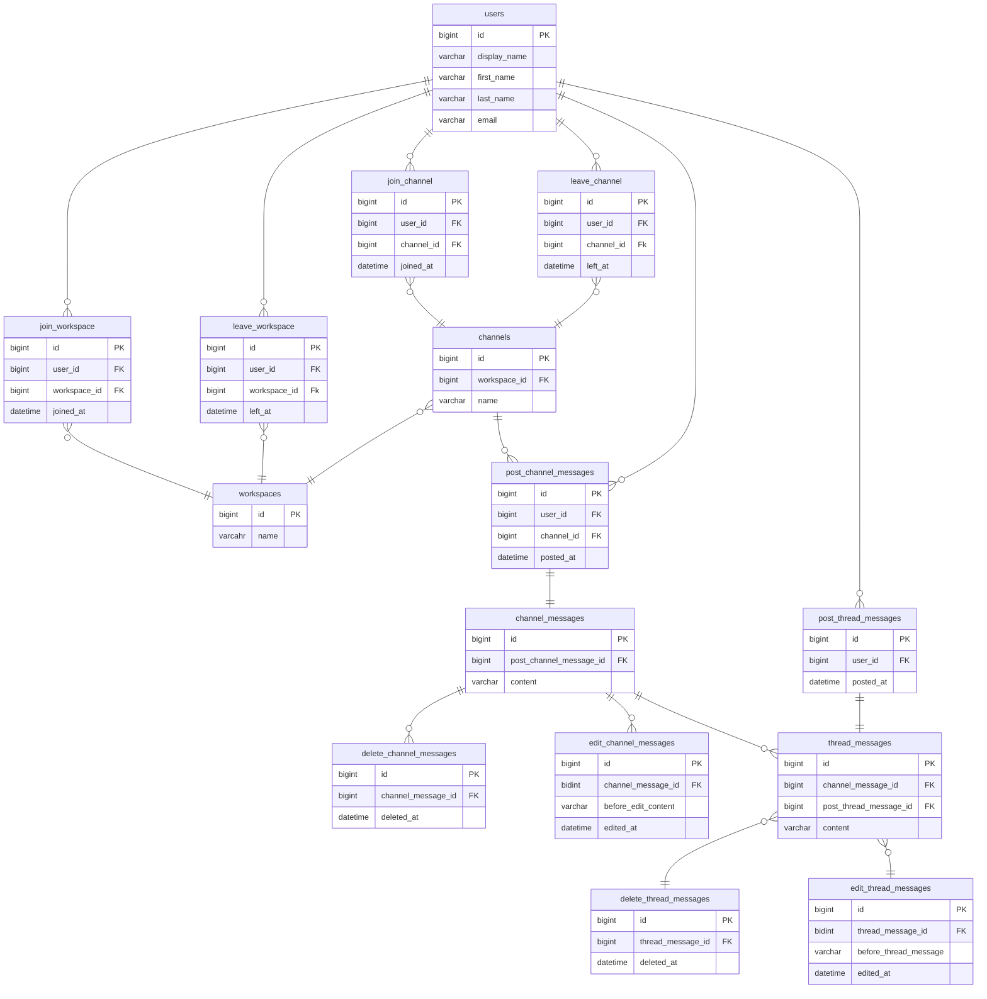

```mermaid
erDiagram
	
	%% リレーション
	users ||--o{ join_workspace : ""
	users ||--o{ leave_workspace : ""
    channels }o--|| workspaces : ""
	join_workspace }o--|| workspaces : ""
	leave_workspace }o--|| workspaces : ""
	users ||--o{ join_channel : ""
	users ||--o{ leave_channel : ""
	join_channel }o--|| channels : ""
	leave_channel }o--|| channels : ""
	users ||--o{ post_channel_messages : ""
	channels ||--o{ post_channel_messages : ""
	users ||--o{ post_thread_messages : ""
	post_channel_messages ||--|| channel_messages : ""
	channel_messages ||--o{ delete_channel_messages : ""
	channel_messages ||--o{ edit_channel_messages : ""
	channel_messages ||--o{ thread_messages : ""
	post_thread_messages ||--|| thread_messages : ""
	thread_messages }o--|| delete_thread_messages : ""
	thread_messages }o--|| edit_thread_messages : ""

	%% テーブル
	join_channel{
		bigint id PK
		bigint user_id FK
		bigint channel_id FK
		datetime joined_at
	}

	leave_channel{
		bigint id PK
		bigint user_id FK
		bigint channel_id Fk
		datetime left_at
	}

	join_workspace{
		bigint id PK
		bigint user_id FK
		bigint workspace_id FK
		datetime joined_at
	}

	leave_workspace{
		bigint id PK
		bigint user_id FK
		bigint workspace_id Fk
		datetime left_at
	}

	delete_thread_messages{
        bigint id PK
        bigint thread_message_id FK
        datetime deleted_at
    }

	delete_channel_messages{
        bigint id PK
        bigint channel_message_id FK
        datetime deleted_at
    }

	edit_channel_messages{
        bigint id PK
        bidint channel_message_id FK
		varchar before_edit_content 
        datetime edited_at
    }

	post_thread_messages{
        bigint id PK
        bigint user_id FK
        datetime posted_at
    }

    edit_thread_messages{
        bigint id PK
        bidint thread_message_id FK
		varchar before_thread_message
        datetime edited_at
    }

	thread_messages{
        bigint id PK
		bigint channel_message_id FK
		bigint post_thread_message_id FK
		varchar content
	}

	users{
		bigint id PK
		varchar display_name
		varchar first_name
		varchar last_name
		varchar email 
	}

    post_channel_messages{
        bigint id PK
        bigint user_id FK
		bigint channel_id FK
        datetime posted_at
    }

	channel_messages{
        bigint id PK
		bigint post_channel_message_id FK
		varchar content
	}	
	
	channels{
		bigint id PK
		bigint workspace_id FK
		varchar name
	}
	
	workspaces{
		bigint id PK
		varcahr name
	}
```