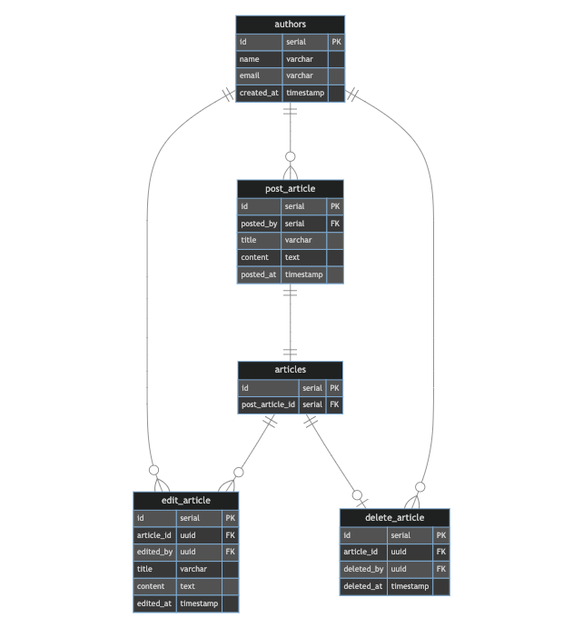
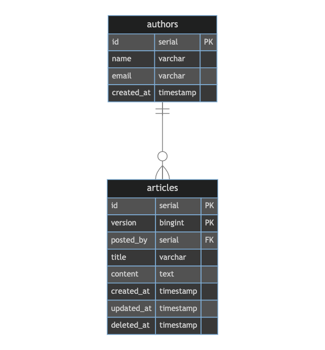

# 課題１
## 記事と編集履歴を管理するサービス
- リソース
  - 記事
    - 記事のタイトル
    - 10000字程度の本文
    - 各イベントと対応させることで状態を管理する
    - 記事に対して更新処理は行わず、イベントから最新の状態を導出
- イベント
  - 記事の作成
    - 記事が新しく作成される際に、データが登録される
    - 作成した記事の内容と、作成日時、作成者の情報が格納
  - 記事の編集
    - 作成された記事が編集される際に、データが登録される
    - 編集した記事の内容と、編集日時、編集者の情報が格納
  - 記事の削除
    - 削除された記事が編集される際に、デーが登録される
    - 削除された記事のIDと、削除日時、削除者の情報が格納

  

# 課題２
## 履歴データの扱いについて
分析のみの用途であっても履歴データは残っていた方がいいと思う。
というよりも、業務上発生するコトに関して、保存しなければならない要素を初めから絞り込み過ぎずにテーブル設計をする必要があると思った。分析が必要になってから新しくテーブルを作成したり、既存のテーブルにカラムを追加したりするのは、アプリ側の修正に対する影響も大きい。

履歴データを残す必要はあると思うが、あるエンティティに対して履歴テーブルというテーブルを作成するという戦略を必ずしも取る必要はないと思う。
今回のテーブル設計はイミュータブルデータモデルを参考にしているが、この設計だと履歴という概念はなくイベントを蓄積していくことで履歴をたどることができる。
エンティティの状態が、関連するイベントテーブルに依存する形になるため、参照時に複数テーブルを結合することが避けられない点や「基本的にはINSERT...」という取り扱い方に癖があるため採用には注意が必要。

## 課題１と異なる履歴データの表現

- 記事テーブルにversionカラムを持たせる。
  - 変更が行われるとversionカラムのデータが1→2→3…と増えていく。
  - versionが最大値のレコードが最新のレコード

### メリット
- 履歴の一覧を見たい場合、`SELECT * FROM articles WHERE id = 1 ORDER BY version ASC`で簡単に取得できる。
- 基本的にINSERTするだけでいいため、データの登録がシンプル。

### デメリット
- 最新のデータを取得する際に、常にWHEREでversionを指定する必要がある。
- 作成、更新、削除の全てのイベントが一つのテーブルに集まっているため、記事の数が増えた場合に、負荷が一つのテーブルに集中する。
- 現時点では考慮されていないが、articlesを参照している他テーブルが存在している場合、idとversionを外部キーとして持たせることが考えられる。そうすると、記事が更新され新たなversionのレコードが挿入された場合、関連テーブルのversionも更新しなければならなくなる。