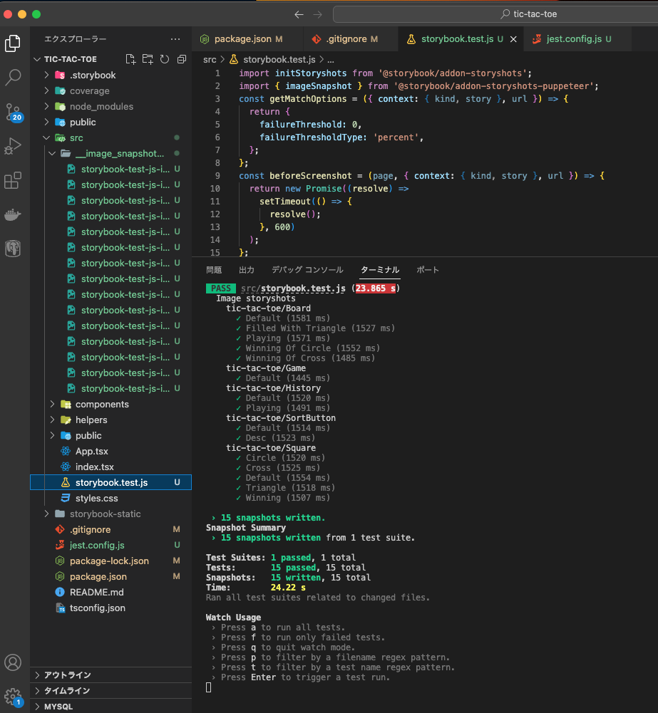
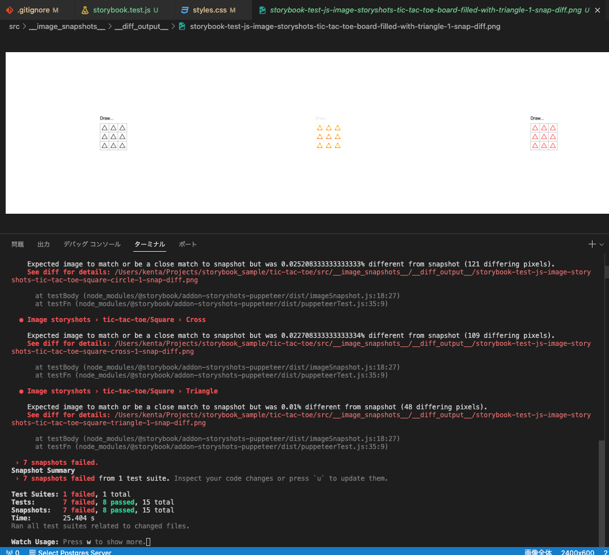
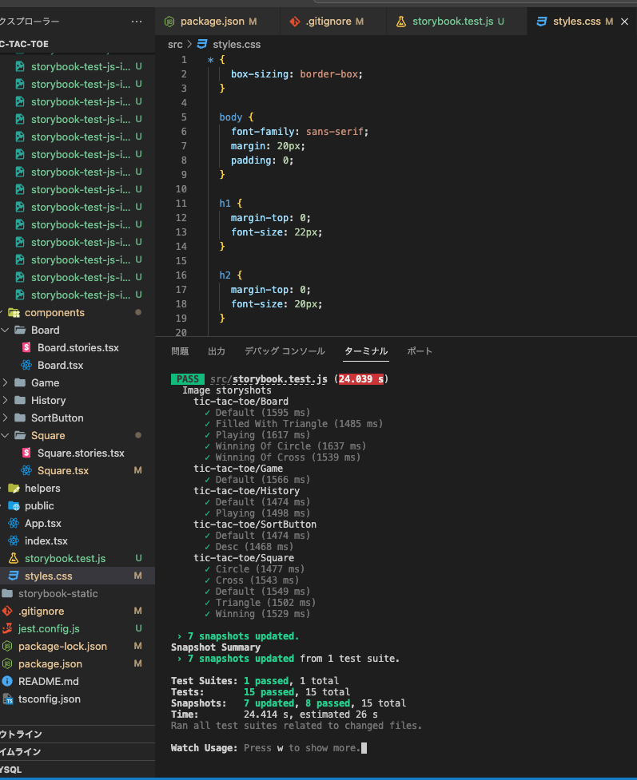
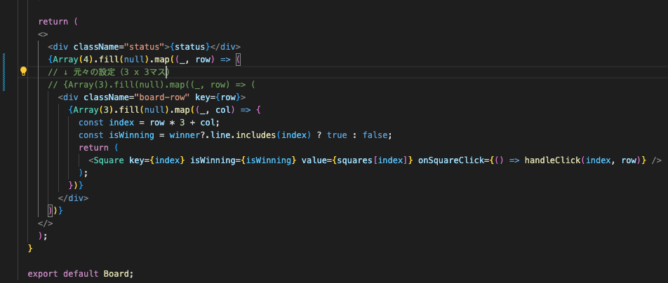
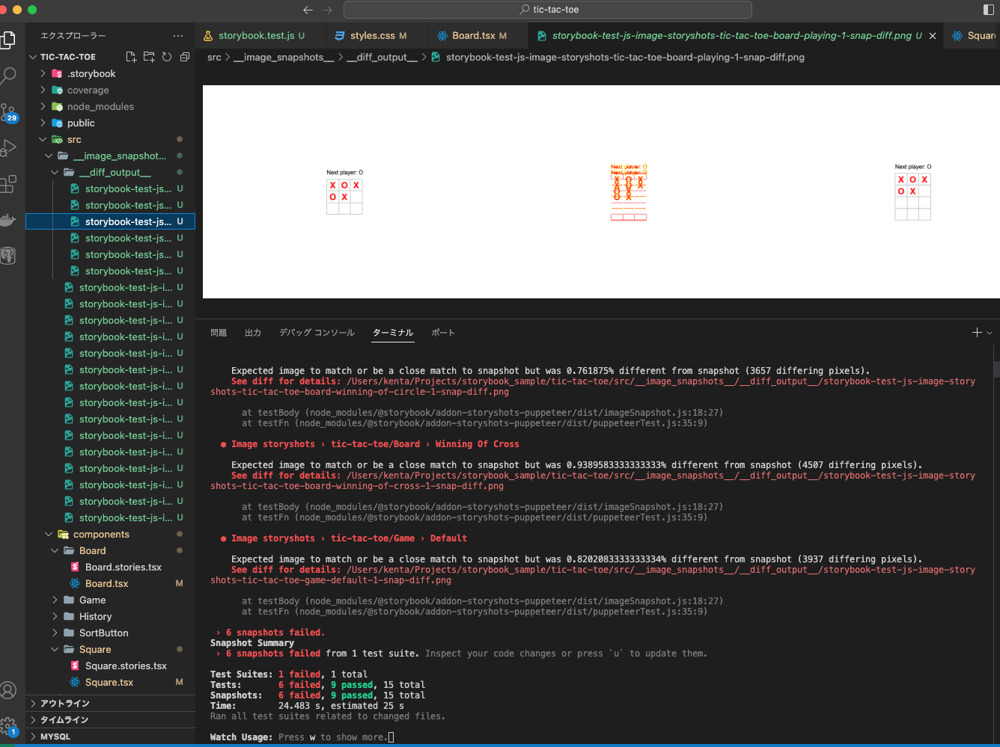
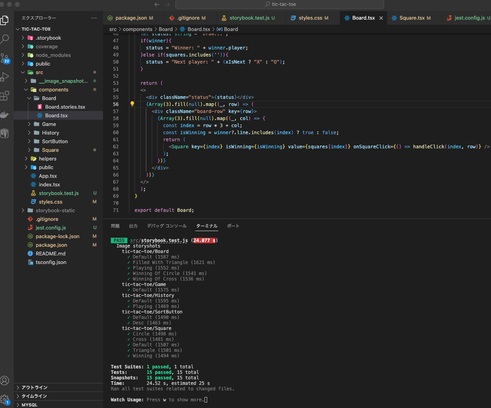

# ビジュアルリグレッションテスト

# 課題1
以下のリポジトリにて実装しております。
https://github.com/hira-kenta/storybook_sample/pull/3

### 導入後
`npm run test`で各Storyのスナップショットが撮られ、**src/__image_snapshots__**配下に格納されることを確認。


> Squareの中身（o,x）を赤色に変えてください

差分のスナップショットを取得し、テストが落ちることを確認。


> 変更を受け入れて、スクリーンショットを更新しましょう

ターミナルでコマンド`u`を入力することで、スナップショットが更新され、テストが成功した状態になる。

  
> 間違って3x3ではなく、4x3のboardを作成してみてください。ビジュアルリグレッションテストが変更を検知していることを確認してください。

変更したソース

  
差分のスナップショットを取得し、テストが落ちることを確認。


> 変更を拒否してください。スクリーンショットが更新されていないことを確認しましょう。

ソースを戻してテストを実行した際、テストが成功するため、スクリーンショットが更新されていないことを確認。



# 課題２
> ビジュアルリグレッションテストとスナップショットテストを比較した時、それぞれにどのようなメリット・デメリットがあると感じましたか？  

## スナップショットテスト
### メリット
- 画面上には現れないが、DOM構造上には現れるようなプロパティやHTMLタグ等の予期せぬ変更を検出できる。
- DOM構造に基づいて差分を検出するため、テストの実行速度が早い。

### デメリット
- 各コンポーネントにおけるDOM構造上の差分を検知するため、CSS 周りの差分が含まれず、UI（見た目）の変化を検知できない。
  - 検知するにはCSSinJSなどを導入する必要がある…。

## ビジュアルリグレッションテスト
### メリット
- CSSの設定も含めて、画面にどのように表示されるかという観点で、ソース修正前後の差分を検知することができる。

### デメリット
- キャプチャしたスクリーンショットを保存しておく必要があったり、画像間のピクセル単位の比較が必要であったりするため、リソースへの負荷が大きい。
  - それ故テスト実行に時間がかかる恐れもある。
- コンポーネントの読み込みに時間がかかる場合、テストが落ちる恐れがある（表示するまでテスト実行を待機するという設定が必要）。

  
個人的にはUIをテストするという目的であるならば、ビジュアルリグレッションテストの方が、ユーザーからどう見えるかと言う視点で差分を表示してくれるため直感的でわかりやすいと思ったし、CSSまでひっくるめて検証できる点が魅力的に感じた。
画面上に現れないプロパティや状態の予期せぬ変更などはE2Eテストやその他のテストでカバーする方がいいのかなと思った。

# 課題３
> ビジュアルリグレッションテストに関するクイズを作成してください

## 1. ビジュアルリグレッションテストでは、差分を検出するにあたってどの程度の差分なら許容するかという閾値を設定する必要がある。 story-puppeteerで設定できる閾値の種類にはどんなものがあるか？

### 解答
以下、storyshots-puppeteerでの閾値の設定箇所。
```
import initStoryshots from '@storybook/addon-storyshots';
import { imageSnapshot } from '@storybook/addon-storyshots-puppeteer';
const getMatchOptions = ({ context: { kind, story }, url }) => {
  return {
    failureThreshold: 0,
    failureThresholdType: 'percent',
  };
};
initStoryshots({
  suite: 'Image storyshots',
  test: imageSnapshot({
    storybookUrl: 'http://localhost:6006',
    getMatchOptions,
  }),
});
```
上記の`getMatchOptions()`によって返却されるプロパティの`failureThresholdType`によって閾値の種類が設定される。
以下がその種類。
1. percent : 変更の割合。何%変化しているかを評価する。
```
failureThresholdType: 'percent',
failureThreshold: 2, // 2％の変化を許容
```
2. pixel : ピクセル単位の差異を基準に判定。特に設定しない場合は、デフォルトでpixelが使用される。
```
failureThresholdType: 'pixel',
failureThreshold: 100, // 差分が100ピクセル以下
```
3. ssim : SSIM（構造的類似性指数）を使用して画像の品質を評価する。
```
failureThresholdType: 'ssim',
failureThreshold: 0.01, // SSIM指数が0.01未満の変化を許容
```
SSIMは画像の照度、コントラスト、画像の配置、模様、エッジなどの画像の構造などの要素を組み合わせて、類似性を0から1の範囲で評価する。1に近いほど類似していることを表す指標。
  
## 2. ビジュアルリグレッションテストにおいて、reg-suitというツールが用いられることがある。このツールの特徴について説明してください。
  
### 解答
- 前回取得したスクリーンショットと比較してビジュアルの変更を自動で検出することができる。
- テスト結果に基づいてビジュアルリグレッションテストの差分結果をHTMLレポートで表示するすることができる。（個人的にはこのHTMLレポートで差分結果を確認する際にわかりやすくていいなと思いました！ピャッピャッって差分を見比べることができるアレがこのレポートでできます…）
- スナップショット画像をクラウドストレージ(AWS S3, GCSなど)に自動的に保存することができる。
- reg-suit自体は、スクリーンショットを撮影する機能を提供していないため、storyshots-puppeteerやPlaywrightなどのツールと連携して使用するのが一般的。
- CI/CDに組み込むことで、PRが作成されるたびにビジュアルリグレッションテストを自動で実行してくれるようになり、そのPR上で比較結果を確認することができる。
  

#### 参考
[reg-suit+CircleCIでVisual Regression Test環境の構築](https://zenn.dev/toshiokun/articles/3d7087b84ba1d9)  
[2023年にVisual Regression Testingを始めるならどんな選択肢があるか](https://www.wantedly.com/companies/loglass/post_articles/463738)
  
## 3. 外部から画像を読み込む画面であったり、コンポーネントの生成に時間がかかる画面のテストが意図せず失敗することがあります。これを解消する方法にはどんなものがあるか？

## 3. ビジュアルリグレッションテストの実行速度を早めるための工夫にはどのようなものがあるか？

- CI/CDパイプライン内でテストを並列実行するように設定する。
  - スクリーンショットの撮影がボトルネックになってくるため、複数の実行環境で同時にその工程を実行する設定を行うことで高速化が期待できる。
  - CircleCIでは、ジョブに対して`parallelism`を指定することで、テストジョブの並列実行が設定できる。
  ```
  // Chat-GPTにジョブ設定のサンプルを生成してもらいました
  run_vrt_capture:
  executor: my_executor
  parallelism: 10
  steps:
    - checkout
    - attach_workspace
    - run: npm run screenshot:ci
    - persist_to_workspace:
        root: /workspace
        paths:
          - __screenshots__
  ```
  
- 外部リソースからデータや画像を読み込む必要があるコンポーネントに対して、モックサーバーを使用したり、ローカルにモックデータを用意して利用する。
  - 外部への通信時間を削減することでテスト実行時間が短縮でき、通信状態によってスクリーンショットがうまく取得できなくなる（描画に時間がかかってしまい描画が完了する前にスクリーンショットが取得されてしまうとか）ことを抑止できる。実行速度の改善に加えて、結果の安定化が図れる。

#### 参考
- [reg-suit と storycap で行う Visual Regression Testing の高速化](https://blog.wadackel.me/2022/vrt-performance-optimize/)
- [ABEMAでスナップショットテストをやめてVisual Regression Testingに移行する話](https://developers.cyberagent.co.jp/blog/archives/29784/)

# 参考記事
- https://note.com/pocke_techblog/n/n6947c0bb4df1
- https://developers.cyberagent.co.jp/blog/archives/29784/
- https://blog.owlcode.net/posts/20211114-front-test
- https://blog.recruit.co.jp/rmp/front-end/visual-regression-testing/
- https://blog.wadackel.me/2022/vrt-performance-optimize/