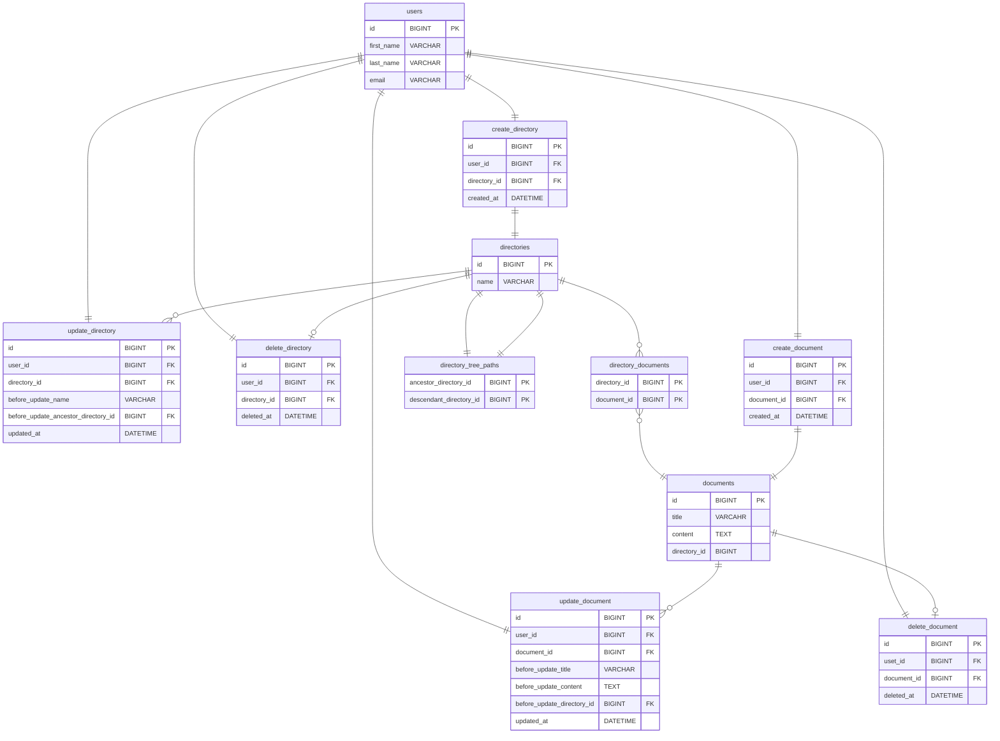

```mermaid
erDiagram

users ||--|| create_directory : ""
users ||--|| update_directory : ""
users ||--|| delete_directory : ""
create_directory ||--|| directories : ""
directories ||--o{ update_directory : ""
directories ||--o| delete_directory : ""

directories ||--o{ directory_documents : ""
directory_documents }o--|| documents : ""

directory_tree_paths ||--|| directories : ""
directories ||--|| directory_tree_paths : ""

users ||--|| create_document : ""
users ||--|| delete_document : ""
users ||--|| update_document : ""
create_document ||--|| documents : ""
documents ||--o{ update_document : ""
documents ||--o| delete_document : ""


users{
    id BIGINT PK
    first_name VARCHAR
    last_name VARCHAR
    email VARCHAR
}

directories{
    id BIGINT PK
    name VARCHAR
}

documents{
    id BIGINT PK
    title VARCAHR
    content TEXT
    directory_id BIGINT
}

directory_documents{
    directory_id BIGINT PK
    document_id BIGINT PK
}

create_directory{
    id BIGINT PK
    user_id BIGINT FK
    directory_id BIGINT FK
    created_at DATETIME
}

delete_directory{
    id BIGINT PK
    user_id BIGINT FK
    directory_id BIGINT FK
    deleted_at DATETIME
}

update_directory{
    id BIGINT PK
    user_id BIGINT FK
    directory_id BIGINT FK
    before_update_name VARCHAR
    before_update_ancestor_directory_id BIGINT FK
    updated_at DATETIME
}

directory_tree_paths{
    ancestor_directory_id BIGINT PK
    descendant_directory_id BIGINT PK
}

create_document{
    id BIGINT PK
    user_id BIGINT FK
    document_id BIGINT FK
    created_at DATETIME
}

delete_document{
    id BIGINT PK
    uset_id BIGINT FK
    document_id BIGINT FK
    deleted_at DATETIME
}

update_document{
    id BIGINT PK
    user_id BIGINT FK
    document_id BIGINT FK
    before_update_title VARCHAR
    before_update_content TEXT
    before_update_directory_id BIGINT FK
    updated_at DATETIME
}


```