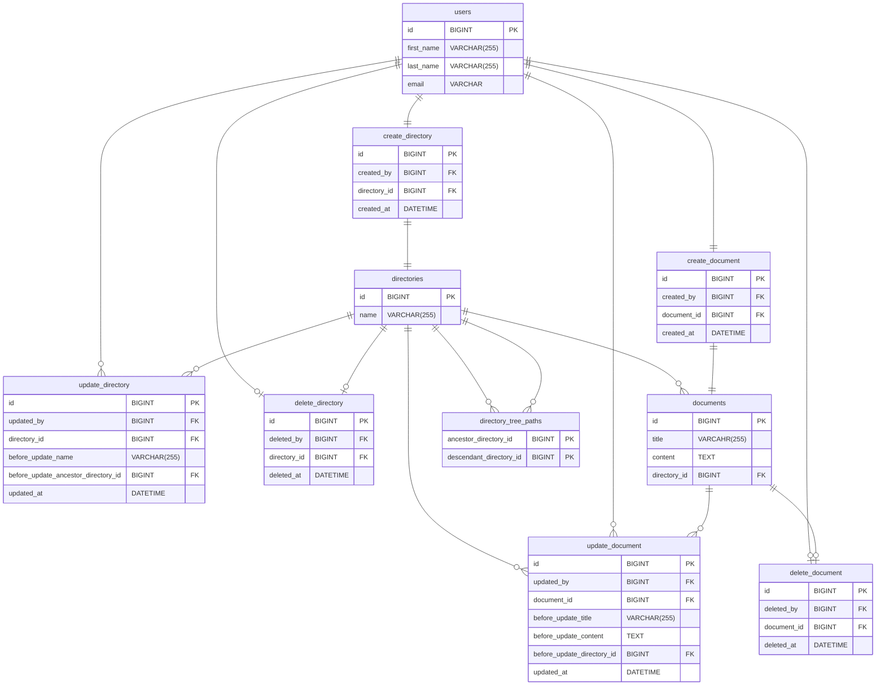

```mermaid
erDiagram

%% ディレクトリ関連
users ||--|| create_directory : ""
users ||--o{ update_directory : ""
users ||--o| delete_directory : ""
create_directory ||--|| directories : ""
directories ||--o{ update_directory : ""
directories ||--o| delete_directory : ""
directories ||--o{ documents : ""
directories ||--o{ update_document : ""

%% ドキュメント関連
users ||--|| create_document : ""
users ||--o{ update_document : ""
users ||--o| delete_document : ""
create_document ||--|| documents : ""
documents ||--o{ update_document : ""
documents ||--o| delete_document : ""

%% ディレクトリーサブディレクトリ関連
directory_tree_paths }o--|| directories : ""
directories ||--o{ directory_tree_paths : ""

%% リソース
%% ユーザー
users{
    id BIGINT PK
    first_name VARCHAR(255)
    last_name VARCHAR(255)
    email VARCHAR
}

%% ディレクトリ
directories{
    id BIGINT PK
    name VARCHAR(255)
}

%% ドキュメント
documents{
    id BIGINT PK
    title VARCAHR(255)
    content TEXT
    directory_id BIGINT FK
}

 %% ディレクトリとサブディレクトリの閉包テーブル
directory_tree_paths{
    ancestor_directory_id BIGINT PK
    descendant_directory_id BIGINT PK
}

%% イベント
%% ディレクトリ作成
create_directory{
    id BIGINT PK
    created_by BIGINT FK
    directory_id BIGINT FK
    created_at DATETIME
}

%% ディレクトリ削除
delete_directory{
    id BIGINT PK
    deleted_by BIGINT FK
    directory_id BIGINT FK
    deleted_at DATETIME
}

%% ディレクトリ更新
update_directory{
    id BIGINT PK
    updated_by BIGINT FK
    directory_id BIGINT FK
    before_update_name VARCHAR(255)
    before_update_ancestor_directory_id BIGINT FK
    updated_at DATETIME
}

%% ドキュメント作成
create_document{
    id BIGINT PK
    created_by BIGINT FK
    document_id BIGINT FK
    created_at DATETIME
}

%% ドキュメント削除
delete_document{
    id BIGINT PK
    deleted_by BIGINT FK
    document_id BIGINT FK
    deleted_at DATETIME
}

%% ドキュメント更新
update_document{
    id BIGINT PK
    updated_by BIGINT FK
    document_id BIGINT FK
    before_update_title VARCHAR(255)
    before_update_content TEXT
    before_update_directory_id BIGINT FK
    updated_at DATETIME
}

```