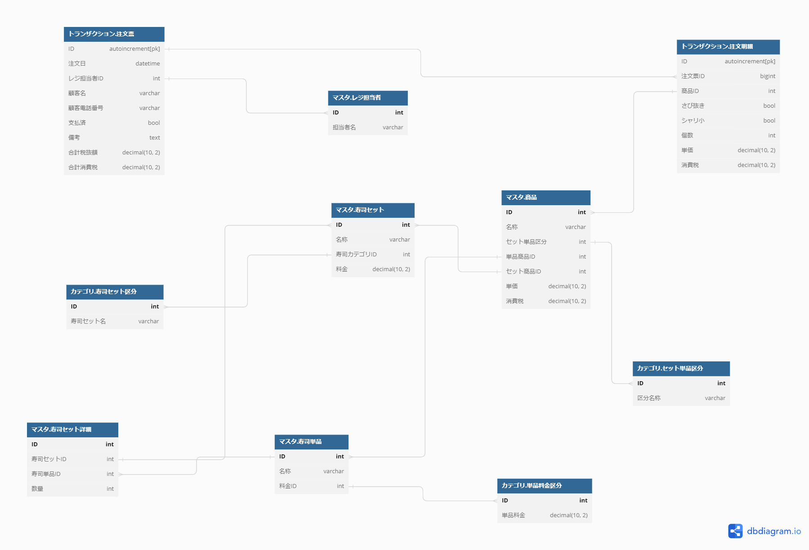

## モデリング図

図へのリンク
https://dbdiagram.io/d/641bd53d296d97641d8a198e

### 課題2（課題1からの変更点）
- シャリの大小も選べるように
⇒"トランザクション.注文明細"に「シャリ小」(default false)テーブルを追加しました。
山崎さんみたいにオプションテーブルの方が綺麗か、と思いつつこれまでのやり方を踏襲しました。

- 寿司ネタが毎月何個売れているのか知る必要が生じました。どのようにテーブル設計をするべきでしょうか?
⇒"マスタ.寿司セット詳細"というのを追加して、「寿司セット」テーブルに単品寿司を組み合わせて作成できるようにした。
集計出来ない事ないが、ちょっとSQLが複雑になる気がする。。