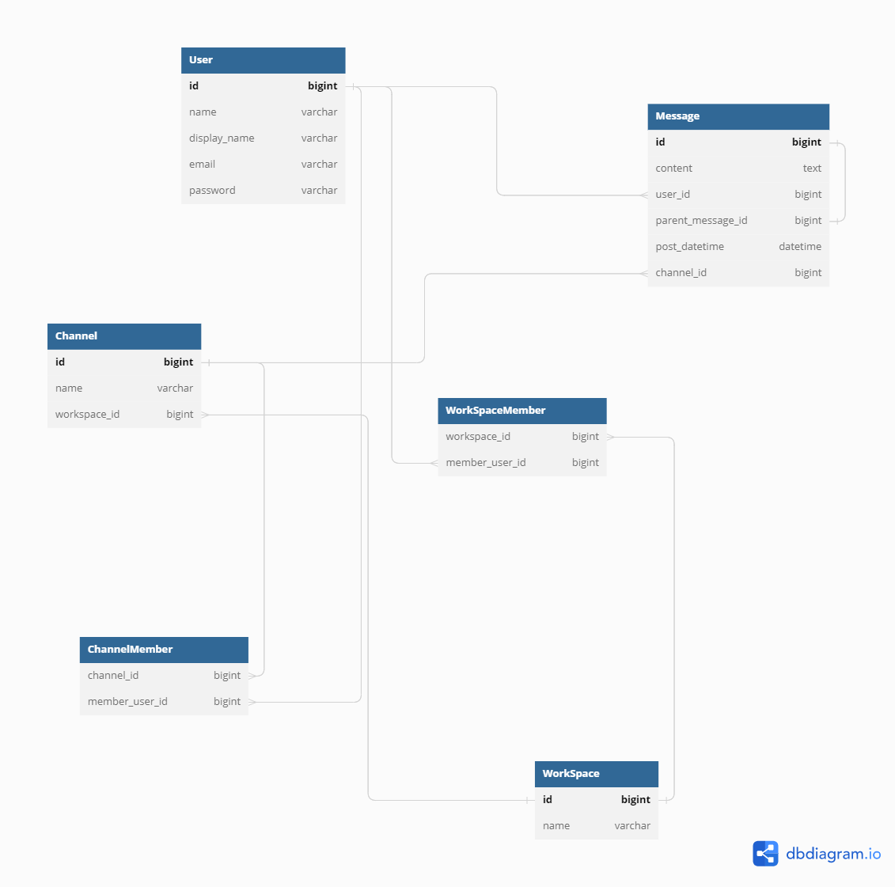

### 説明事項

- #### メンバーの管理
   山崎さんの考えに近いがメンバー中間テーブルを作ってユーザーとワークスペース、ユーザーとチャンネルを管理するテーブルを作成
- #### スレッドの扱いについて
  スレッドを別テーブルに分けるか考えたが、スレッドのデータ内容がほぼメッセージと同じになる点と、メッセージ自体が親子構造（Messageの中のparent_message_idフィールドを使用）を持っていることでスレッド一連の流れを表現する形にした為、Messageテーブルのparent_message_idがnullのものが最上位の親となる想定。
そのような設計も見るため概念的には理解しにくいものではない、と判断。
メリットとしてはスレッドとメッセージの横断検索が簡単になった。

### 参照

- UML図
  
  [diagram.io](https://dbdiagram.io/d/6414245c296d97641d88b5d4)
- [DDL.sql](./DDL.sql)

- [DML.sql](./DML.sql)

- [ユースケース.sql](./UseCase.sql)

  ⇒チャンネル所属ユーザーだけ検索できるように。

  スレッドをメッセージテーブルで統一したこと、チャネル所属ユーザーは別テーブルで管理したこと、が功を奏して比較的クエリしやすかった。