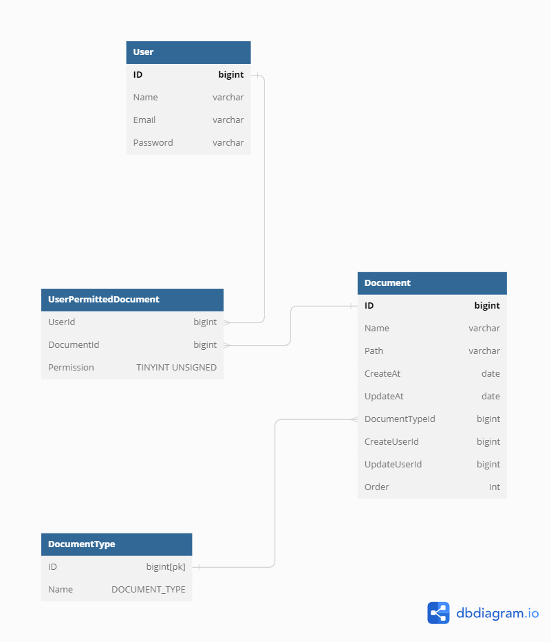

# 課題１

```
Confluence や esa や kibela のようなドキュメント管理システムのデータベースを設計してスケッチを作成してください
```
敢えてほかの二人がやってない経路列挙モデルで実装した。

メリット：

SQLがシンプルになったと感じる。
順番がごちゃごちゃになる心配がないものはジェイウォークでもなんとかなるかも、と感じた。

デメリット：

ただし変更する際は下層のデータ全てを書き変える事になり、影響範囲が大きく、毎回トランザクションでロックする事になるので、規模が大きかったり、大人数で共有する場合は向かないと感じる。

### テーブル概要
<!--q:mdファイルのテーブルの例 -->

|  テーブル名  |  内容  |
| ---- | ---- |
| User | ユーザーを管理する  |
| UserPermittedDocument|中間テーブルとしてユーザーがアクセスできるドキュメントを管理する。<br>ユーザーはこのテーブルを経由してしかDocumentにアクセスできないように設計。<br>パーミッションのはUnixファイルシステムと同じような想定で<br>0:NotPermitted, 4: ReadOnly , 6: Writable, 7: Excutable<br>とした。要件に入ってない、かつ複雑になるため実装しなかったが、Owner, Growp, Otherの3ケタで表現してもよかったかもしれない。<br>またSQL側でやる是非はあるが、ディレクトリが削除された時は完全に不要になるのでDocumentのデータが削除されたら一緒に削除。|
| Document | PathとしてIDをベースとした経路を保持する。<br>「ユースケースをSQLだけで表現する」という今回の目的の視認性の高さを重視してDocumentTypeはEnumを使った。また今後Enumが変更される事はほぼ無いと想定<br>Pathは経路列挙モデル。検索性や追加削除の簡便さの都合で、/1（ルートに対して）"ディレクトリID/"を重ねてていく形にした|

### UML図

https://dbdiagram.io/d/6439473c6b319470519a97c1

### DML
[UseCase.sql](.)

# 課題２

```もし上記のシステムに以下のような仕様が追加された場合、どのようなテーブル設計にしますか？
ディレクトリ内のドキュメントの順番を変更できる
順番はユーザー間で共有される（例えばAさんがディレクトリ内でhoge.txtの前にfuga.txtが表示されるように並べ替えたら、Bさんがディレクトリを開いた時にfuga.txtが先に表示される）
```

⇒　リセットを想定して浮動小数点で実装しました。