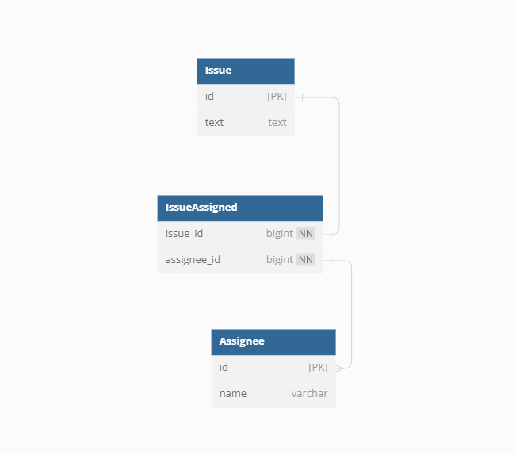

# 課題１
> SQLクエリで以下の式を実行した時の結果を答えてください

一応MySQLとPostgreSQLの２つで確認した。

```SELECT NULL = 0;```

|MySQL|PostgreSQL|
|:-:|:-:|
|NULL|NULL|

```SELECT NULL = NULL;```

|MySQL|PostgreSQL|
|:-:|:-:|
|NULL|NULL|

```SELECT NULL <> NULL;```

|MySQL|PostgreSQL|
|:-:|:-:|
|NULL|NULL|

```SELECT NULL AND TRUE;```

|MySQL|PostgreSQL|
|:-:|:-:|
|NULL|NULL|

```SELECT NULL AND FALSE;```
|MySQL|PostgreSQL|
|:-:|:-:|
|0|false|

```SELECT NULL OR TRUE;```
|MySQL|PostgreSQL|
|:-:|:-:|
|1|true|

```SELECT NULL IS NULL;```

|MySQL|PostgreSQL|
|:-:|:-:|
|1|true|

```SELECT NULL IS NOT NULL;```

|MySQL|PostgreSQL|
|:-:|:-:|
|0|false|


### 蛇足
特にNULL AND FALSE（結果FALSE）とNULL OR TRUE（結果TRUE）が直感に反する為、それがなぜかを調べた。

MySQLとPostgreSQLが同じ挙動の為SQL言語としての定義によるものと思われた。

そこでまずChatGPT4の回答をきっかけに原因を調べました。

下記はその回答。

- NULL AND FALSEがFALSEになる理由

```
これはSQLの3値論理（three-valued logic）という特性によるもので、この論理システムでは真（TRUE）、偽（FALSE）、未定義（UNKNOWN）の3つの論理値が存在します。NULLはこの3値論理での未定義（UNKNOWN）に対応します。

AND演算子の場合、以下の論理規則が適用されます：

全てのオペランド（比較する値）がTRUEならば、結果はTRUEです。
一つでもFALSEが含まれているならば、結果はFALSEです。
FALSEがなく、一つでもUNKNOWN（SQLでのNULL）が含まれているならば、結果はUNKNOWN（SQLでのNULL）です。
したがって、NULL AND TRUE の場合は、全てのオペランドがTRUEではない（NULLが存在する）ため、そしてFALSEもないため、結果はUNKNOWN（SQLでのNULL）になります。

一方、NULL AND FALSE の場合は、一つでもFALSEが含まれている（この場合、FALSEが存在する）ため、結果はFALSEになります。

つまり、この挙動はSQLの3値論理の一部として定義されています。

````

- NULL OR TRUEがTRUEになる理由

```
SQLのOR演算子もまた3値論理（TRUE、FALSE、UNKNOWN）を用いて動作します。OR演算子の論理規則は以下の通りです：

一つでもTRUEが含まれているならば、結果はTRUEです。
全てのオペランドがFALSEならば、結果はFALSEです。
TRUEがなく、一つでもUNKNOWN（SQLでのNULL）が含まれているならば、結果はUNKNOWN（SQLでのNULL）です。
したがって、NULL OR TRUE の場合、一つでもTRUEが含まれている（この場合、TRUEが存在する）ため、結果はTRUEになります。

このように、SQLの3値論理はAND演算子とOR演算子の両方で用いられ、それぞれの演算子がNULL（UNKNOWN）をどのように扱うかを定義しています。
```


※三値論理について下記が分かりやすく解説してました。

【参考】[【新人教育 資料】第2章 SQLへの道 〜3値論理編〜](https://qiita.com/devopsCoordinator/items/9c10410b50f8fcc2ba79#:~:text=3%E5%80%A4%E8%AB%96%E7%90%86%E3%81%A8%E3%81%AF,%E3%81%8C%E6%8E%A1%E7%94%A8%E3%81%95%E3%82%8C%E3%81%A6%E3%81%84%E3%81%BE%E3%81%99%E3%80%82)


# 課題２

> GitHubのissueに誰かassigneeを割り当てるような状況を思い浮かべてください
> テーブル設計を見直して、Issueテーブルが null を含まないように作り変えてください


[dbdiagram.ioへのリンク](https://dbdiagram.io/d/64c5c66b02bd1c4a5eeac187)


※IssueAssingedをLeftJoinして取得する想定。

## 課題
> 果たしてNULLがデータベースに存在することは本当に悪いことなのでしょうか？自分なりの意見を作って、トリオの方と議論してみてください

## 回答
NULLは
- 比較式において直感に反する挙動をすることがある。
- インデックスを張れない為、パフォーマンスに影響を与える

また
- NULLの伝播
と言われる問題があり、NULLが計算式に一つでも含まれていると結果はすべてNULLになる、という特性があるためNULLが含まれてるフィールドの取扱いには充分気を付ける必要がある。

ただし、NULLは例えば今回の例のように「担当者なし」という「UNKNOWN（不明）」なデータがどうしても存在し得る場合において、NULLでしかきっちりと表現できない場合もある。

なので、上記のようなデメリットを勘案した上で、メリットが上回るようであれば使う。

またNULLを使わずに、敢えて値を入れる方法、例えば日付型だと「0001-01-01」や「9999-12-31」、数値型だと「9999」や「-1」、文字列だと空や敢えて「UNKNOWN」を入れる、などして「NULL」を代替する方法もある。

ただし、これらに関しては「データ入力時の正規化をアプリケーション側でハンドリングしなければならない」「開発者に約束事として共有されていないといけない」などのデメリットがある。


※下記二つは同じ人ですが非常に参考になるので是非ご一読されると面白いです。

【参考】[NULL撲滅委員会](https://mickindex.sakura.ne.jp/database/db_getout_null.html#LocalLink-char)

【参考】[3値論理 ―― 神のいない論理](https://mickindex.sakura.ne.jp/database/db_getout_null.html#LocalLink-char)

# 課題3

> NULLについて教えたところ新人エンジニア君は「NULLは悪ですね！撲滅します！」と意気込んで、以降自分が設計するテーブルの中でNULLになり得るカラムには全てNOT NULL制約を付与して、デフォルト値を設定しました
> 何がいけなかったのか一緒に考えてみましょう

意気込みは素晴らしいが、制約を盲目的につけることで、データの柔軟性がなくなり、本当はNULLが必要なデータや一時的にNULLにならざるを得ないデータさえ入れられなくなること、またデフォルト値について事前の相談や了承も得ずに乱発してしまうと開発現場の混乱の元となってしまうことを説明する。

新人エンジニアくんには、今後ちゃんと報連相をしてもらう習慣をつけてもらうとして、、

<b>NOT NULL制約に関して</b>

モデルのデータをよくよく見た上で

- ビジネスロジック的に一時的にでもNULLな値が入りえるフィールドではないか。

- 将来にわたってもNOT NULLの制約を付けてしまって良いフィールドか

- インデックスを張って検索パフォーマンスを考えた時にNOT NULLにした方いいフィールドか

- そのカラムを使って計算や比較演算を行うフィールドか

などの観点からNULLにした方がいいか、NOT NULLにすべきかを考えてもらう。


<b>デフォルト値に関して</b>

またその上でNOT NULLのフィールドでUNKNOWNな値が出る場合、デフォルト値に関して

- デフォルト値は開発者の直感に反しないか。

- デフォルト値に関して事前の開発者に対して了承と共有ができるか

- もしくはアプリケーション側モデル層やSQLトリガーなどの操作によって開発者が将来にわたって意識する必要がなく、誤って別の値を入れてしまう恐れが無いような仕組みを構築可能か

- 通常の業務によってUNKNOWNを表すデフォルト値と意図した値を明確に区別することができ、誤って混在することがないか（例えば日付型のデフォルト値を、アプリケーション側でのエポック秒での0、つまり1970-01-01とした時に、現場で実際その値を意図して入れることがないか、など。）


などの観点でNOT NULL制約とまたその時のデフォルト値を考えてもらう。


# 課題4

データベースにおける「NULL」に関するクイズを作成すること

## 問1.

`SELECT NULL OR FALSE;`の結果は何になるか。

またその理由を「三値論理」という言葉を使って説明してください。

## 回答例.

NULL。

なぜならSQLにおいて、論理式はTRUE、UNKNOWN、FALSEの3つが存在し、これを三値論理という。

この中でOR演算子は比較式の評価において

- 一つでもTRUEがあればTRUE

- 一つでもUNKNOWN(NULL)があればUNKNOWN(NULL)

- すべてFALSEならFALSE

という評価順を経るため、SQLの結果はNULLとなる。

## 問2.

NOT NULL制約を付けなかった事によって、あるいはつけたことによって起きたトラブルのユースケースを考えてください。


## 回答例

（実際の懺悔）


売上受注データを管理するシステムがあり、売り上げた商品の明細を入れるフィールドがあった。

そのうち既製品だけではなく、商品に「特注」というのを詳しく管理する必要が出てきた。

これまで特注は商品コードを入れる際に「700000」みたいな特注用のコードがあり、それでみんな入れていた。

しかし特注が増えるにつれて、特注をその限られたコードだけで管理することに無理が生じてきた。

またその会社は自社工場を持っており、特注はもっとちゃんと、特注製造品、そして特注在庫としてもう少しきっちり製造・在庫・出荷の管理もする必要が出てきた。

そこで売上明細データの中に「特注品番」というフィールドを追加し、そこに16ケタの特注製品ごとに振られた一意のデータを入れられるようにして、特注在庫や特性製品と紐づけられるようにした。

特注品番のフィールドは、無論受注商品全体で言えばレギュラー品の方が多いわけでNULLABLEにしてしまった。

それによって品番というインデックスパフォーマンスが重要なフィールドにもかかわらずNULLABLEなため、特注関連の操作や検索は検索が非常に遅く、また他の在庫システムや生産管理とも紐づいてるので容易に変更できなくなってしまった。

デフォルト値に文字を入れる、今回のように中間テーブルを作る、などをして対策する方法があったかと思っている。
