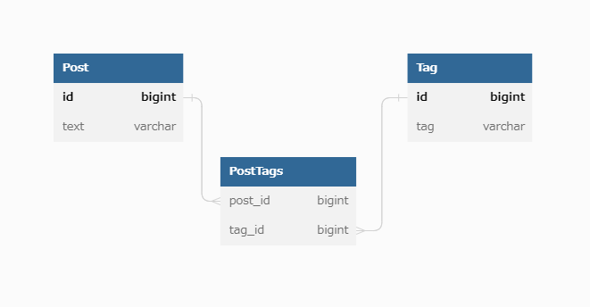

# 課題１

## 懸念される問題

- 設計が柔軟ではない。
  タグを増やしたり消したりする度にマイグレーションが必要になり、発展性が低い。
- 参照整合性が担保できない。
  フィールド名ではリレーションを貼ることができず、整合性が担保できない。例えばもし Post 側の TagxxId のフィールドを削除した後、Tag のデータの方に削除もれがあっても気づかない。例えば最後の Tag3Id を削除した後、そのままうっかり同じ ID でフィールドを作ってしまった時に、アプリケーション側で誤って削除したハズのデータが出てきたりしてしまう。

課題２

> どのようにテーブル設計を見直せばこの問題は解決できるでしょうか？新しいスキーマを描いてみてください

まあ、、アンチパターン１と同じですがこうなりますよね。。

課題 3

> どんなサービスを開発している時に上記のようなアンチパターンに陥りそうでしょうか？最低でも 1 つは例を考えてみてください

- 例えば商品テーブルに対して、それぞれ倉庫 1,倉庫 2 などとフィールドのカラムをつくっており、そこで数量を管理していた。しかしその後、それぞれの倉庫に対して、例えば住所情報など、別のサブ情報を管理する必要がでてきた。今からフィールドの仕様を変えるには在庫にも影響してしまい膨大な工数が掛かるため、また倉庫数も当時は少なくて、そのまま WareHouseInfo テーブルをこのアンチパターンのやり方で管理することにした。
