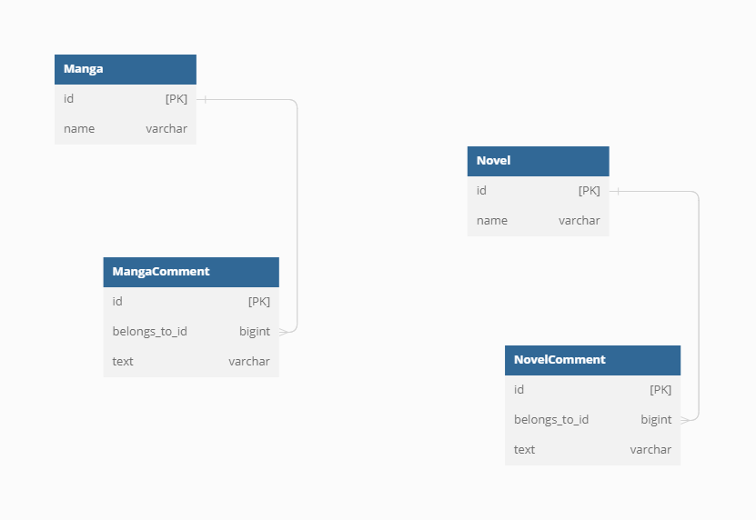

# 課題１

> 上記の設計で、どのような問題が発生するでしょうか？

- 片方の要件が変わった時の問題

例えば「Novelだけに著者情報を加えたい」「Mangaだけ複数Commentを追加できるようにしたい」など、片方に異なる要件が増えた時にCommentにフィールドを増やして対応するしかないが、どちらがどのようなエンティティを持つのか、不要に複雑かつ、データからは推測しにくい暗黙のドメイン表現になってしまい、正規化もしづらくなる。

- テーブルの名称が変更された時の問題

例えばサービスの方向性が変わり「Novel」の名称が「Essey」に変更されたが、typeには'novel'を入れているため、そのままにするしかないか、全件updateするしかなくなった。

- テーブルの構造が変更された時の問題

例えばサービスの方向性が変わり「Novel」に階層構造が生まれNovelに属する「Mistery」や「SF」などをそれぞれテーブルで保持することになったが、typeには'novel'を入れているため、そのままにするしかないか、全件変更していくしかなくなった。

# 課題２

> どのようにテーブル設計を見直せばこの問題は解決できるでしょうか？新しいスキーマを描いてみてください

意味があって別れてるものは分ける。

# 課題3

> どんなサービスを開発している時に上記のようなアンチパターンに陥りそうでしょうか？最低でも1つは例を考えてみてください

- 最初はNovelだけのサービスだけだったが、Mangaも加えたくなった。その際Novelテーブルに漫画データを入れてもよかったが、最初のテーブル名をNovelとしてしまったし、別途Mangaテーブルを作った方が拡張性がある気がした。既に存在していたCommentはシンプルな仕組みだし、typeを加えて出し分けていれば充分対応できるとその時は考えた。

- 寿司屋をやってるお客さんに「持ち帰り売上」と「店内飲食売上」という売上を格納するテーブルがそれぞれあった。そのうち「発行したクーポンとその売上情報を紐づけたい」という話になった。その時点では「クーポンは『持ち帰り』のものしかやりません」って言われていたので、「持ち帰り売上」に対してのみ「クーポン発行情報」というテーブルと「クーポン使用済情報」という中間テーブルを作ってリレーションを張って管理していた。しかしそのうち「売上向上のため店内の飲食にもクーポン情報を付けたい」と言われて、その時は「クーポンの仕組みも変わらないしテーブルも複雑になるから」という理由で「クーポン使用済情報」テーブルに「持ち帰り」と「店内飲食」のTypeを加えて対応した。しかし、、、そのうちまた「うちはフィットネスクラブもやっていて、そこで促販のため寿司屋のクーポンを配布する。その際持ち帰りに対するクーポンは配布しないが、店内飲食にはこのクーポンが使える。またこれまでクーポンは一つの会計で一つだったけど、そのフィットネスからのクーポンだけは併用可能にするので複数その情報を保持できるようにして欲しい」とか言われて正規化がぐちゃぐちゃになる。