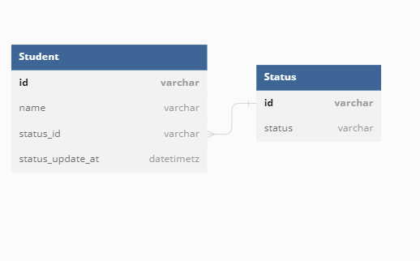

## 課題1

> サービスに新しく退会機能を加えることになりました。とあるエンジニアは、登録しているユーザーが退会済みか否か判断できるよう以下のようなフラグを追加しました

> この対応にはどのような問題点が潜んでいるでしょうか？

1. 個人情報漏洩のリスクと保護法抵触のリスク

    「なんとなく心配だから」で保存したままだと、メンテナンスされなくなったデータが漏洩するリスクや、個人情報保護法に抵触するリスクがある。個人情報保護法には「個人データを利用する必要がなくなったときは遅延なく削除しなければならない」と定められており、それに違反する恐れがある。

2. ユーザー情報を操作するたびに毎回taikaiFlag = 0を打たなければならない。

    うっかりWhereを忘れて取得や更新をしてしまうと取り返しのつかない事故に繋がってしまう可能性がある。
    適切にアプリケーション側のドメイン層でオブジェクトを切り分けるか、MVCだとモデル層で間違いにくいようにしておく必要がある。

3. このフィールドの0と1だけで表現できない状態が生まれた時の柔軟性がない。

    例えばここに「復会者を管理したい」ということになり、FukukaiFlagが増えた。「復会者は一回退会してるから0のままでいい」と勘違いする人が現れたりして非整合なデータの元になったり、さらにここに休会者のKyukaiFlagも増えることになり、「Taikai,Fukukai,Kyukaiが全部ゼロかもしくはどれかが1なのが正しい状態」「2つ以上1なのは間違い」という使用者やプログラマーの共通認識を持たせることでしか正規化するすべがなくなった。

4. 「とりあえず削除フラグ」のデメリット

    脳死でエンティティを設計することによって、上記のリスクや顧客のビジネスロジックを理解しないまま設計に落とし込んでしまい後々引き返せない事態になってしまう。

## 課題2

> どのようにテーブル設計を見直せばこの問題は解決できるでしょうか？新しいスキーマを考えて、UML図を描いてみてください

- 顧客の状態を柔軟に管理するためステータスを分けた。

  ※StudentとStatusを管理する中間テーブルを作ってそれによって管理する案も考えたが（[ボツ案](./ボツ案.png)）、Studentがstatus_idというフィールドを保持して状態を持っている、という事がパッとわかることによって「Whereによって状態を出し分けないといけない」というのが設計者以外にも理解しやすく上記２の致命的なリスクを減らせると感じたため、こちらを採用した。

  ※ただし、1の個人情報削除に関して「退会後ステータスの更新日から1カ月たったら削除する」などするしかない。

## 課題3

注文情報を削除してしまう場合
- 顧客の後からの問い合わせに対応、追跡できなくなる
- データが残らずマーケティング分析ができなくなる
- 顧客が誤って削除した場合に復活できなくなる
などのデメリットがある。

ビジネス的な価値、特に上記などの理由によって将来的にそのデータが残っていることが重要な意味を持つ場合は物理削除すべきではない。
ただし漏洩リスクや管理保管のコスト、意味を持つ期間（例えば10年後に意味を持つ必要はない）などを考慮しながら適宜論理削除も採用すべきである。

> 他にも、ご自身が過去に開発したサービスを振り返って、物理削除を採用したケースを思い出してみてください。今振り返ってみると、果たしてそれは妥当な物理削除だったでしょうか？

以前の仕事で大手電気会社の営業管理システムを担った。
そこでは全てのテーブルにおいて論理削除が採用されていた。
それが妥当であったかどうかを考えると
- 大規模ではあるが社内専用のシステムであった点
- 顧客が基本は法人である点

などを考えると論理削除で良かったと思う。
ただ、そのフレームワークはPHPのレガシーなMVCの三層アーキテクチャフレームワークであり、自力でモデル層で毎回全てのクエリにおいてWhereを打っており涙ぐましいコードだった。基本モデル層の基底クラスのようなところでFindやDeleteに関してハンドリングしたら充分だったのではないかと思う。
また方法として、論理削除しているものの、データは何かあった時の確認以外では使わず、データを復活させる必要は無かったため、Trigerなどで別テーブルに保存する、などしてもよかったのではないかと思う。
さらに最近のフレームワークやORMによってはデフォルトで論理削除の機能がついているものもあるため、フレームワークに依存するデメリットはあるが、それを選択する道もあったと思う。
