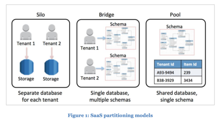

# 課題

もしタイムマシンを使って過去に戻れるとしたら、そもそもSmartHRを立ち上げる前に自分らが立ち上げる、、っていう冗談はさておき、アプリケーション側での工夫とデータベース側での工夫に大きく手としては分けられて、さらにその中でもいくつか方法があるな、と思いましたので整理しました。（課題１と２は合わせてこなしています。）


## アプリケーション側での工夫

### ①モデル層での共通処理

  フレームワークやORMパッケージを使って、Whereの絞り込みに対して絶対的に絞り込みが発生するようにする。
  モデル層の基底クラスや、ORMのミドルウェア、初期化動作の中にそういうスコープを含めることが出来るものがあるので、そこで必ず指定するようにする。

  例えばLaravelのEloquentモデルだとboostedというモデル層すべての初期化処理の中に下記のような処理を入れることができる。
  ```
  class Customer extends Model
  {
      protected static function booted()
      {
          static::addGlobalScope('tenant', function (Builder $builder) {
              $builder->where('tenant_id', Auth::user()->tenant_id);
          });
      }
  }
  ```
  【参考】[【Laravel】スコープを使えば「うっかり」が減って「ラク」できる](https://blog.capilano-fw.com/?p=8019)

  ただし、適切に設計しないと、ログインしてない時の処理でtenant_idにnullがわたってしまったり、例えば「これは絞りたくない」みたいな例外的なテーブルが出たり、「これはtenant_idではなくuser_idで絞り込みたい」など複雑な要件をifで切り分けるようになったり、各モデルにコピーして記載していくようになり、ドメインロジックを複雑に管理するようになってしまうリスクがある。

  ただしDBでやってしまうよりは明示的で柔軟性があるメリットはある。

### ②テナント化ライブラリ

  マルチテナントを実現するライブラリがフレームワークによっては存在する。Laravelで言えばTenacy/Tenancyやarchtechx/tenancyなどがあり、ORM、マイグレーション、シーダー、コンソールコマンド、キュー、ブロードキャスト、ファイル、ログなどまでテナント化してくれる。またユーザーがアクセスするサブドメインに基づいてこれらを切り分けてくれるものがあったりなど、ライブラリとしても成熟していて実績もある印象。
  
  【参考】[[tenancy] Laravelでマルチテナント対応するときに見るページ](https://wonwon-eater.com/laravel-multi-tenant/)

### ③番外編 クエリの工夫
参考元の記事でSQLのセッションやトランザクションに必ず変数を持つようにして「その値が無いと失敗する」ようにしておく、というやり方が紹介されていた。

このようなやり方自体は新鮮ではあったが、ただ結局これも「書き忘れたらNG」「（例ではPrismaを使っているが）生クエリを発行していてライブラリの恩恵に預かれない」「DBに依存する」などのデメリットが大きいように思った。


【参考】[テナントの情報をDBセッションあるいはDBトランザクションに持たせる](https://kiririmode.hatenablog.jp/entry/20220911/1662836199#%E3%83%86%E3%83%8A%E3%83%B3%E3%83%88%E3%81%AE%E6%83%85%E5%A0%B1%E3%82%92DB%E3%82%BB%E3%83%83%E3%82%B7%E3%83%A7%E3%83%B3%E3%81%82%E3%82%8B%E3%81%84%E3%81%AFDB%E3%83%88%E3%83%A9%E3%83%B3%E3%82%B6%E3%82%AF%E3%82%B7%E3%83%A7%E3%83%B3%E3%81%AB%E6%8C%81%E3%81%9F%E3%81%9B%E3%82%8B)


## データベース側での工夫

### ①DB or テーブル or インスタンスでの切り分け
大きく3つのアプローチがある。
  1. Multi Tenants in 1 Database：複数企業のデータを一つのデータベースで管理
  2. 1 Tenant in 1 Database：テナントごとにデータベースを分けて管理。物理的なインスタンスは同じ。
  3. 1 Tenant in 1 Instance：テナントごとにデータベースを分けて管理。物理的なインスタンスも分け企業ごとにデータベースインスタンスを作成。


またこれらについては下記のような特徴がある。

| Pattern | Multi Tenants in 1 Database | 1 Tenant in 1 Database | 1 Tenant in 1 Instance |
|---------|-----------------------------|------------------------|------------------------|
| 金銭的コスト | ○ | ○ | × |
| マイグレーションコスト | ○ | × | × |
| 安全性 | × | △ | ◎ |
| スケーラビリティ | △ | △ | △ |

【参考】[PostgreSQLのRow Level Securityを使ってマルチテナントデータを安全に扱う](https://times.hrbrain.co.jp/entry/postgresql-row-level-security)

【参考】[マルチテナントデータを安全に扱うための Row Level Security、そして1ユーザーが複数のテナントに所属するときの対応について](https://kiririmode.hatenablog.jp/entry/20220911/1662836199#%E3%83%86%E3%83%8A%E3%83%B3%E3%83%88%E3%81%AE%E6%83%85%E5%A0%B1%E3%82%92DB%E3%82%BB%E3%83%83%E3%82%B7%E3%83%A7%E3%83%B3%E3%81%82%E3%82%8B%E3%81%84%E3%81%AFDB%E3%83%88%E3%83%A9%E3%83%B3%E3%82%B6%E3%82%AF%E3%82%B7%E3%83%A7%E3%83%B3%E3%81%AB%E6%8C%81%E3%81%9F%E3%81%9B%E3%82%8B)


### ②PostgresqlでのRow Level Security
またPostgresqlでのRow Level Securityは簡単に行単位でのテナンシーを可能にし、テーブルに対してポリシーを加えることで、クエリの影響範囲を絞りながらマイグレーションや運用を統一できる。

プログラマーの責任を考えなくてよくなり、脳のメモリを抑え、精神衛生上も良い選択となりえる。

実際今の現場でsupabaseを使ってRLSを実装しようと考えている。

（※↓マルチテナントの概要からPSLQのRLSについてやフレームワーク使っての実践的な内容もあって参考になった）

【参考】[RLSを用いたマルチテナント実装 for Django](https://www.slideshare.net/shimizukawa/a-multitenant-implementation-using-rls-for-django?from_action=save)


### ③Oracleのマルチテナント

マルチテナントの実現方法としてOracleにはそもそもマルチテナント用の機能とコマンドが用意されていることを知った。ただし上の①の言い方でいえば「Multi Tenant in 1 Instance」という感じで実装コストや運用コストはPostgresqlでのRow Level Securityに比べ高いように感じられた。


【参考[マルチテナントとは](https://xn--w8j8bac3czf5bl7e.com/2018/06/07/%E3%83%9E%E3%83%AB%E3%83%81%E3%83%86%E3%83%8A%E3%83%B3%E3%83%88%E3%81%A8%E3%81%AF/)


## 所感

以前からRLSのことは聞き知っていて、マルチテナントの話になるとRLSがベストプラクティスに語られることが多いような気がしている。

人のうっかりで情報が他者に漏れることが大きなリスクとなる今回のような場合、堅牢かつ運用コストが高くないのは非常に有用ではあるが、パフォーマンスの観点や、実装がDBに依存して変更不可能になる事や実装の可読性が落ちる事などは、立ち止まって考える必要があると思う。

軽微な実装や、「きっちり分れてるわけではない」などロジック的にテナントの分割が曖昧複雑な実装であればアプリケーション層での解決を試みてもいいのではないかと思う。