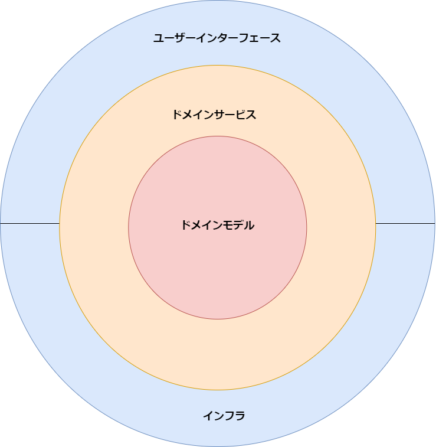

# 課題１

## オニオンアーキテクチャを図解してください

「オニオンアーキテクチャ」はドメイン駆動設やクリーンアーキテクチャを元に生じたアーキテクチャで、クリーンアーキテクチャの原典で紹介されている設計で、よりシンプルで理解しやすい形になっている。

いずれもビジネスロジックを最上位モジュールとして、他モジュールの影響や依存から守る。
オニオンの形になっているのは、外側のモジュールから直接接している内側のモジュールに対してのみ依存を許す設計を視覚的に表すため。
これにより堅牢で変更に強いアプリケーションを構築することができる。

- ドメインモデル
ドメインオブジェクトともいう。
ビジネスロジックに登場するモデルやオブジェクト、アクターについて定義したもの。
オニオンアーキテクチャの再中心に位置し、最上位モジュールとして何者からも

- ドメインサービス
ユースケースともいう。
ドメインモデルを操作しロジックを表現したもの。
UI層から受け取ったデータを操作したり、インフラストラクチャ層に対してインタフェースを介してDB操作を行ったりする。

ちなみにドメイン駆動設計においては、何でもメソッドをドメインサービスに置いてしまいがちになってしまうことをアンチパターンとして「ドメインモデル貧血症」と言う。
「ドメインオブジェクト自身がそれを知っている／操作できるということに違和感がある場合」のみドメインサービス層に書くべき、と言われている。

- インフラ
基本的にはDBモデル操作などがそれにあたるが、基本的にドメインサービスを実現するための技術的な関心はインフラ層に置くべき、と言われている。
これは例えばログや監視、メール送信など、DB操作以外の事柄に関してもインフラ層ということになる。

- ユーザインターフェース
プレゼンテーション層ともいう。
直接ユーザーに対して表現が行われる層。
MVCのビューや、バックエンドであればコントローラーもユーザーインターフェースに当たる。

## 中心に位置するドメインモデル層は他のどの層にも依存していません。こうすることに、どのようなメリットがあるのでしょうか？

- 本当に守るべきドメインロジックをあらゆる依存関係から独立させることが出来る。
これにより、本来表現したいビジネスロジックの表現や、守るべき制約に集中でき、バグも少なくなると言われている。またリリース後の、アプリケーションの変更に対しても堅牢で柔軟なアプリケーションにすることができる。

個人的に一番分かりやすかった例えは、「GUIがCUIになってもドメインモデル／ドメインサービス層はそのまま機能するように作るべき」という話。

## 層をまたいで依存関係が発生する時（例えばユースケース層がレポジトリ層のメソッドを呼び出す時など）はインターフェースに対する依存のみ許可します。こうすることに、どのようなメリットがあるのでしょうか？

所謂「依存性の逆転」の法則を使うことでユースケース層が具体的な実装ではなく抽象に依存する。
レポジトリを操作する際にインタフェースを使うことにより最上モジュールであるドメイン／ユースケース層が下位モジュールであるインフラストラクチャ層に依存しなくなる。
インフラストラクチャが交換可能になるだけでなく、技術的な都合や、そこで使用するモジュールの都合にロジックが左右されなくなる。

## 「依存性の逆転」がオニオンアーキテクチャにおいてどのように使われているのか説明してください

恐らく一番利用するのはDB操作のシチュエーション。
所謂「レポジトリパターン」を使い、インタフェースによりDBのCRUD操作を行うメソッドを定義する。
それにより前述のようなドメインを、他のあらゆるモジュールに対する最上位モジュールとして守るメリットがある。

## 特定のユーザにしかリソースの追加や更新を許さないようなアクセス制限機能を実装したいとします。どの層に記述するのが適切でしょうか？

個人的にはほぼ絶対的にドメインモデル／ドメインサービス層になるだろうと思います。
基本的にはアプリケーションで登場するビジネスモデルとそれの制約をアプリケーションの中心として位置付けることで、アプリケーションが堅牢になるからです。
今回の場合「特定のユーザー」や「リソース」がドメインモデルに当たり、「そこへの操作と制限」をドメインサービス層に書くのが実際かな、と思います。

## データベースをMySQLからPostgreSQLに変更するとします。どの層を変更する必要があるでしょうか？

インフラ層です。
前述のとおり、インフラ層に対する操作は「レポジトリパターン」を使ってインタフェースを通して操作しているだけなので、DBの変更に対してもインフラ層を切り替えるだけになります。

# 課題２

## オニオンアーキテクチャに関するクイズを作成してください
### 問. MVCパターンと比べてどのようなそれぞれメリットデメリットがあるでしょうか。
  - MVCパターン
    - メリット
      - 多くのフレームワークで採用しており習得が容易
      - 基本的にデータの流れが1方向で直感的なので手数がオニオンアーキテクチャに比べて少ない
      - 複数人で開発する時にMVCをそれぞれ分割して開発することができる。
    - デメリット
      - ビジネスロジックをどこに書くか明確ではなく、現場やエンジニアによって左右されて、それぞれ異なる場所に書かれがち
      - 結果ファットモデル、ファットコントローラーを生み出し、「共通化の罠」などにより大規模になるほど保守性、堅牢性の悪いアプリケーションになりがち
      - MVCがそれぞれに依存してしまいがちで（特にモデルに対して依存しがち）分離が難しく、テスト容易性が低くなりがち

  - オニオンアーキテクチャ
    - メリット
      - 守るべきビジネスロジックを最上位に置き、ドメインモデルとその操作をするサービス層、その他の下位モジュールとの役割分担と棲み分けが明確で、堅牢性、保守性の高いアプリケーションになる
      - またそれらのビジネスロジックが技術的関心から独立して存在して守られているために、メンテナンスコストも低く、テスト容易性が高いアプリケーションになる。

    - デメリット
      - 学習コストが高く、チームに浸透させるためには単なる学習だけはなく、経験と時間が必要。
      - 基本的にMVCなどと比べて手数が多く工数が多くなりがち

### 問. 外部のAPIを操作するのは何層になるでしょうか。

  インフラ層
  
  技術的な関心を詰め込むのはインフラストラクチャ層。
  DBなどと同じ考えで、外部の通信を行うのもインフラストラクチャ層であり、ドメインロジック実現のために、APIに対する操作が必要な場合、インタフェースを通して操作する必要がある。

### 問. オニオンアーキテクチャとヘキサゴナルアーキテクチャの違いについて教えてください。

  基本的にはどちらも同じクリーンアーキテクチャの流れを組むドメイン駆動による設計思想。
  一旦ヘキサゴナルアーキテクチャで完成した考え方を、より具体的でシンプルに表現した形がオニオンアーキテクチャともいえる。
  いずれもコアドメインを中心に置き、外部への依存を避け、基本的に外側の層から内側の層のみ依存をする設計にする。
  それによりコアドメインに集中し、堅牢性、保守性、拡張性の高いアプリケーションを設計できる。
  ヘキサゴナルアーキテクチャはポートアンドアダプターパターンとも言われ、外部との接続にポート／アダプターと呼ばれるクラスを介してのみ通信／操作を行う。それによりコアドメインを外部の影響から徹底的に守る。
  総じてヘキサゴナルアーキテクチャの方が登場概念が多く難解。

参考：
https://little-hands.hatenablog.com/entry/2017/10/04/231743

https://little-hands.hatenablog.com/entry/2017/10/11/075634

https://qiita.com/cocoa-maemae/items/b08c4cf95d47e314e2dc