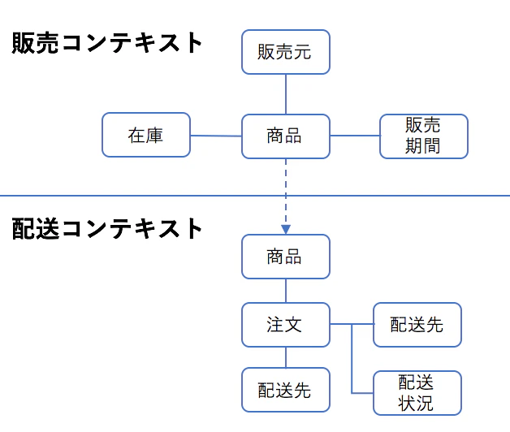

# 課題１

以下の用語を解説してください

### エンティティ

DDDではドメインオブジェクトとも呼ばれる。
英語で実体、という意味で、アプリケーションによって実現したい関心事に登場するオブジェクトを定義したもの。
IDによって識別され個別化されるもの。
生成されて破棄されるライフサイクルを持つ。

例：社員番号によって識別される社員オブジェクト、商品IDによって識別される商品オブジェクト

### 値オブジェクト（バリューオブジェクト）

属性によって識別されるオブジェクト。
属性がすべて同じであれば同一。生成されたら破棄されるのみ。

例えば「0以下になってはいけない『販売額』など、プリミティブな値のように扱いつつ、ドメインを守れるメリットがある。

https://little-hands.hatenablog.com/entry/2018/12/09/entity-value-object

### 集約

「データの一貫性を保つために一つの纏まりとして扱うべきエンティの集合」のことを「集約」という。

例えば在庫管理を行うアプリケーションで「商品在庫」と「商品在庫明細」というドメインオブジェクトがあり、「商品在庫」に商品ごとの現在数が、「商品在庫明細」に各「入庫数」もしくは「出庫数」が記録されるような状態を考える。

これで言えばこの「商品在庫」と「商品在庫明細」が1つの集約に属する。

また必ずデータの変更や外部からのデータ参照は「集約ルート」に対してしなくてはならず、参照整合性が崩れるのを防ぐため、それ以外の部分に直接アクセスしてはならない、とされている。

この場合例えば出庫により在庫数を更新する時に「商品在庫」の「現在庫」フィールドと「商品在庫明細」の「出庫数」に変更が生じ、トランザクションが必要な一つの固まりだとする。
それを一つの「集約」とみて「商品在庫」を集約ルートとする。

集約に対しては、集約ルートからしかアクセスしないようにすることでデータの一貫性を保つ。

https://codezine.jp/article/detail/10776

### ユビキタス言語

ドメイン対象となる業務内で一般的に使われている言葉のこと。
エンジニアがシステムの都合や設計の都合での言葉を使うのではなく、あくまでもその専門知識をもったドメインエキスパートたちが使う言葉を使用すべきであるとする。
それがアプリケーションと実際の業務、表現し解決すべき領域をつなぐ役割をする。

また実装においては、そのユビキタス言語に沿ったドメインオブジェクトやメソッドを定義することが良いとされている。

例えば「『商品』を『発送する』」という概念を、「発送業務」において「『運送品』を『搬送する』」とユビキタス言語として使われていたら、Item等ではなく「運送品」として命名し、プログラム内でもそれを発送するメソッドを「搬送する」と名付ける。

またユビキタス言語を用いることによってプログラマーもモデリングしながら「ドメイン知識についてここをまだよく理解してないな」と気づくことができる。

ちなみにこのことにおいて、「DDDでは日本語を使った方がよいか」という議論があるが言語としての相性もあるし、それはまた別の話。

### 境界づけられたコンテキスト

あるドメイン領域において、特定のモデルを分ける必要がある境界。
分かりやすい例で言えば同じ「商品」と一言で言ったとしても経理で扱う商品と、発送で扱う商品のふるまいや、必要なプロパティが異なる。
それをあいまいなまま、プログラム内で同じにしてしまうためにアプリケーション上の混乱や無理、バグが生まれる。

「境界付けられたコンテキスト」においてはそれぞれがオニオンアーキテクチャの形を取り、例えばAPIなどで通信を行う。

上記の例の場合、経理コンテキストと発送コンテキストがあり、それぞれが独立したドメイン領域となる。

【参考】松岡さんによる分かりやすい説明

https://qiita.com/little_hand_s/items/2929b6323bf1bc6d0d0d

### ドメイン

アプリケーションによって解決しようとする業務領域のこと。
またそれに登場するオブジェクトのことをドメインオブジェクトという。

### ドメインサービス

上記ドメインにおけるふるまいについて、「ドメイン自身でやることには無理があること」を定義するのがドメインサービス。
例えばUserエンティティがあり、「それが存在するかどうかを確認するExistメソッド」は「User自身が知っているということは無理がある為」「ドメインサービスに定義する」とされる（成瀬さんの本より）

### リポジトリ

エンティのデータを永続化（及び再構築）するための層。
具体的にはリレーショナルデータベースや外部API、ファイル、メモリなどに対して保存や変更、データ取得などの処理を行う。
レポジトリパターンを使って依存性の逆転によりドメイン層がリポジトリに依存しないようにする。

### アプリケーション（ユースケース層と呼ばれることも）

ドメインオブジェクトとドメインサービスを組み合わせて何かの要求を満たす操作を行う層。

例えば発送業務でItemオブジェクトをCreateするのはドメイン自身の責務、ItemExistなどはサービス、それらを組み合わせて永続化したり、Sendなどを行うのがユースケース。

### CQS/CQRS

CQRS（コマンドクエリ責務分離）

更新系をコマンド、取得系をクエリとしてそれぞれレポジトリとクエリサービスとしてモジュールを分けて責務を分離する方法。
更新系にはWriteモデル、取得系にはReadモデルのクラスを作成し、それぞれのユースケースに特化したモデルをする。

メリット：
  - クエリパフォーマンスがあがる、チューニングしやすくなる
  - 復習集約の条件で絞り込んでのページングができるようになる

デメリット：
  - アーキテクチャ自体が複雑になる。
  - ドメインオブジェクトのデータが参照されいている場所が追いにくくなる

参考：ドメイン駆動設計モデリングガイド（松岡さんの本）

CQSに関しては元々メソッドの分離パターンの事をさすことが多いようだ。
CQRSは責務含めたモデルの分離を指すようでした。

- CQS -> コマンドクエリ分離原則(Command-Query Separation:CQS)
- CQRS -> コマンドクエリ責務分離原則(Command-Query Responsibility Segregation:CQRS)

参考：
- (CQSとCQRSの違いはメソッドの分離かモデルの分離かという観点)[https://qiita.com/hirodragon/items/6281df80661401f48731]

- (CQRSとCQSの違い)[https://zenn.dev/praha/articles/4da7c1f91fb91f]

### DTO

ドメイントランスファーオブジェクトの略。
中心のドメイン層（オブジェクト／サービス）より外側のUI層やインフラストラクチャ層にドメイン知識が漏れだすのを防ぐために、詰め替えを行うのが、DTOの役割。
ドメインオブジェクトが漏れだした場合、「一番外側の層がドメインを知っている」状態になり、例えばDBの更新の都合やデータの取得の都合などにドメインが左右されてしまうことが起きがちであるため、ドメイン層とそれ以外の層を疎結合に保つ役割がある。
ただ、UIの都合とDBの都合、あとはそれぞれのCRUDに合わせてDTOを作っていると非常に煩雑で、データのバケツリレーが増える程にメンテナンス頻度はあがり、結合テストではないとわからないものが生じたりと、バグも潜みやすくなるようにも感じる。

### ドメインモデル貧血症

ドメイン層（ドメインオブジェクトとドメインサービス）を定義する時に、「基本的にメソッドはドメインオブジェクトにを定義すべき」「ドメインオブジェクト自身がそれを操作できることに違和感がある時のみドメインサービスに実装すべき」とされており、ややもすればドメインサービスにばかりメソッドを定義して、ドメインオブジェクトにメソッドが無くなってしまうことをアンチパターンとして「ドメインモデル貧血症」という。

ユースケースのように書こうとするとどうしてもドメインサービスに書いてしまうことになり、また手続き的な記述になりがちなので注意が必要、としている（この一文はドメインモデリング設計ガイドより）

# 課題2

## 境界づけられたコンテキストの実例を一つ挙げてください

例えば商品の配送管理を担い、経理処理まで行うアプリケーションを考える。
コンテキストとして「配送ドメイン」「経理ドメイン」と分ける。これが境界づけられたコンテキスト。
エンティティである商品において、配送と経理で必要なプロパティ、ドメインサービスが異なる。
例えば配送が終わった商品がその個数に応じて「出荷済商品」として売上が立てられる、というロジックになっていたなどする場合、出荷数は請求数になり、商品単価とは別の1個当たりの配送料が経理ドメインにおいての請求額となる。

またこのようにコンテキストを跨ぐオブジェクトがあった場合、その関係性を「コンテキストマッピング」として図示しておくことが良いとされている。

コンテキストマッピングの例:

[境界づけられたコンテキスト 概念編 - ドメイン駆動設計用語解説](https://qiita.com/little_hand_s/items/2929b6323bf1bc6d0d0d)より

## 「Human」エンティティを作成してください。

1. 新人エンジニアが最初に作ったエンティティ

  [こちら](Entity_02_01.ts)

2. 値オブジェクトに書き変えたエンティティ

  [こちら](Entity_02_02.ts)

# 課題3

> よくDDDの文脈で会話していると「ドメイン知識が漏れている」という表現を目にすることがあります。これは一体どういう意味なのか説明するため、ドメイン知識が漏れているサンプルコードを作成してください

### 知識漏れサンプルです。

https://github.com/sutefu23/ddd-sample

### 修正したブランチのプルリクです。

https://github.com/sutefu23/ddd-sample/pull/1

# 課題4

> DDDに関するクイズを作成してください

### 問.　下記の3択クイズに答えてください。

（注：試しにChatGPTにリクエストしてみたらいい問題だったのでそのまま問題は使いますが、解説は僕が書きます。）

#### クイズ1: エンティティとバリューオブジェクトの違い
#### 質問: ドメイン駆動設計において、エンティティ（Entity）とバリューオブジェクト（Value Object）の主な違いは何ですか？

- A) エンティティは不変であり、バリューオブジェクトは可変である。
- B) エンティティには固有の識別子があり、バリューオブジェクトには識別子がない。
- C) バリューオブジェクトはビジネスロジックを含むが、エンティティは含まない。
- D) エンティティとバリューオブジェクトには実質的な違いはない。

#### クイズ2: 集約の概念
#### 質問: ドメイン駆動設計において「集約（Aggregate）」とは何を指しますか？

- A) ビジネスロジックを実行するための一連の関連オブジェクトのグループ。
- B) システム全体のデータモデルを表す単一のオブジェクト。
- C) 複数のサービスやアプリケーションを統合するプロセス。
- D) ドメインモデルの中で最も重要なエンティティ。

#### クイズ3: ドメインサービスの役割
#### 質問: ドメイン駆動設計におけるドメインサービス（Domain Service）の役割は何ですか？

- A) データベースとの通信を担当する。
- B) 単一のエンティティやバリューオブジェクトに属さないドメインのビジネスロジックをカプセル化する。
- C) ユーザインターフェースとドメインモデルの間のデータ変換を担当する。
- D) システムのセキュリティポリシーを管理する。

正解は、クイズ1: B、クイズ2: A、クイズ3: B です。

-----
### 解説

- クイズ1: B

バリューオブジェクトとエンティ（ドメインモデル）はその等価性が異なります。
エンティティは（主にUUIDによって）IDが振られます。

バリューオブジェクトは基本的にその値同士が等価であれば同じです。
同じ10円は同じ10円です。

しかしエンティティは識別子が異なれば異なるものです。
社員IDが同じであれば同じエンティですが、違えば違う人です。

[分かりやすい解説](https://qiita.com/little_hand_s/items/f8c0d0858c895afed7e2)

- クイズ2: A
「集約」という概念は「そのデータ（エンティ）を扱う時に一緒に扱うべきひと塊」です。

データを変更する単位を「集約」といいます。

例えるなら、「商品在庫」をいじるときに「商品在庫明細」みたいなのも一緒に更新しないと行けないとしたらその2つは同じ集約に属します。

- クイズ3: B

これは前述の通りですね。
