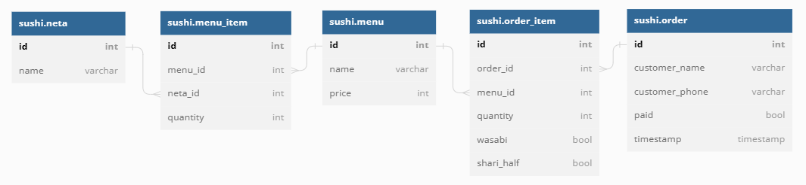

# 解答2
## 変更1
### E-R図

## 変更2
### E-R図

### 長所
セット商品と単品を別のテーブルにする設計も可能だが、セット商品と単品を同一視するこちらの設計の方がネタ単位のクエリが簡潔になる。
### 短所
ある商品がセット商品であるか知るためにsushi.menu_itemまで遡る必要がある。ただし、これはsushi.menuの属性にセット商品であるかどうかのフラグを追加することで解決可能である。
## 見直し
その後、設計細部の見直しを行った。以下に示すものが暫定版のスキーマである。
### 主な見直し箇所
* 価格の変更が生じた場合に、過去の売上の集計ができなくなる問題を解消
* 消費税率が変更された場合に、過去の売上の集計ができなくなる問題を解消
### E-R図

## 各テーブルの説明
### sushi.orderテーブル
1件の注文に対応する
* id: 注文ID
* customer_first_name: 注文者の名
* customer_last_name: 注文者の姓
* customer_phone: 注文者の電話番号
* comment: 注文に関する自由記述
* is_paid: 支払い済か
* timestamp: 注文確定日時
### sushi.order_detailテーブル
各注文に含まれるメニューを表す
* id
* order_id: 注文ID
* menu_id: メニューID
* quantity: 注文個数
* wasabi: サビありか
* shari_half: シャリを小さくするか
### sushi.menuテーブル
注文可能なメニューを管理する
* id: メニューID
* name: メニュー名
* price_id: 価格ID
### sushi.priceテーブル
メニューの値段を管理する
* id: 価格ID
* price: 価格
* start: 適用開始日時
* end: 適用終了日時
### sushi.menu_detailテーブル
各メニューに含まれるネタを管理する
* id
* menu_id: メニューID
* neta_id: ネタID
* quantity: 何貫含まれるか
### sushi.netaテーブル
ネタを管理する
* id: ネタID
* category_id: ネタのカテゴリID
* name: ネタ名
### sushi.neta_categoryテーブル
ネタのカテゴリを管理する
* id: カテゴリID
* name: カテゴリ名
### sushi.taxテーブル
消費税参照用テーブル
* id
* rate: 税込/税抜
* start: 適用開始日時
* end: 適用終了日時

## 疑問点
sushi.order_detailテーブル、sushi.menu_detailテーブルのidカラムは正規化の観点から見ると不要だが、(DBMSによって自動でレコードにidが割り振られる事がない場合)残すべきだろうか？消去した場合、カラムの全体集合が主キーと一致するが、パフォーマンス上の影響はどうだろうか？