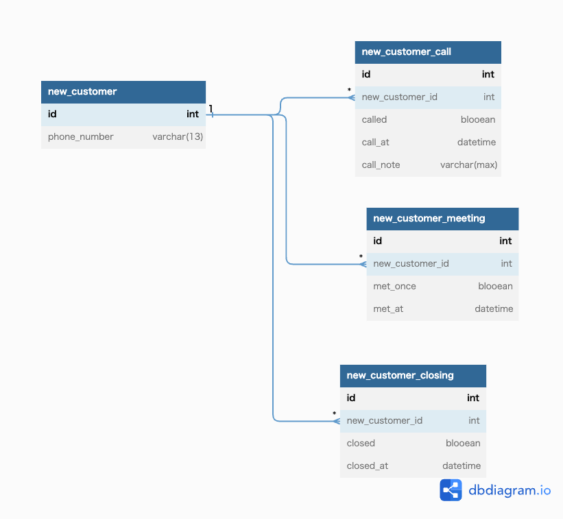

# 課題1
成約することを最終目的として、それまでの進捗を管理したいシステムだとする。  
成約までのStepは以下2つに分けられる。  
・電話営業を行う  
・面談を行う  
上記の前提を考慮すると、以下の問題が発生する。  
・電話営業を複数回行った際に、交わしな内容のメモを一つのカラムで管理しないといけないので、煩雑さを生む。
どこからどこまでが1回目やりとりのメモかといった時系列が追いづらい。  
・面談についても複数回行った際に、どのような時系列で成約にいたったのか、あるいは成約にいたらなかったのかが見えづらいため、分析にあたって仮説を立てることが難しくなる。  

# 課題2

# 課題3
採用サービスでも同様の問題が発生しうる。