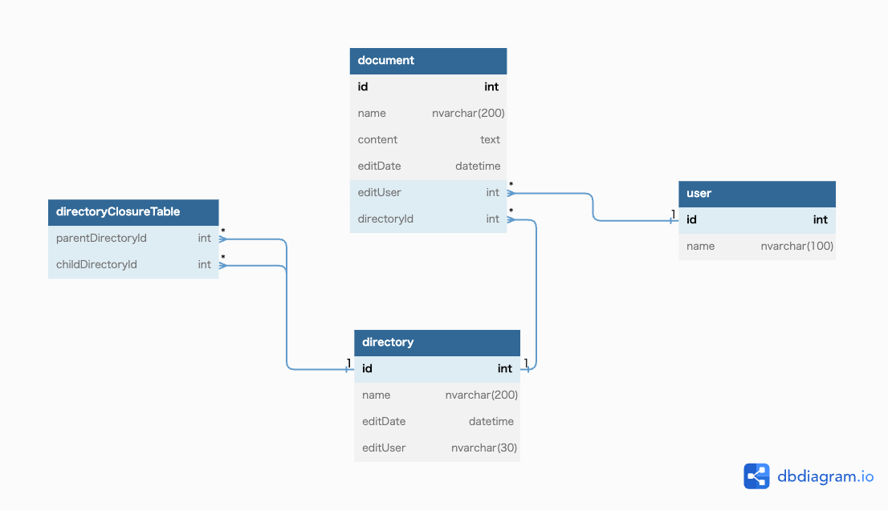
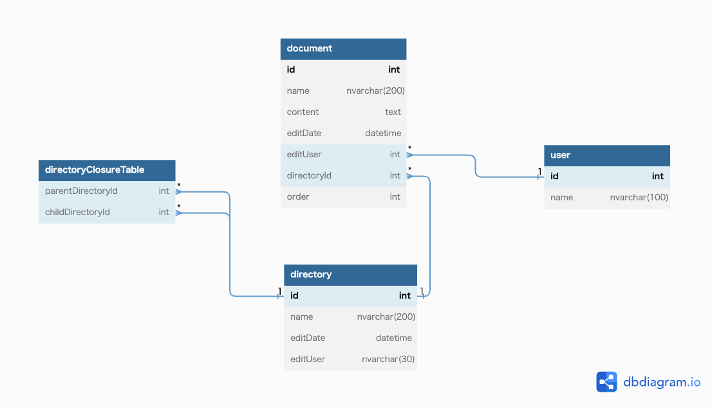

# 課題1
## ER図

# 課題2
## ER図

## テーブル定義
[テーブル定義](task_02/documentManagementSystem_DDL)
## 初期データ登録クエリ
### ユーザー登録
INSERT INTO `user` (`id`, `name`) VALUES(1,'satou');  
INSERT INTO `user` (`id`, `name`) VALUES(2,'suzuki');  
INSERT INTO `user` (`id`, `name`) VALUES(3,'sasaki');  
### ディレクトリを作成
INSERT INTO `directory` (`id`, `name`, `editDate`, `editUser`) VALUES(1,'layer1','2023/05/01',1);  
INSERT INTO `directory` (`id`, `name`, `editDate`, `editUser`) VALUES(2,'layer1-1','2023/05/02',2);  
INSERT INTO `directory` (`id`, `name`, `editDate`, `editUser`) VALUES(3,'layer1-2','2023/05/03',1);  
INSERT INTO `directory` (`id`, `name`, `editDate`, `editUser`) VALUES(4,'layer1-2-1','2023/05/03',1);  
### 閉包テーブルデータを作成
INSERT INTO `directoryClosureTable` (`parentDirectoryId`, `childDirectoryId`) VALUES(1,2);  
INSERT INTO `directoryClosureTable` (`parentDirectoryId`, `childDirectoryId`) VALUES(1,3);  
INSERT INTO `directoryClosureTable` (`parentDirectoryId`, `childDirectoryId`) VALUES(3,4);  
INSERT INTO `directoryClosureTable` (`parentDirectoryId`, `childDirectoryId`) VALUES(1,1);  
INSERT INTO `directoryClosureTable` (`parentDirectoryId`, `childDirectoryId`) VALUES(2,2);  
INSERT INTO `directoryClosureTable` (`parentDirectoryId`, `childDirectoryId`) VALUES(3,3);  
INSERT INTO `directoryClosureTable` (`parentDirectoryId`, `childDirectoryId`) VALUES(4,4);  
INSERT INTO `directoryClosureTable` (`parentDirectoryId`, `childDirectoryId`) VALUES(1,4);  
### ドキュメント作成
INSERT INTO `document` (`id`,`name`,  `content`, `editDate`, `editUser`, `directoryId`, `order`) VALUES(1,'test1','今日の天気は晴れで、最高気温は25度です。外でのアクティビティには最適な日ですね。','2023/06/01',1,1,1);  
INSERT INTO `document` (`id`,`name`,  `content`, `editDate`, `editUser`, `directoryId`, `order`) VALUES(2,'test2','新製品の発売日は明日です。予約が殺到しているので、早めにご購入いただけると確実です。','2023/06/02',2,1,2);  
INSERT INTO `document` (`id`,`name`,  `content`, `editDate`, `editUser`, `directoryId`, `order`) VALUES(3,'test3','お知らせです！当社では新しいキャンペーンを実施しています。ご来店の際にはチラシをお持ちください。','2023/06/03',1,2,1);  
INSERT INTO `document` (`id`,`name`,  `content`, `editDate`, `editUser`, `directoryId`, `order`) VALUES(4,'test4','重要なお知らせです。システムメンテナンスのため、明日の午後2時から4時まで一時的にサービスを停止します。ご迷惑をおかけしますが、ご理解いただきますようお願い申し上げます。','2023/06/03',3,3,1);  

## ユースケースクエリ
### ドキュメントの追加作成
-- ディレクトリ内の最大順番を取得  
SELECT MAX(order) FROM document WHERE directoryId = '1';  
-- 最大順番を一つあげて登録  
INSERT INTO `document` (`id`,`name`,  `content`, `editDate`, `editUser`, `directoryId`, `order`) VALUES(5,'test5','ドキュメント追加','2023/06/04',1,1,3);  
### ドキュメントの順番を変更する
-- 同ディレクトリ内のファイルを取得  
SELECT * FROM document WHERE directoryId = 1 ORDER BY `order`  
-- documentのid指定でorderを更新する  
UPDATE document SET `order` = 1 WHERE id = 2;  
UPDATE document SET `order` = 2 WHERE id = 1;  
### フォルダ階層を取得する
-- ID4のディレクトリパスを取得する  
SELECT  
name AS ファイル名  
FROM  
directoryClosureTable AS DC  
LEFT JOIN directory AS D  
ON  
  DC.`parentDirectoryId` = D.id  
WHERE  
childDirectoryId = 4  
ORDER BY D.id;  

### フォルダを移動する
-- layer1-1のフォルダを削除  
DELETE FROM directoryClosureTable WHERE childDirectoryId = 2;  
-- 削除されていることの確認  
SELECT * FROM directoryClosureTable WHERE childDirectoryId = 2;  
-- 移動先のフォルダの親子関係を取得  
SELECT * FROM directoryClosureTable WHERE childDirectoryId = 3;  
-- 自身IDと親IDを登録する  
INSERT INTO directoryClosureTable VALUES(2, 2);  
INSERT INTO directoryClosureTable VALUES(1, 2);  
INSERT INTO directoryClosureTable VALUES(3, 2);  
-- 登録結果の確認  
SELECT * FROM directoryClosureTable WHERE childDirectoryId = 2;  
