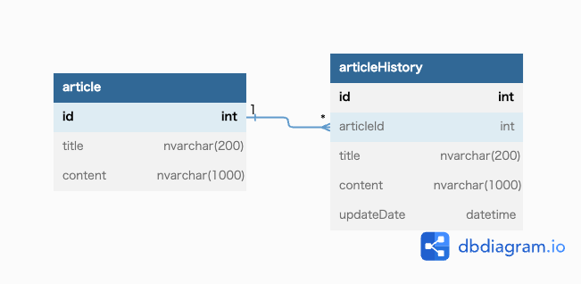
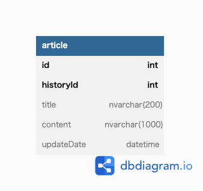

# 課題1
## ER図

## テーブル定義
[テーブル定義](task_02/articleManagementSystem_DDL.sql)

## 初期データ登録クエリ
### 記事登録
INSERT INTO `article` (`id`,`title`, `content`) VALUES(1,'新しいスマートウォッチが発売！','最新のスマートウォッチが登場しました。健康管理や通知機能など、さまざまな機能を搭載し、快適なデジタルライフをサポートします。');  
INSERT INTO `article` (`id`,`title`, `content`) VALUES(2,'未来の交通手段、空飛ぶタクシーの実用化へ','革新的な技術を搭載した空飛ぶタクシーが実用化に向けて動き出しました。渋滞を回避し、効率的な移動が可能となることが期待されています。');  
INSERT INTO `article` (`id`,`title`, `content`) VALUES(3,'新型スマートフォンの発表！画期的な機能搭載','最新のスマートフォンが発表されました。高解像度ディスプレイやAI機能など、驚きの機能が満載。さらに、長時間のバッテリー駆動も可能です。');  
INSERT INTO `article` (`id`,`title`, `content`) VALUES(4,'地球温暖化対策に向けた新たな取り組み','地球温暖化への対策が進められています。再生可能エネルギーの利用や排出削減策など、環境保護に取り組む企業や政府の取り組みが広まっています。');  
### 記事履歴登録
INSERT INTO `articleHistory` (`id`,`articleId`, `title`, `content`, `updateDate`) VALUES(1,1,'新しいスマートウォッチが発売！','最新のスマートウォッチが登場しました。健康管理や通知機能など、さまざまな機能を搭載し、快適なデジタルライフをサポートします。','2023/06/15 18:23:01');  
INSERT INTO `articleHistory` (`id`,`articleId`, `title`, `content`, `updateDate`) VALUES(2,2,'未来の交通手段、空飛ぶタクシーの実用化へ','革新的な技術を搭載した空飛ぶタクシーが実用化に向けて動き出しました。渋滞を回避し、効率的な移動が可能となることが期待されています。','2023/06/16 17:18:01');  
INSERT INTO `articleHistory` (`id`,`articleId`, `title`, `content`, `updateDate`) VALUES(3,3,'新型スマートフォンの発表！画期的な機能搭載','最新のスマートフォンが発表されました。高解像度ディスプレイやAI機能など、驚きの機能が満載。さらに、長時間のバッテリー駆動も可能です。','2023/06/17 18:23:01');  
INSERT INTO `articleHistory` (`id`,`articleId`, `title`, `content`, `updateDate`) VALUES(4,4,'地球温暖化対策に向けた新たな取り組み','地球温暖化への対策が進められています。再生可能エネルギーの利用や排出削減策など、環境保護に取り組む企業や政府の取り組みが広まっています。','2023/06/19 18:23:01');  
INSERT INTO `articleHistory` (`id`,`articleId`, `title`, `content`, `updateDate`) VALUES(5,1,'新しいスマートウォッチが発売！','最新のスマートウォッチが登場しました。健康管理や通知機能など、さまざまな機能を搭載し、快適なデジタルライフをサポートします。','2023/06/20 18:23:01');  

## ユースケースクエリ
### 1000文字程度の本文を記入して保存できる
INSERT INTO `article` (`id`,`title`, `content`) VALUES(5,'人工知能が医療現場に革命をもたらす','最新の人工知能技術が医療現場で活用され、病気の早期検出や治療法の開発などに大きな進展が見られています。医療の未来がより希望に満ちたものになることが期待されています。');  
INSERT INTO `articleHistory` (`id`,`articleId`, `title`, `content`, `updateDate`) VALUES(6,5,'人工知能が医療現場に革命をもたらす','最新の人工知能技術が医療現場で活用され、病気の早期検出や治療法の開発などに大きな進展が見られています。医療の未来がより希望に満ちたものになることが期待されています。','2023/06/20 18:23:01');  

### 記事を更新すると履歴が保存される
UPDATE `article` SET title = '人工知能が医療現場に革命をもたらす', content = '最新の人工知能技術が医療現場で活用され、病気の早期検出や治療法の開発などに大きな進展が見られています。医療の未来がより希望に満ちたものになることが期待されています。' WHERE id = 5;  
INSERT INTO `articleHistory` (`id`,`articleId`, `title`, `content`, `updateDate`) VALUES(7,5,'人工知能が医療現場に革命をもたらす','最新の人工知能技術が医療現場で活用され、病気の早期検出や治療法の開発などに大きな進展が見られています。医療の未来がより希望に満ちたものになることが期待されています。',NOW());  

### 特定の記事の履歴を一覧表示できる
SELECT  
ah.title  
,ah.content  
FROM  
article AS a  
LEFT JOIN articleHistory AS ah  
ON  
a.id = ah.articleId  
WHERE  
a.id = 1  
ORDER BY  
ah.id  
;  

### 履歴を選択して過去の記事状態に戻す事が可能
-- 履歴情報を取得  
SELECT  
ah.title  
,ah.content  
FROM  
article AS a  
LEFT JOIN articleHistory AS ah  
ON  
a.id = ah.articleId  
WHERE  
a.id = 1  
ORDER BY  
ah.id  
;  

-- 履歴情報の中から戻したい状態を選択し、更新  
update article set title = '', content = '' WHERE id = 1;  

### 最新状態の記事を一覧表示できる
SELECT * FROM article;

# 課題2
## ER図
