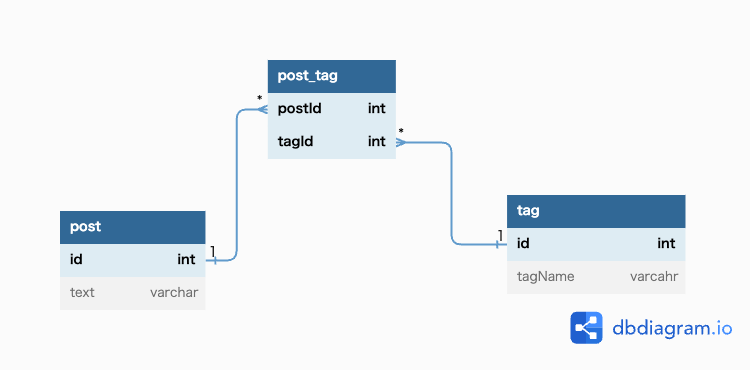

# 課題1
タグを管理できる機能を新規作成した場合に、そのタグ管理マスターとの整合性を独自ロジックで担保しないといけなくなる。
タグを管理できる機能でタグを削除した際に、削除するのに手間がかかる。  
1.任意のタグを含むレコードをLIKE句で抽出する  
2.その後tagsカラムより任意のタグを削除する
# 課題2

# 課題3
本を管理するシステム開発において、同様のパターンに陥る可能性がある。
「書籍」テーブルに「著者」カラムを追加して、そこに共著者の名前をカンマ区切りで入力する。